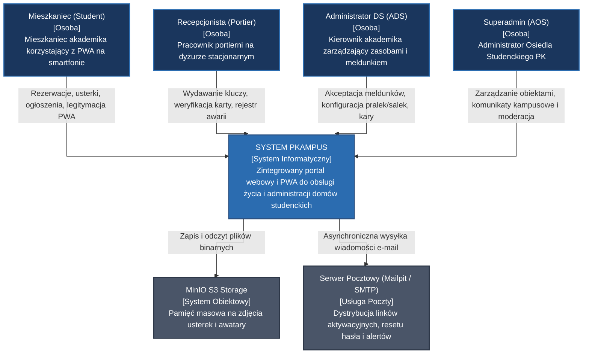
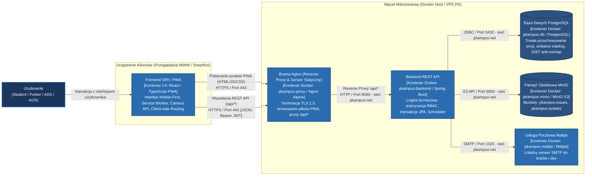

# Diagram Komponentów i Architektury Systemu (C4 Model & ADR) - System PKampus

Dokument stanowi uzupełnienie architektury logicznej i wdrożeniowej o model C4 (ang. *Context, Containers, Components, Code*) wg metodologii Simona Browna oraz rejestr kluczowych decyzji architektonicznych (ang. *Architecture Decision Records - ADR*).

---

## 1. Poziom 1: Diagram Kontekstu Systemu (C4 System Context)

Diagram przedstawia usytuowanie systemu PKampus w otoczeniu aktorów ludzkich oraz powiązanych systemów pomocniczych w infrastrukturze uczelni.

---

## 2. Poziom 2: Diagram Kontenerów (C4 Containers)

Diagram dekomponuje system PKampus na odrębne jednostki oprogramowania i magazyny danych zgodnie z modelem C4. W architekturze systemu wyróżnia się:
1. **Kontener kliencki (PWA SPA):** Aplikacja React / TypeScript + Tailwind CSS (komponenty funkcyjne, RWD Mobile-First) wykonywana w przeglądarce lub jako zainstalowane PWA (smartfon / komputer).
2. **Kontenery serwerowe (Docker Host: VPS PK w profilu produkcyjnym lub stacja robocza w profilu demonstracyjnym):** Zespół 5 długowiecznych kontenerów usługowych zarządzanych przez Docker Compose w odizolowanej sieci mostkowej `pkampus-net` (plus job inicjalizacyjny `pkampus-minio-init` oraz opcjonalny `pkampus-certbot` w profilu produkcyjnym — łącznie 7 serwisów w `docker-compose.yml`):
   - `pkampus-proxy` (Nginx Alpine z wieloetapowym buildem z `node:20-alpine`) – brama wejściowa serwera, terminacja TLS 1.3, serwowanie wbudowanych skompilowanych zasobów statycznych PWA (`/usr/share/nginx/html`) oraz reverse proxy dla ścieżek `/api/*` (prefiks obejmujący `/api/v1/*`),
   - `pkampus-backend` (Spring Boot) – warstwa logiki biznesowej REST API,
   - `pkampus-db` (PostgreSQL) – relacyjna baza danych,
   - `pkampus-minio` (MinIO S3) – magazyn obiektowy na zdjęcia usterek i awatary,
   - `pkampus-mailpit` (Mailpit) – lokalny serwer SMTP na potrzeby deweloperskie i testowe,
   - `pkampus-minio-init` (job one-shot `minio/mc`) – inicjalizacja bucketów i użytkownika aplikacyjnego (bez `restart`, poza `NFR-REL-01`),
   - `pkampus-certbot` (profil `production`) – odnawianie TLS Let's Encrypt na VPS PK.

---

## 3. Poziom 3: Diagram Komponentów Backendowych (C4 Components - Spring Boot)

Diagram szczegółowy prezentuje architekturę warstwową wewnątrz kontenera aplikacji Spring Boot API (`pkampus-backend`).

```mermaid
%%{init: {'flowchart': {'curve': 'stepBefore'}}}%%
flowchart TD
    classDef ctrlStyle fill:#2b6cb0,stroke:#2c5282,stroke-width:2px,color:#fff;
    classDef svcStyle fill:#2d3748,stroke:#4a5568,stroke-width:2px,color:#fff;
    classDef repoStyle fill:#1a365d,stroke:#2b6cb0,stroke-width:2px,color:#fff;
    classDef extStyle fill:#4a5568,stroke:#1a202c,stroke-width:2px,color:#fff;

    subgraph API_Controllers ["Warstwa Kontrolerów REST (Web Layer)"]
        direction LR
        C_AUTH["AuthController<br/>/api/v1/auth/*"]:::ctrlStyle
        C_PROFILE["ProfileController<br/>/api/v1/profile/*"]:::ctrlStyle
        C_LAUND["LaundryController<br/>/api/v1/laundry/*"]:::ctrlStyle
        C_ROOM["RoomController<br/>/api/v1/rooms/*"]:::ctrlStyle
        C_KEY["KeyManagementController<br/>/api/v1/keys/*"]:::ctrlStyle
        C_ISSUE["IssueController<br/>/api/v1/issues/*"]:::ctrlStyle
        C_BOARD["BoardController<br/>/api/v1/board/*"]:::ctrlStyle
        C_EVENT["EventController<br/>/api/v1/events/*"]:::ctrlStyle
        C_ADMIN["AdminController<br/>/api/v1/admin/*"]:::ctrlStyle
    end

    subgraph Business_Services ["Warstwa Logiki Biznesowej (Service Layer)"]
        direction TB
        S_AUTH["AuthService & Security<br/>(JWT 15min, Caffeine blacklist, Bucket4j, BCrypt, Token Reset)"]:::svcStyle
        S_LAUND["LaundryBookingService<br/>(LaundryService: Rezerwacje, Sloty, Awaria)"]:::svcStyle
        S_ROOM["RoomBookingService<br/>(RoomService: Rezerwacje salek, Regulamin PK)"]:::svcStyle
        S_KEY["KeyService<br/>(Wydawanie i zwrot kluczy, reguła 15 min)"]:::svcStyle
        S_SANC["SanctionService<br/>(Weryfikacja kar, nakładanie blokad)"]:::svcStyle
        S_ISSUE["IssueService<br/>(Rejestr usterek, Koordynacja)"]:::svcStyle
        S_BOARD["BoardService<br/>(Tablica ogłoszeń, komentarze)"]:::svcStyle
        S_EVENT["EventService<br/>(Kalendarz, komunikaty, pościel)"]:::svcStyle
        S_SCHED["ReservationScheduler<br/>(@Scheduled - reguła 15 min)"]:::svcStyle
        S_MAIL["EmailNotificationService<br/>(@Async - integracja SMTP)"]:::svcStyle
        S_S3["S3StorageService<br/>(MinIO Client - upload zdjęć)"]:::svcStyle
    end

    subgraph Data_Layer ["Warstwa Repozytoriów (Spring Data JPA)"]
        direction LR
        R_USER["UserRepository + RoomAssignmentRepository"]:::repoStyle
        R_LAUND["LaundryMachineRepository + LaundryBookingRepository"]:::repoStyle
        R_ROOM["ThematicRoomRepository + RoomBookingRepository"]:::repoStyle
        R_ISSUE["IssueRepository + IssuePhotoRepository"]:::repoStyle
        R_POST["PostRepository + CommentRepository"]:::repoStyle
        R_EVENT["EventRepository (dorm_events)"]:::repoStyle
        R_SANC["SanctionRepository"]:::repoStyle
    end

    DB_EXT[("PostgreSQL DB")]:::extStyle
    S3_EXT[("MinIO S3")]:::extStyle
    MAIL_EXT[("Mailpit SMTP")]:::extStyle

    %% Powiązania kontrolerów z serwisami
    C_AUTH --> S_AUTH
    C_PROFILE --> S_AUTH
    C_LAUND --> S_LAUND
    C_ROOM --> S_ROOM
    C_KEY --> S_KEY
    C_ISSUE --> S_ISSUE
    C_BOARD --> S_BOARD
    C_EVENT --> S_EVENT
    C_ADMIN --> S_AUTH
    C_ADMIN --> S_LAUND
    C_ADMIN --> S_ROOM
    C_ADMIN --> S_SANC

    %% Koordynacja między serwisami
    S_ROOM --> S_SANC
    S_LAUND --> S_ISSUE
    S_ROOM --> S_ISSUE
    S_LAUND --> S_MAIL
    S_ROOM --> S_MAIL
    S_ISSUE --> S_S3
    S_ISSUE --> S_MAIL
    S_AUTH --> S_MAIL
    S_AUTH --> S_S3
    S_SCHED --> S_KEY
    S_SCHED --> S_LAUND
    S_SCHED --> S_ROOM

    %% Repozytoria
    S_AUTH --> R_USER
    S_LAUND --> R_LAUND
    S_ROOM --> R_ROOM
    S_KEY --> R_LAUND
    S_KEY --> R_ROOM
    S_SANC --> R_SANC
    S_ISSUE --> R_ISSUE
    S_BOARD --> R_POST
    S_EVENT --> R_EVENT

    %% Wyjście do bazy i usług
    R_USER --> DB_EXT
    R_LAUND --> DB_EXT
    R_ROOM --> DB_EXT
    R_ISSUE --> DB_EXT
    R_POST --> DB_EXT
    R_EVENT --> DB_EXT
    R_SANC --> DB_EXT

    S_S3 --> S3_EXT
    S_MAIL --> MAIL_EXT
```

---

## 4. Rejestr Kluczowych Decyzji Architektonicznych (ADR Summary)

Poniższa tabela zbiera najważniejsze uzgodnienia projektowe podjęte podczas audytu specyfikacji:

| Identyfikator | Tytuł Decyzji | Wybrana Opcja | Uzasadnienie Inżynierskie i Biznesowe |
| :--- | :--- | :--- | :--- |
| **ADR-01** | Podział ról w procesie meldunku | Wyłącznie Administrator DS (ADS) | Recepcjonista odpowiada za bieżący dyżur (klucze, usterki, wzrokowa weryfikacja karty). Formalna weryfikacja tożsamości, przypisanie pokoju i aktywacja konta studenta leży wyłącznie w kompetencjach kierownictwa akademika. |
| **ADR-02** | Ochrona przed podwójną rezerwacją (Race Condition) | Ograniczenie PostgreSQL `EXCLUDE USING gist` (`btree_gist`) | Indeks unikalny `(machine_id, start_time)` zabezpieczał jedynie ten sam moment rozpoczęcia. Nałożenie ograniczenia na przedziały czasowe `tstzrange(start_time, end_time) WITH &&` na poziomie silnika bazy danych w 100% eliminuje wyścigi nawet przy równoległych żądaniach HTTP. |
| **ADR-03** | Architektura mobilna interfejsu | Progressive Web App (PWA) | Umożliwia instalację aplikacji na ekranie głównym smartfona bez opłat licencyjnych i procedur publikacji w sklepach Apple/Google. Zapewnia natywny dostęp do kamery urządzenia (Media Capture API) na potrzeby dokumentowania usterek. |
| **ADR-04** | Magazyn plików multimedialnych | MinIO S3 (Buckety: `pkampus-issues`, `pkampus-avatars`) | Odciąża bazę od BLOB. Env: `MINIO_BUCKET_ISSUES` / `MINIO_BUCKET_AVATARS`. Buckety prywatne; upload z `AuthService` (awatar) i `IssueService` (usterki) przez `S3StorageService`. |
| **ADR-05** | Asynchroniczna dystrybucja powiadomień | Spring `@Async` + Mailpit (SMTP) | Wysyłka powiadomień e-mail (aktywacja konta, reset hasła, zmiana statusu naprawy usterki, awaria pralki) nie blokuje wątków obsługi żądań HTTP użytkownika. Mailpit zapewnia bezpieczne testowanie bez ryzyka SPAM-u. |
| **ADR-06** | Procedura wyłączenia zasobu z eksploatacji (pralka / salka) | Kaskadowe anulowanie + auto-issue | Oznaczenie pralki jako `OUT_OF_ORDER` (`FR-LAUND-06`) lub salki jako `MAINTENANCE` (`FR-ROOM-09`, analogicznie ze statusem `CANCELLED_ROOM_MAINTENANCE`) przez Portiera/ADS natychmiast blokuje grafik, anuluje **aktywne przyszłe** rezerwacje w stanie `CONFIRMED` (bez kaskady na sloty już w `KEY_ISSUED`), powiadamia studentów e-mailem i generuje zlecenie w rejestrze usterek (zapisując `reporter_id` pracownika, co spełnia `BR-07`). |
| **ADR-07** | Procedura odzyskiwania dostępu | Jednorazowy e-mail token kryptograficzny w DB (TTL: 15 min) | Hasła są haszowane BCrypt. Reset hasła używa tabeli `password_reset_tokens`. **Weryfikacja e-mail przy rejestracji** stosuje osobny wzorzec: podpisany token w linku (HMAC/JWT) bez tabeli w bazie. |
| **ADR-08** | Baner alertów CRITICAL | Widoczność wg `is_pinned` + daty (bez ACK per user) | Potwierdzanie odczytu wymagałoby osobnej tabeli i UI; w MVP baner znika po odpięciu/wygaśnięciu komunikatu przez personel. |
| **ADR-09** | Notatki przy usterkach | Jedno pole `staff_notes` (ostatnia notatka) | Pełny dziennik zmian statusu odroczony poza MVP; mieszkaniec widzi bieżący status + ostatnią odpowiedź portiera oraz dostaje e-mail przy zmianie statusu. |
