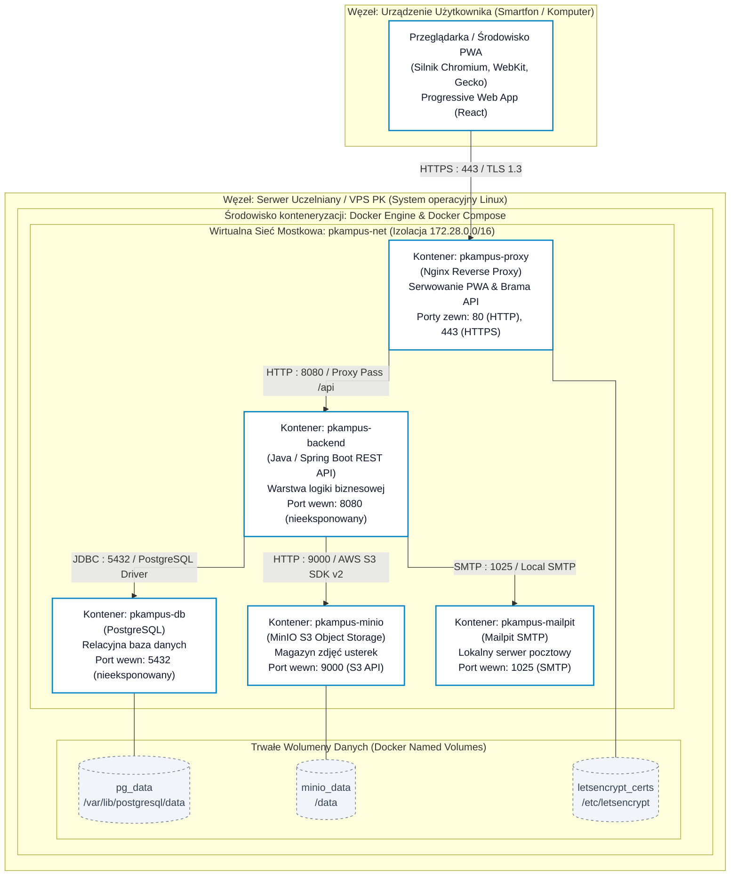

# Diagram Wdrożenia Systemu PKampus (UML Deployment Diagram)

---

## 1. Wprowadzenie i Cel Diagramu Wdrożenia

Diagram wdrożenia w notacji języka UML (ang. *UML Deployment Diagram*) stanowi kluczowy element projektu technicznego systemu informatycznego. Jego celem jest:
1. **Odwzorowanie fizycznej i wirtualnej topologii środowiska uruchomieniowego** – zdefiniowanie węzłów sprzętowych (komputery użytkowników, serwer uczelniany/VPS) oraz węzłów logicznych (kontenery Docker Engine).
2. **Prezentacja artefaktów oprogramowania (ang. *Execution Artifacts*)** – rozmieszczenie skompilowanych modułów aplikacji (SPA React, archiwum JAR Spring Boot, silnik PostgreSQL, magazyn MinIO, serwer Nginx) w dedykowanych kontenerach.
3. **Formalizacja protokołów i ścieżek komunikacji sieciowej** – określenie wykorzystywanych portów, protokołów (HTTPS, HTTP, JDBC, S3 API, SMTP) oraz mechanizmów bezpieczeństwa (izolacja sieciowa, szyfrowanie TLS 1.3).
4. **Zapewnienie powtarzalności środowiska (ang. *Infrastructure as Code - IaC*)** – precyzyjne powiązanie modelu architektonicznego z deklaratywną konfiguracją orkiestracji `docker-compose.yml`.

---

## 2. Diagram Wdrożenia Środowiska Konteneryzowanego (Docker Compose)


> **Konwencja graficzna:** Diagram zachowuje ścisłą dyscyplinę inżynierską – wszystkie linie połączeń prowadzone są ortogonalnie pod kątem prostym 90° (`curve: stepBefore`), bez przecinania obrysów węzłów oraz bez użycia elementów dekoracyjnych (emotikonów).



---

## 3. Specyfikacja Węzłów i Artefaktów Wykonawczych

Zgodnie z wymogami inżynierii oprogramowania każdy węzeł i artefakt środowiska wykonawczego posiada precyzyjną charakterystykę techniczną:

### 3.1. Tabela Węzłów Sprzętowych i Wirtualnych (Nodes)

| Identyfikator Węzła | Typ Węzła | Środowisko bazowe (OS / Runtime) | Adresacja / Rola |
| :--- | :--- | :--- | :--- |
| **Urządzenie Użytkownika (Smartfon / Komputer)** | Fizyczny (Smartfon Android/iOS, laptop, stacja robocza) | Dowolny system operacyjny (Android, iOS, Windows, Linux, macOS) | Klient HTTP uruchamiający przeglądarkę WWW lub zainstalowaną aplikację **PWA (Progressive Web Application)** z obsługą manifestu instalacyjnego, Service Workera i aparatu fotograficznego (zgłaszanie usterek). |
| **Serwer Uczelniany / VPS PK** | Maszyna wirtualna / serwer dedykowany | Linux Server (Dystrybucja serwerowa x86_64, np. Ubuntu/Debian) | Główny węzeł aplikacyjny hostujący silnik Docker Engine oraz orkiestrator Docker Compose. |

---

### 3.2. Tabela Kontenerów i Artefaktów Oprogramowania (Execution Artifacts)

| Nazwa Kontenera | Obraz bazowy (Docker Image) | Artefakt oprogramowania | Porty wewn. / zewn. | Rola i odpowiedzialność w systemie |
| :--- | :--- | :--- | :--- | :--- |
| **`pkampus-proxy`** | `nginx:alpine` | Skompilowany pakiet **React PWA** (`manifest.webmanifest`, `sw.js`, HTML/JS/CSS, ikony) + plik `nginx.conf` | **Zewn:** 80 (HTTP), 443 (HTTPS)<br/>**Wewn:** brak | Brama wejściowa serwera (Reverse Proxy). Wymusza HTTPS, serwuje statyczne zasoby PWA (App Shell, cache), terminacja SSL oraz przekazuje zapytania `/api/*` do kontenera backendu. |
| **`pkampus-backend`** | `eclipse-temurin:alpine` | `pkampus-backend.jar` (Spring Boot Executable JAR) | **Zewn:** brak (izolacja)<br/>**Wewn:** 8080 | Główna warstwa logiki biznesowej, uwierzytelniania JWT, transakcji rezerwacji pralni/salek, walidacji czarnej listy oraz obsługi zgłoszeń usterek. |
| **`pkampus-db`** | `postgres:alpine` | Instancja silnika PostgreSQL + DDL schematu | **Zewn:** brak (izolacja)<br/>**Wewn:** 5432 | Relacyjny magazyn danych. Przechowuje 14 tabel domenowych, realizuje blokady transakcyjne, egzekwuje unikalne indeksy cząstkowe i integralność referencyjną. |
| **`pkampus-minio`** | `minio/minio` | Silnik MinIO Object Storage | **Zewn:** brak<br/>**Wewn:** 9000 (S3 API), 9001 (Console) | Magazyn obiektowy kompatybilny z protokołem Amazon S3. Przechowuje pliki zdjęć usterek (`issue_photos`) w dedykowanym buckecie `pkampus-issues`. |
| **`pkampus-mailpit`** | `axllent/mailpit` | Serwer Mailpit | **Zewn:** 8025 (Web UI - dev only)<br/>**Wewn:** 1025 (SMTP) | Serwer pocztowy w kontenerze. Przechwytuje wiadomości e-mail z linkami aktywacyjnymi meldunku i powiadomieniami o rezerwacjach bez ryzyka wysyłki spamu. |

---

## 4. Architektura Sieciowa i Bezpieczeństwo

### 4.1. Segmentacja Sieci i Zasada Minimalnych Uprawnień (Least Privilege)
Architektura wdrożeniowa realizuje koncepcję **głębokiej obrony (ang. *Defense in Depth*)**:
1. **Pojedynczy publiczny punkt wejścia**: Jedynym kontenerem posiadającym zmapowane porty publiczne na interfejsie sieciowym serwera (`0.0.0.0`) jest `pkampus-proxy` (porty 80 i 443).
2. **Izolacja baz danych i storage'u**: Kontenery `pkampus-db`, `pkampus-backend`, `pkampus-minio` oraz `pkampus-mailpit` operują wyłącznie wewnątrz wirtualnej sieci mostkowej Docker (`pkampus-net`, podsieć `172.28.0.0/16`). Żaden podmiot z publicznego internetu nie ma możliwości bezpośredniego nawiązania połączenia z portem bazy danych (5432) ani S3 API (9000).
3. **Translacja nazw DNS w sieci Docker**: Kontenery komunikują się ze sobą za pośrednictwem wbudowanego resolvera DNS Dockera, posługując się unikalnymi nazwami usług (np. `jdbc:postgresql://pkampus-db:5432/pkampus_db`).

### 4.2. Protokoły Komunikacyjne i Szyfrowanie

```
[Klient / Smartfon / PWA]
        │
        │  HTTPS (TLS 1.3, AES-256-GCM, Port 443)
        ▼
[pkampus-proxy (Nginx)]
   │                │
   │ (PWA Assets)   │  HTTP (REST API JSON, Port 8080)
   ▼                ▼
[App Shell / SW] [pkampus-backend (Spring Boot)]
                    │
                    ├── JDBC / TCP (Port 5432) ──────────► [pkampus-db (PostgreSQL)]
                    │
                    ├── S3 API / HTTP (Port 9000) ───────► [pkampus-minio (S3 Storage)]
                    │
                    └── SMTP / TCP (Port 1025) ──────────► [pkampus-mailpit (Mailpit)]
```

### 4.3. Polityka Bezpieczeństwa HTTP na poziomie Nginx
Kontener Reverse Proxy wyposażony jest w zestaw nagłówków zabezpieczających:
- `Strict-Transport-Security: max-age=31536000; includeSubDomains` (wymuszenie HTTPS / HSTS),
- `X-Frame-Options: SAMEORIGIN` (ochrona przed atakami Clickjacking),
- `X-Content-Type-Options: nosniff` (blokada MIME-sniffing),
- `Content-Security-Policy: default-src 'self'; img-src 'self' data:; connect-src 'self' /api;` (ochrona przed wstrzykiwaniem skryptów XSS).

---

## 5. Architektura Pamięci Masowej i Wolumeny Trwałe (Storage & Volumes)

Zgodnie z zasadą bezstanowości kontenerów aplikacyjnych (ang. *Stateless Containers*), wszystkie dane wymagające trwałego przechowywania (ang. *Persistence*) są odseparowane od cyklu życia kontenerów i mapowane do dedykowanych wolumenów Docker (ang. *Named Volumes*):

| Nazwa Wolumenu | Ścieżka docelowa w kontenerze | Typ danych | Polityka kopii zapasowych (Backup Policy) |
| :--- | :--- | :--- | :--- |
| **`pg_data`** | `/var/lib/postgresql/data` | Fizyczne pliki relacyjnej bazy danych PostgreSQL (tabele, indeksy, WAL). | Codzienny automatyczny zrzut logiczny poleceniem `pg_dump` do archiwum skompresowanego `*.sql.gz` na wydzieloną przestrzeń backupową. |
| **`minio_data`** | `/data` | Binarny magazyn obiektowy MinIO (oryginalne pliki zdjęć usterek JPG/PNG). | Kopia lustrzana bucketu `pkampus-issues` z użyciem narzędzia `mc mirror` na zewnętrzny serwer plików PK. |
| **`letsencrypt_certs`**| `/etc/letsencrypt` | Certyfikaty SSL/TLS wygenerowane przez certbot oraz klucze prywatne. | Odtwarzalny zasób; backup kluczy prywatnych i konfiguracji certyfikatu. |

---

## 6. Produkcyjna Konfiguracja Orkiestracji: `docker-compose.yml`

Poniższy deklaratywny plik konfiguracyjny stanowi referencyjną implementację środowiska wdrożeniowego PKampus:

```yaml
version: '3.8'

networks:
  pkampus-net:
    driver: bridge
    ipam:
      config:
        - subnet: 172.28.0.0/16

volumes:
  pg_data:
    driver: local
  minio_data:
    driver: local
  letsencrypt_certs:
    driver: local

services:
  # -------------------------------------------------------------
  # Brama wejściowa Reverse Proxy & Serwer Statyczny SPA React
  # -------------------------------------------------------------
  pkampus-proxy:
    image: nginx:alpine
    container_name: pkampus-proxy
    restart: unless-stopped
    ports:
      - "80:80"
      - "443:443"
    volumes:
      - ./infra/nginx/nginx.conf:/etc/nginx/nginx.conf:ro
      - ./infra/nginx/conf.d:/etc/nginx/conf.d:ro
      - ./frontend/dist:/usr/share/nginx/html:ro
      - letsencrypt_certs:/etc/letsencrypt:ro
    networks:
      - pkampus-net
    depends_on:
      pkampus-backend:
        condition: service_healthy

  # -------------------------------------------------------------
  # Warstwa Aplikacyjna i Logika Biznesowa (Spring Boot)
  # -------------------------------------------------------------
  pkampus-backend:
    build:
      context: ./backend
      dockerfile: Dockerfile
    image: pkampus-backend:latest
    container_name: pkampus-backend
    restart: unless-stopped
    environment:
      - SPRING_PROFILES_ACTIVE=prod
      - SPRING_DATASOURCE_URL=jdbc:postgresql://pkampus-db:5432/pkampus_db
      - SPRING_DATASOURCE_USERNAME=${DB_USER:-pkampus_app}
      - SPRING_DATASOURCE_PASSWORD=${DB_PASSWORD:-pkampus_secure_pass_2026}
      - SPRING_JPA_HIBERNATE_DDL_AUTO=validate
      - MINIO_ENDPOINT=http://pkampus-minio:9000
      - MINIO_ACCESS_KEY=${MINIO_ROOT_USER:-pkampus_admin}
      - MINIO_SECRET_KEY=${MINIO_ROOT_PASSWORD:-minio_secure_pass_2026}
      - MINIO_BUCKET_NAME=pkampus-issues
      - SPRING_MAIL_HOST=${MAIL_HOST:-pkampus-mailpit}
      - SPRING_MAIL_PORT=${MAIL_PORT:-1025}
      - JWT_SECRET=${JWT_SECRET:-9a8b7c6d5e4f3a2b1c0d9e8f7a6b5c4d3e2f1a0b9c8d7e6f5a4b3c2d1e0f}
    networks:
      - pkampus-net
    depends_on:
      pkampus-db:
        condition: service_healthy
      pkampus-minio:
        condition: service_healthy
    healthcheck:
      test: ["CMD-SHELL", "wget -qO- http://localhost:8080/actuator/health | grep UP || exit 1"]
      interval: 15s
      timeout: 5s
      retries: 5
      start_period: 25s

  # -------------------------------------------------------------
  # Relacyjna Baza Danych (PostgreSQL)
  # -------------------------------------------------------------
  pkampus-db:
    image: postgres:alpine
    container_name: pkampus-db
    restart: unless-stopped
    environment:
      - POSTGRES_DB=pkampus_db
      - POSTGRES_USER=${DB_USER:-pkampus_app}
      - POSTGRES_PASSWORD=${DB_PASSWORD:-pkampus_secure_pass_2026}
    volumes:
      - pg_data:/var/lib/postgresql/data
      - ./backend/src/main/resources/db/init.sql:/docker-entrypoint-initdb.d/init.sql:ro
    networks:
      - pkampus-net
    healthcheck:
      test: ["CMD-SHELL", "pg_isready -U ${DB_USER:-pkampus_app} -d pkampus_db"]
      interval: 10s
      timeout: 5s
      retries: 5

  # -------------------------------------------------------------
  # Magazyn Obiektowy na Zdjęcia Usterek (MinIO S3)
  # -------------------------------------------------------------
  pkampus-minio:
    image: minio/minio:latest
    container_name: pkampus-minio
    restart: unless-stopped
    command: server /data --console-address ":9001"
    environment:
      - MINIO_ROOT_USER=${MINIO_ROOT_USER:-pkampus_admin}
      - MINIO_ROOT_PASSWORD=${MINIO_ROOT_PASSWORD:-minio_secure_pass_2026}
    volumes:
      - minio_data:/data
    networks:
      - pkampus-net
    healthcheck:
      test: ["CMD-SHELL", "mc ready local || exit 1"]
      interval: 15s
      timeout: 5s
      retries: 3

  # -------------------------------------------------------------
  # Usługa Pocztowa Dev/Test (Mailpit)
  # -------------------------------------------------------------
  pkampus-mailpit:
    image: axllent/mailpit
    container_name: pkampus-mailpit
    restart: unless-stopped
    ports:
      - "127.0.0.1:8025:8025" # Dostęp do panelu WWW wyłącznie z localhost / tunelu SSH
    networks:
      - pkampus-net
```

---

## 7. Macierz Zgodności Architektury Wdrożenia z Wymaganiami Niefunkcjonalnymi (NFR)

| Identyfikator Wymagania | Nazwa Wymagania | Realizacja w Architekturze Wdrożeniowej | Status |
| :--- | :--- | :--- | :--- |
| **NFR-DEP-01** | Wdrożenie i konteneryzacja (IaC) | Kompletne środowisko (React PWA, Nginx, Spring Boot, PostgreSQL, MinIO, Mailpit) spakowane i uruchamiane pojedynczym poleceniem `docker compose up -d`, gwarantując 100% spójności między dev/test a VPS PK. | Zgodny |
| **NFR-SEC-01** | Bezpieczeństwo sesji (JWT) | Bezstanowe uwierzytelnianie tokenami JWT podpisywanymi kryptograficznie w Spring Boot; brak stanu sesji w kontenerze ułatwia horyzontalną skalowalność. | Zgodny |
| **NFR-SEC-02** | Ochrona poświadczeń (BCrypt) | Bezpieczne haszowanie haseł algorytmem BCrypt z soleniem po stronie Spring Security przed utrwaleniem w relacyjnej bazie danych PostgreSQL. | Zgodny |
| **NFR-SEC-03** | Bezpieczeństwo plików (MinIO S3) | Ścisła walidacja MIME-type i limitu 5 MB na poziomie Spring Boot API; pliki binarne zdjęć usterek i awatarów izolowane w buckecie MinIO `pkampus-issues`. | Zgodny |
| **NFR-SEC-04** | Szyfrowanie transmisji sieciowej (TLS 1.3 / HTTPS) | Nginx Reverse Proxy (`pkampus-proxy`) jako jedyny publiczny punkt styku wymusza protokół HTTPS, szyfrowanie TLS 1.3, nagłówek HSTS oraz polityki CSP i anty-clickjacking. | Zgodny |
| **NFR-SEC-05** | Izolacja sieciowa bazy danych i magazynu | Baza PostgreSQL oraz MinIO nie publikują portów na interfejsie publicznym serwera; komunikacja backendu z bazą i storage odbywa się wyłącznie wewnątrz izolowanej sieci `pkampus-net`. | Zgodny |
| **NFR-CONC-01** | Współbieżność i integralność transakcyjna | Mechanizmy transakcyjne Spring Data JPA oraz unikalne indeksy warunkowe PostgreSQL (`idx_laundry_no_overlap`, `idx_room_no_overlap`) wykluczają podwójne rezerwacje w warunkach wielodostępnych. | Zgodny |
| **NFR-PERF-01** | Czas odpowiedzi interfejsu i backendu | Zasoby PWA buforowane w Service Workerze klienta; Nginx kompresuje assety (Gzip/Brotli); zapytania bazy wsparte indeksami B-drzewa, co gwarantuje czasy odpowiedzi < 200 ms. | Zgodny |
| **NFR-USAB-01** | Mobilność i instalowalność (PWA) | Architektura Progressive Web App umożliwia instalację ikony na ekranie głównym smartfona bez sklepów z aplikacjami oraz bezpośredni dostęp do systemowego API aparatu fotograficznego. | Zgodny |
| **NFR-REL-01** | Niezawodność i samonaprawa usług | Wszystkie kontenery posiadają politykę `restart: unless-stopped` oraz zdefiniowane procedury `healthcheck`, gwarantujące sekwencyjny start kontenerów i automatyczny restart w razie awarii procesu. | Zgodny |
| **NFR-REL-02** | Trwałość danych (Data Persistence) | Baza danych i pliki MinIO utrwalane są w dedykowanych wolumenach Docker (`pg_data`, `minio_data`), co zabezpiecza stan aplikacji przed aktualizacjami i restartami obrazów kontenerowych. | Zgodny |
