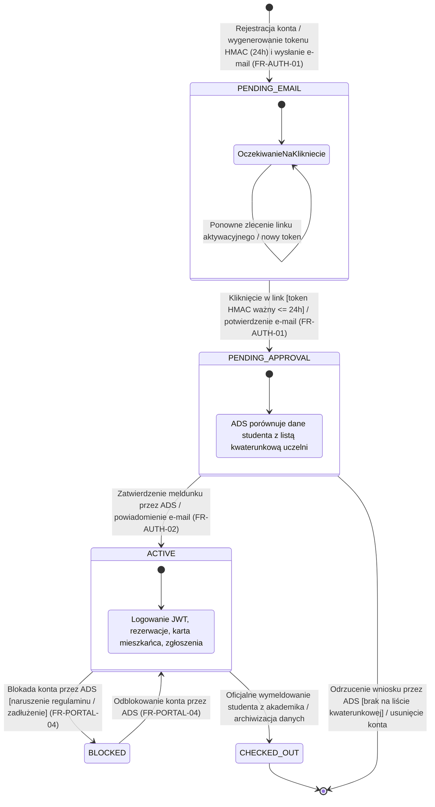
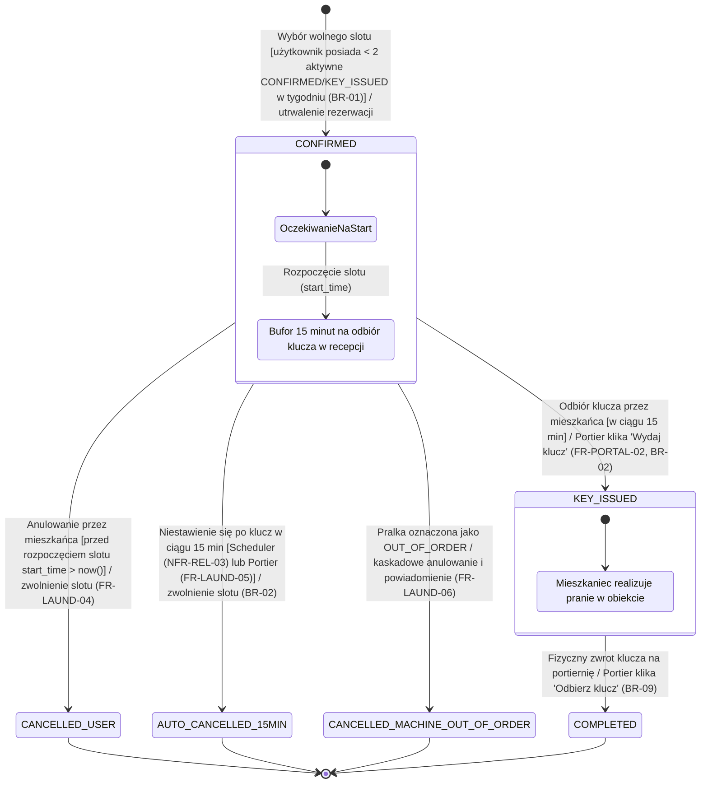
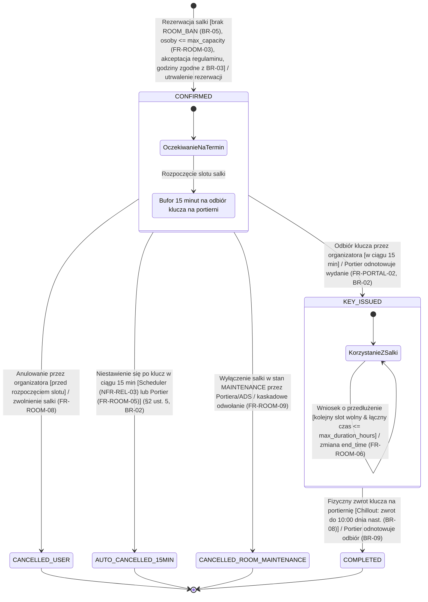
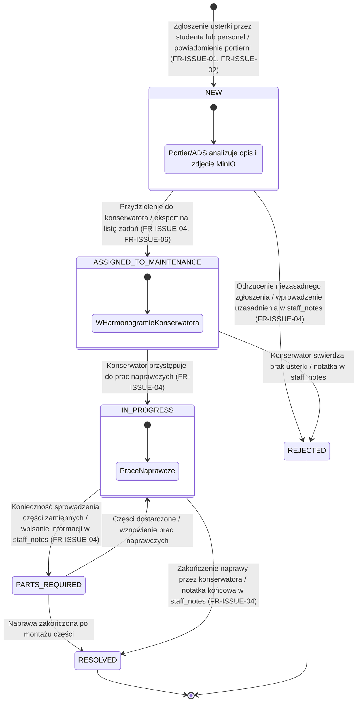
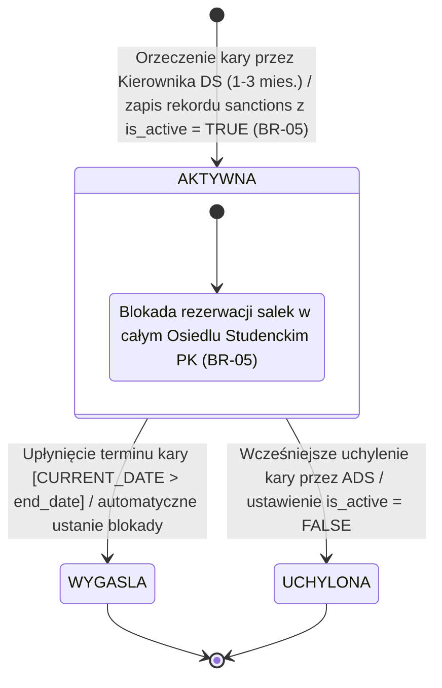
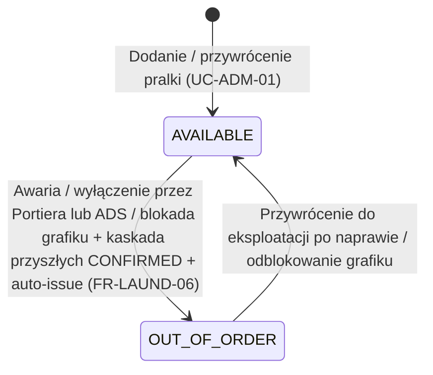
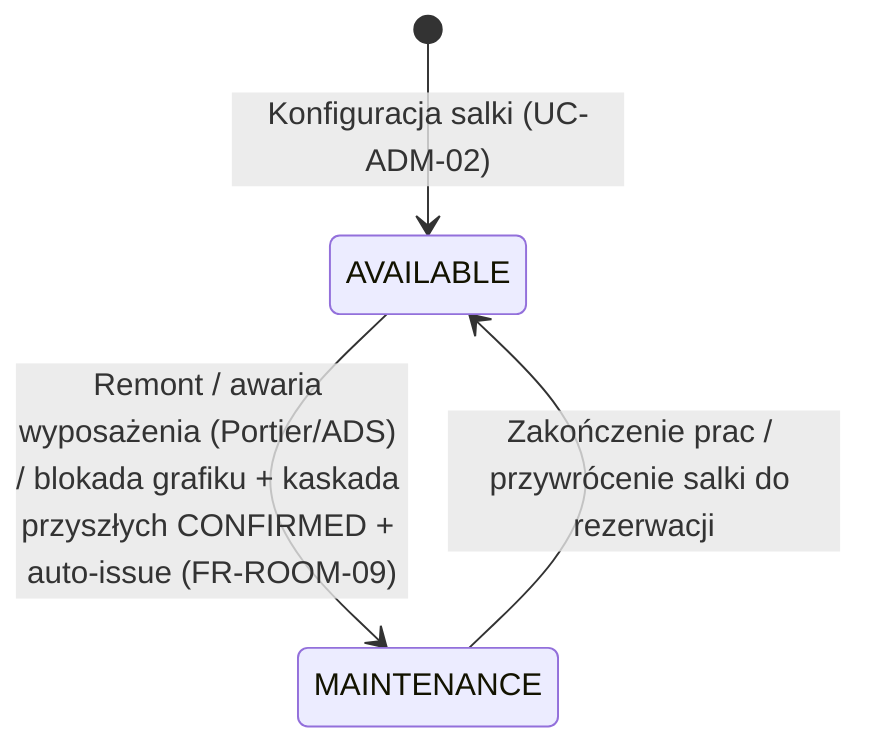
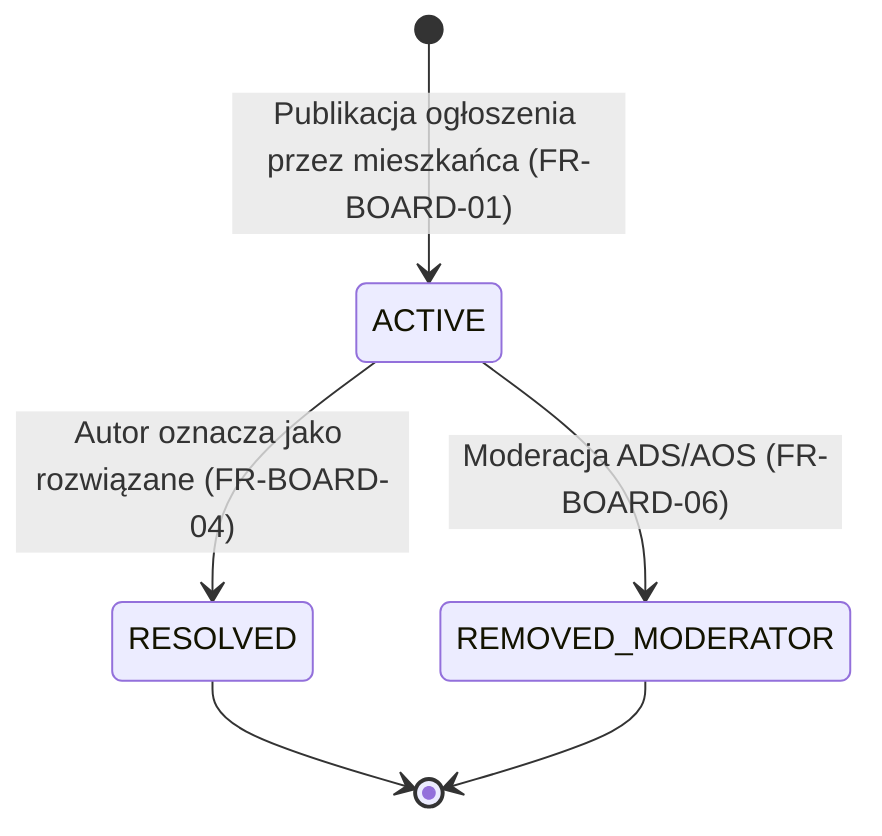

# Diagramy Maszyny Stanów (UML State Machine Diagrams) - System PKampus

---

## 1. Wprowadzenie i Konwencja

Zgodnie z metodyką inżynierii oprogramowania (modelowanie dynamiki systemu, stany obiektów, warunki dozoru oraz akcje przejść), niniejszy dokument przedstawia formalne **Diagramy Maszyny Stanów UML** dla kluczowych encji systemu PKampus.

Wszystkie nazwy stanów, ograniczenia i dozwolone przejścia są w 100% zgodne ze skryptem DDL ([Model_Bazy_Danych_ERD.md](Model_Bazy_Danych_ERD.md)) oraz regułami biznesowymi ([Wymagania_projektowe.md](Wymagania_projektowe.md)).

Notacja przejść stosuje standard UML: `Zdarzenie [Warunek_Dozoru] / Akcja`.

---

## 2. Maszyna Stanów 1: Cykl Życia Konta Użytkownika (`users.status`)

Cykl życia konta użytkownika odzwierciedla dwuetapową procedurę rejestracji i autoryzacji: weryfikację adresu e-mail za pomocą podpisanego linku z tokenem HMAC (TTL: 24h, `FR-AUTH-01`) oraz zatwierdzenie meldunku przez Administratora DS na podstawie uczelnianych list kwaterunkowych (`FR-AUTH-02`). Zgodnie z regułą **`BR-06`**, do momentu zatwierdzenia meldunku konto w stanie `PENDING_APPROVAL` ma bezwzględną blokadę tworzenia rezerwacji i zgłaszania usterek.

### Reguły przejść:
* `PENDING_EMAIL` -> `PENDING_APPROVAL`: Wymaga kliknięcia w link z kryptograficznym tokenem HMAC-SHA256 w ciągu 24 godzin (`FR-AUTH-01`).
* `PENDING_APPROVAL` (Stan oczekiwania): Zgodnie z `BR-06` użytkownik nie posiada możliwości rezerwacji zasobów ani zgłaszania usterek do czasu zatwierdzenia meldunku.
* `PENDING_APPROVAL` -> `ACTIVE`: Wyzwalane wyłącznie przez autoryzowanego Administratora DS (`DORM_ADMIN`) w portalu administracyjnym (`FR-AUTH-02`).
* `ACTIVE` -> `BLOCKED`: Blokada administracyjna nakładana przez ADS (`FR-PORTAL-04`).

---

## 3. Maszyna Stanów 2: Cykl Życia Rezerwacji Pralni (`laundry_bookings.status`)

Modeluje obieg slotu pralniczego z uwzględnieniem limitu maksymalnie 2 aktywnych rezerwacji (`CONFIRMED`/`KEY_ISSUED`) na tydzień kalendarzowy (`BR-01`), 15-minutowej reguły przepadku rezerwacji (`BR-02`, §2 ust. 5 Regulaminu) oraz fizycznego wydania i zwrotu klucza na portierni (`BR-09`).

Wszystkie statusy odpowiadają ograniczeniu `CHECK (status IN ('CONFIRMED', 'KEY_ISSUED', 'COMPLETED', 'CANCELLED_USER', 'AUTO_CANCELLED_15MIN', 'CANCELLED_MACHINE_OUT_OF_ORDER'))` w tabeli `laundry_bookings`.

### Reguły przejść i strażnicy (Guards):
* **Do CONFIRMED:** System weryfikuje limit `BR-01`: maksymalnie **2** rezerwacje ze statusem `CONFIRMED` lub `KEY_ISSUED` z `start_time` w bieżącym tygodniu kalendarzowym (pon–niedz., `Europe/Warsaw`); horyzont max 7 dni w przód.
* **Do CANCELLED_USER:** Mieszkaniec może anulować rezerwację w dowolnym momencie przed godziną rozpoczęcia slotu (`start_time > now()`, `FR-LAUND-04`).
* **Do AUTO_CANCELLED_15MIN:** Następuje automatycznie przez Spring Scheduler (`NFR-REL-03`) lub ręcznie przez portiera (`FR-LAUND-05`), gdy minęło 15 minut od startu, a klucz nie został pobrany (`BR-02`).
* **Do KEY_ISSUED:** Wydanie klucza fizycznego przez portiera w recepcji (`FR-PORTAL-02`).
* **Do COMPLETED:** Nadawany wyłącznie w momencie fizycznego zwrotu klucza na portiernię przez portiera (`BR-09`). System nie domyka rezerwacji automatycznie do stanu `COMPLETED`.

---

## 4. Maszyna Stanów 3: Cykl Życia Rezerwacji Salki Tematycznej (`room_bookings.status`)

Odwzorowuje regulaminowy cykl rezerwacji salki tematycznej (standard, cicha nauka „Kujon”, Chillout) zgodnie ze słownikiem `CHECK (status IN ('CONFIRMED', 'KEY_ISSUED', 'COMPLETED', 'CANCELLED_USER', 'AUTO_CANCELLED_15MIN', 'CANCELLED_ROOM_MAINTENANCE'))`.

### Reguły przejść:
* **Warunki rezerwacji (do CONFIRMED):** Weryfikacja braku aktywnej sankcji `ROOM_BAN` o zasięgu kampusowym (`BR-05`), weryfikacja limitu pojemności (`FR-ROOM-03`), akceptacja odpowiedzialności materialnej (`terms_accepted = TRUE`). Ramy czasowe: dla salek standardowych/Kujon max 4 godziny w oknie 06:00–23:30; dla salki Chillout do 12 godzin w oknie 14:00–02:00 z flagą `spans_midnight = TRUE` (`BR-03`, §5 ust. 1 i 8 Regulaminu).
* **Przedłużenie (`extend`):** Możliwe w stanie `KEY_ISSUED` (`FR-ROOM-06`), jeśli kolejny slot jest wolny i łączny czas nie przekracza dopuszczalnego maksimum (`max_duration_hours`).
* **Zwrot klucza i stan COMPLETED:** Nadawany przez portiera przy zwrocie klucza (`BR-09`; dla Chillout do 10:00 rano dnia następnego wg §5 ust. 10 / `BR-08`).

---

## 5. Maszyna Stanów 4: Cykl Życia Zgłoszenia Usterki (`issues.status`)

Cykl życia zgłoszenia usterki jest w 100% zgodny z ograniczeniem DDL:
`CHECK (status IN ('NEW', 'ASSIGNED_TO_MAINTENANCE', 'IN_PROGRESS', 'RESOLVED', 'REJECTED', 'PARTS_REQUIRED'))`.

Zgodnie z decyzją architektoniczną `ADR-09`, system nie posiada osobnej tabeli historii komentarzy ani sztucznego stanu `CLOSED`; komunikacja odbywa się przez pole `staff_notes TEXT` aktualizowane przy zmianie statusu.

### Reguły przejść:
* `NEW` -> `ASSIGNED_TO_MAINTENANCE`: Portier przydziela usterkę; wygenerowanie dziennej listy zadań (`FR-ISSUE-06`) automatycznie przestawia status na `ASSIGNED_TO_MAINTENANCE`.
* `IN_PROGRESS` <-> `PARTS_REQUIRED`: Przejście w stan oczekiwania na części z jednoczesnym odnotowaniem w `staff_notes` widocznym dla studenta.
* `IN_PROGRESS` / `PARTS_REQUIRED` -> `RESOLVED`: Skuteczne usunięcie awarii przez konserwatora kończy cykl życia usterki.

---

## 6. Maszyna Stanów 5: Cykl Życia Sankcji Regulaminowej (`sanctions`)

Zgodnie z modelem tabeli `sanctions`, sankcja `ROOM_BAN` orzekana na okres od 1 do 3 miesięcy (§6 ust. 2 Regulaminu, `BR-05`) posiada flagę `is_active BOOLEAN` oraz daty `start_date` i `end_date`. Stany `AKTYWNA`/`WYGASLA`/`UCHYLONA` są pojęciowe (derywowane z `is_active` i dat, bez osobnej kolumny statusu w DDL).

### Reguły weryfikacji sankcji w zapytaniach:
* Sankcja blokuje rezerwacje salki wtedy i tylko wtedy, gdy:
  `is_active = TRUE AND CURRENT_DATE BETWEEN start_date AND end_date`.
* Uchylenie kary przez ADS polega na aktualizacji rekordu: `UPDATE sanctions SET is_active = FALSE WHERE id = ...`.

---

## 7. Maszyna Stanów 6: Stan Techniczny Pralki (`laundry_machines.status`)

Status zasobu zgodnie z `CHECK (status IN ('AVAILABLE', 'OUT_OF_ORDER'))`. Kaskada na rezerwacje: wyłącznie przyszłe `CONFIRMED` → `CANCELLED_MACHINE_OUT_OF_ORDER` (`FR-LAUND-06`, `ADR-06`); sloty `KEY_ISSUED` nie są automatycznie anulowane.

### Reguły przejść:
* `AVAILABLE` → `OUT_OF_ORDER`: Endpoint awarii; brak nowych rezerwacji; anulowanie przyszłych `CONFIRMED`; auto-zgłoszenie `issues` (`BR-07`).
* `OUT_OF_ORDER` → `AVAILABLE`: Po usunięciu usterki personel przywraca pralkę do puli (operacja administracyjna).

---

## 8. Maszyna Stanów 7: Dostępność Salki (`thematic_rooms.status`)

Status zasobu zgodnie z `CHECK (status IN ('AVAILABLE', 'MAINTENANCE'))`. Analogicznie do pralek: kaskada dotyczy przyszłych `CONFIRMED` → `CANCELLED_ROOM_MAINTENANCE` (`FR-ROOM-09`, `ADR-06`).

### Reguły przejść:
* `AVAILABLE` → `MAINTENANCE`: Blokada nowych rezerwacji; anulowanie przyszłych `CONFIRMED`; auto-issue z `reporter_id` (`BR-07`).
* `MAINTENANCE` → `AVAILABLE`: Przywrócenie po remoncie/naprawie.

---

## 9. Maszyna Stanów 8: Cykl Życia Ogłoszenia (`posts.status`)

Statusy zgodne z `CHECK (status IN ('ACTIVE', 'RESOLVED', 'REMOVED_MODERATOR'))`. Soft-delete (`is_deleted`) jest niezależną flagą i nie zastępuje statusu moderacji.

### Reguły przejść:
* `ACTIVE` → `RESOLVED`: Wyłącznie autor posta (`UC-BOARD-04`).
* `ACTIVE` → `REMOVED_MODERATOR`: Moderacja (`UC-BOARD-05`); treść znika z feedu mieszkańców.
* Usunięcie przez autora przez `is_deleted = TRUE` nie zmienia słownika statusów DDL (osobna ścieżka soft-delete w `UC-BOARD-04`).
