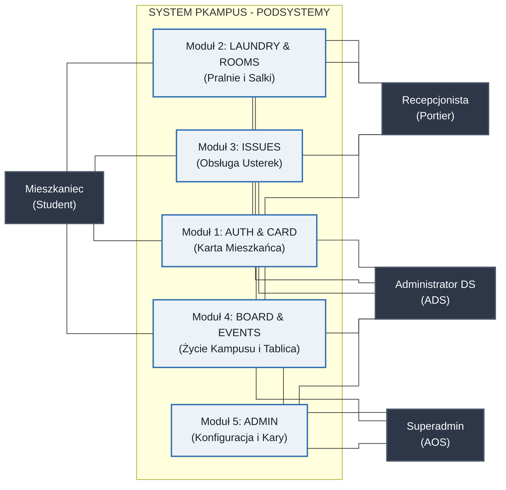
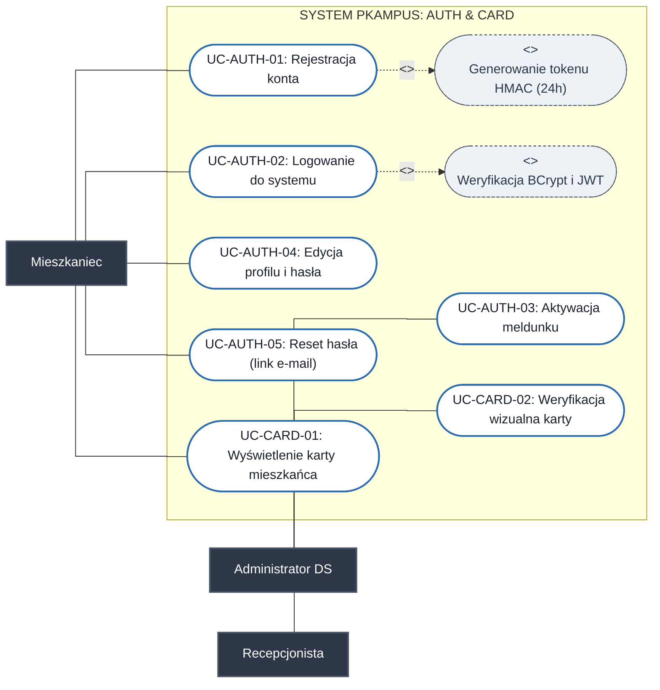
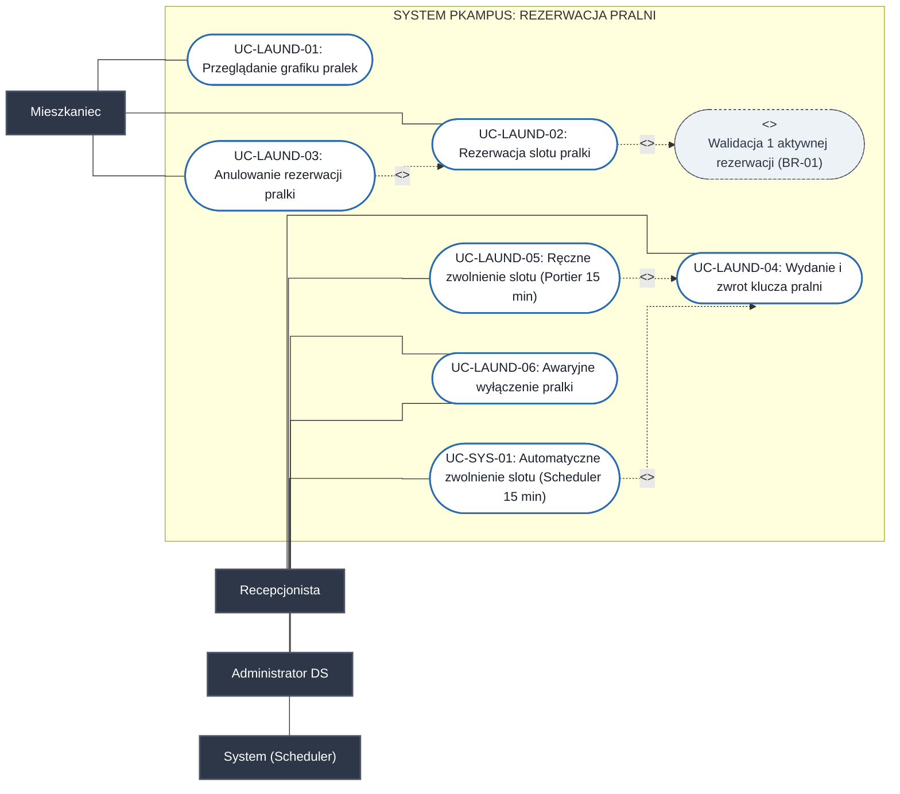
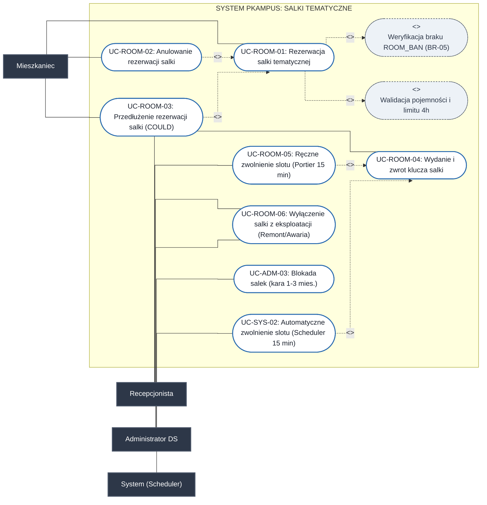
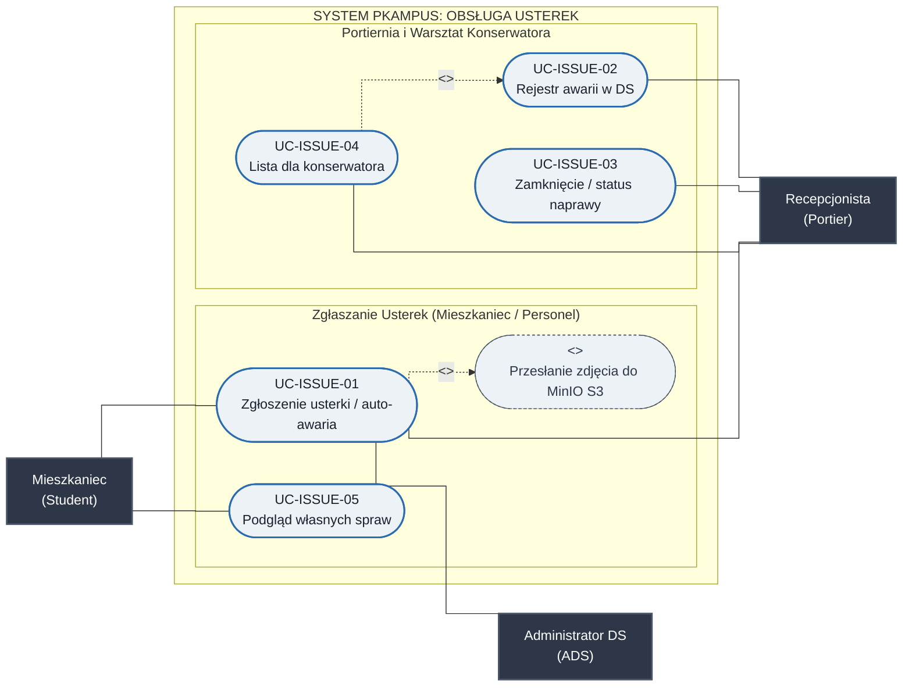
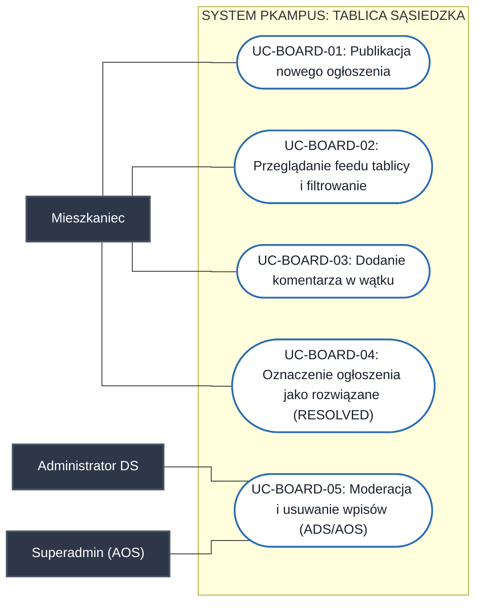
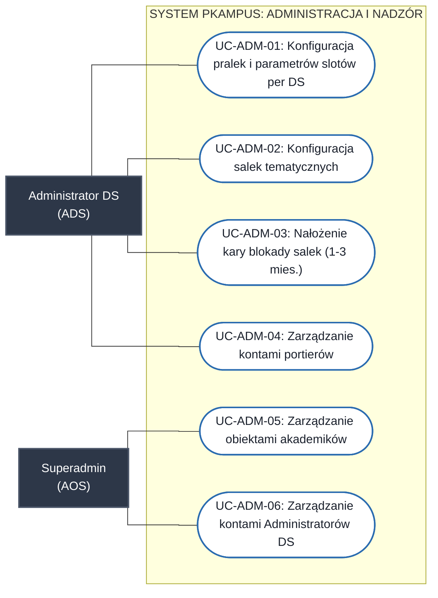

# Specyfikacja Diagramów Przypadków Użycia (UML Use Case) - System PKampus

---

## 1. Aktorzy Systemu

1. **Mieszkaniec (Student)** – zameldowany student korzystający z funkcji bytowych, rezerwacji, karty i tablicy.
2. **Recepcjonista (Portier)** – pracownik portierni (weryfikacja wejść, wydawanie/odbiór kluczy, koordynacja napraw, komunikaty dyżurne).
3. **Administrator Domu Studenckiego (ADS / DORM_ADMIN)** – Kierownik DS / pracownik Administracji Domu Studenckiego (weryfikacja meldunków, konfiguracja zasobów, nakładanie sankcji regulaminowych, oficjalne komunikaty DS).
4. **Superadmin (AOS / SUPER_ADMIN)** – Kierownik OS / pracownik Administracji Osiedla Studenckiego (zarządzanie obiektami domów studenckich, publikacja oficjalnych komunikatów ogólnokampusowych, globalna moderacja tablicy kampusu).
5. **System (Scheduler)** – automatyczny proces uwalniający nieodebrane rezerwacje po 15 minutach.

### 1.1. Hierarchia i Generalizacja Aktorów (UML Actor Generalization)

Zgodnie z notacją UML przypadków użycia, aktorzy personelu oraz mieszkańcy dzielą wspólne cechy użytkownika uwierzytelnionego, a uprawnienia zarządcze personelu tworzą jednoznaczną hierarchię generalizacji (`--|>`):

```mermaid
flowchart BT
    classDef actorStyle fill:#2d3748,stroke:#4a5568,stroke-width:2px,color:#fff;
    classDef abstractStyle fill:#4a5568,stroke:#718096,stroke-width:2px,color:#fff,stroke-dasharray: 4 4;
    classDef systemStyle fill:#1a365d,stroke:#2b6cb0,stroke-width:2px,color:#fff;

    User["<<abstract>><br/>Użytkownik Systemu"]:::abstractStyle
    Student["Mieszkaniec<br/>(Student)"]:::actorStyle
    Staff["<<abstract>><br/>Pracownik Uczelni / OS PK"]:::abstractStyle
    Portier["Recepcjonista<br/>(Portier)"]:::actorStyle
    AdminDS["Administrator DS<br/>(ADS / Kierownik DS)"]:::actorStyle
    SuperAdmin["Superadministrator<br/>(AOS / Kierownik OS)"]:::actorStyle
    Sys["<<system>><br/>System (Spring Scheduler)"]:::systemStyle

    Student --|> User
    Staff --|> User
    Portier --|> Staff
    AdminDS --|> Staff
    SuperAdmin --|> Staff
```

---

## 2. Diagram Ogólny Architektury Przypadków Użycia (High-Level)



### 2.1. Macierz Asocjacji: Aktorzy a Podsystemy

| Aktor | M1: AUTH & CARD | M2: LAUNDRY & ROOMS | M3: ISSUES | M4: BOARD & EVENTS | M5: ADMIN |
| :--- | :---: | :---: | :---: | :---: | :---: |
| **Mieszkaniec (Student)** | Dostęp (Karta, profil) | Dostęp (Rezerwacje) | Dostęp (Zgłoszenia) | Dostęp (Tablica, kalendarz) | Brak dostępu |
| **Recepcjonista (Portier)** | Dostęp (Weryfikacja karty) | Dostęp (Klucze, blokada awaryjna) | Rejestr napraw i zgłaszanie awarii | Dostęp (Komunikaty dyżurne, pościel) | Brak dostępu |
| **Administrator DS (ADS)** | Weryfikacja meldunku | Wyłączenie awaryjne (Nadzór) | Zgłoszenia części wspólnych i auto-awaria (FR-LAUND-06) | Komunikaty i moderacja | Konfiguracja i kary |
| **Superadmin (AOS)** | Zarządzanie kontami ADS (`DORM_ADMIN`) | Brak operacji | Brak operacji | Komunikaty kampusowe i moderacja CAMPUS | Zarządzanie osiedlem i kontami ADS |

---

## 3. Pakiet 1: Uwierzytelnianie i Wirtualna Karta Mieszkańca (AUTH & CARD)



---

## 4. Pakiet 2A: Rezerwacja Pralni (LAUNDRY)



---

## 5. Pakiet 2B: Rezerwacja Salek Tematycznych (ROOMS)



---

## 6. Pakiet 3: Ewidencja i Obsługa Usterek (ISSUES)



---

## 7. Pakiet 4A: Tablica Ogłoszeń Sąsiedzkich (BOARD)



---

## 8. Pakiet 4B: Kalendarz i Komunikaty Dyżurne (EVENTS)


---

## 9. Pakiet 5: Administracja Zasobami i Nadzór (ADMIN)



---

## 10. Macierz Śledzenia Wymagań (Traceability Matrix)

| Wymaganie FR | Identyfikator Use Case | Nazwa przypadku użycia | Główny Aktor |
| :--- | :--- | :--- | :--- |
| **FR-AUTH-01, FR-AUTH-02** | **UC-AUTH-01, UC-AUTH-03** | Rejestracja konta i aktywacja meldunku przez ADS | Mieszkaniec, Admin DS |
| **FR-AUTH-03, FR-AUTH-04** | **UC-AUTH-02** | Logowanie i autoryzacja bezstanowa JWT (RBAC) | Wszyscy |
| **FR-AUTH-05** | **UC-ADM-04** | Zarządzanie kontami personelu portierni | Admin DS |
| **FR-AUTH-06** | **UC-AUTH-04** | Edycja profilu i zmiana hasła (BCrypt) | Mieszkaniec |
| **FR-AUTH-07** | **UC-AUTH-05** | Procedura resetowania hasła przez link e-mail | Mieszkaniec, System |
| **FR-AUTH-08** | **UC-ADM-06** | Zarządzanie kontami Administratorów DS (AOS) | Superadmin (AOS) |
| **FR-CARD-01 .. FR-CARD-04** | **UC-CARD-01, UC-CARD-02** | Karta mieszkańca i weryfikacja wzrokowa (anty-screenshot) | Mieszkaniec, Portier |
| **FR-LAUND-01** | **UC-ADM-01** | Konfiguracja pralek i parametrów slotów per DS | Admin DS |
| **FR-LAUND-02 .. FR-LAUND-04** | **UC-LAUND-01, UC-LAUND-02, UC-LAUND-03** | Harmonogram, rezerwacja pralki i anulowanie slotu przed startem | Mieszkaniec |
| **FR-LAUND-05** | **UC-LAUND-04, UC-LAUND-05, UC-SYS-01** | Odbiór i zwrot klucza pralni, ręczne i automatyczne zwalnianie slotu po 15 min | Portier, System (Scheduler) |
| **FR-LAUND-06** | **UC-LAUND-06** | Awaryjne wyłączenie pralki (OUT_OF_ORDER) i auto-zgłoszenie naprawy | Portier, Admin DS |
| **FR-ROOM-01, FR-ROOM-02** | **UC-ADM-02** | Katalog i parametryzacja salek per DS (Kujon, Chillout) | Admin DS |
| **FR-ROOM-03, FR-ROOM-04** | **UC-ROOM-01** | Rezerwacja salki (formularz organizatora, regulamin, brak ROOM_BAN) | Mieszkaniec |
| **FR-ROOM-05** | **UC-ROOM-04, UC-ROOM-05, UC-SYS-02** | Odbiór i zwrot klucza salki, ręczne i automatyczne zwalnianie slotu po 15 min | Portier, System (Scheduler) |
| **FR-ROOM-06** | **UC-ROOM-03** | Wniosek o przedłużenie rezerwacji salki w oknie slotu (COULD) | Mieszkaniec |
| **FR-ROOM-07** | **UC-ADM-03** | Ewidencja kar i czarna lista salek (ROOM_BAN 1–3 mies.) | Admin DS |
| **FR-ROOM-08** | **UC-ROOM-02** | Anulowanie rezerwacji salki przed startem (SHOULD) | Mieszkaniec |
| **FR-ROOM-09** | **UC-ROOM-06** | Wyłączenie salki z eksploatacji (Stan MAINTENANCE / Awaria) | Portier, Admin DS |
| **FR-ISSUE-01 .. FR-ISSUE-03** | **UC-ISSUE-01** | Zgłoszenie usterki ze zdjęciem MinIO, walidacja pokoju i pilność | Mieszkaniec, Portier, Admin DS |
| **FR-ISSUE-04** | **UC-ISSUE-02, UC-ISSUE-05** | Rejestr napraw portierni oraz podgląd własnych zgłoszeń mieszkańca | Portier, Admin DS, Mieszkaniec |
| **FR-ISSUE-05** | **UC-ISSUE-03** | Aktualizacja statusu naprawy i notatki personelu (staff_notes) | Portier, Admin DS |
| **FR-ISSUE-06** | **UC-ISSUE-04** | Generowanie listy zadań dla konserwatora | Portier |
| **FR-BOARD-01** | **UC-BOARD-01** | Publikacja nowego ogłoszenia sąsiedzkiego | Mieszkaniec |
| **FR-BOARD-02** | **UC-BOARD-02** | Przeglądanie i filtrowanie feedu ogłoszeń | Mieszkaniec |
| **FR-BOARD-03** | **UC-BOARD-03** | Dodanie komentarza w wątku ogłoszenia | Mieszkaniec |
| **FR-BOARD-04, FR-BOARD-05** | **UC-BOARD-04** | Oznaczenie jako rozwiązane (RESOLVED) oraz usunięcie przez autora | Mieszkaniec |
| **FR-BOARD-06** | **UC-BOARD-05** | Moderacja i usuwanie wpisów na tablicy (REMOVED_MODERATOR) | Admin DS, Superadmin (AOS) |
| **FR-EVENT-01, FR-EVENT-02** | **UC-EVT-03, UC-EVT-01** | Publikacja oficjalnych komunikatów + baner przypiętych CRITICAL | Portier, Admin DS, Superadmin (AOS), Mieszkaniec |
| **FR-EVENT-03** | **UC-EVT-01** | Kalendarz oficjalnych terminów kampusu (pościel, wyłączenia) | Mieszkaniec |
| **FR-EVENT-04** | **UC-EVT-02** | Wydarzenia mieszkańców (COULD) | Mieszkaniec |
| **FR-PORTAL-01 .. FR-PORTAL-04** | **UC-LAUND-04, UC-ROOM-04, UC-ADM-01 .. UC-ADM-04** | Dashboard recepcji, obieg kluczy, konfiguracja i meldunki | Portier, Admin DS |
| **FR-PORTAL-05** | **UC-ADM-05, UC-ADM-06, UC-EVT-03, UC-BOARD-05** | Zarządzanie akademikami, kontami ADS, komunikacja kampusowa i moderacja | Superadmin (AOS) |

---

## 11. Szczegółowe Tekstowe Specyfikacje Przypadków Użycia (Use Case Specifications)

Zgodnie ze standardem inżynierii oprogramowania (warsztat wykładowy: uczestnicy, warunki początkowe, scenariusz główny, rozszerzenia/ścieżki alternatywne, warunki końcowe), poniżej przedstawiono pełną specyfikację tekstową przypadków użycia systemu PKampus. Wszystkie identyfikatory, reguły biznesowe i stany są w 100% zsynchronizowane z modelem ERD/DDL oraz specyfikacją wymagań.

---

### 11.1. Pakiet 1: Uwierzytelnianie i Karta Mieszkańca (AUTH & CARD)

#### UC-AUTH-01: Rejestracja konta studenta
* **Aktor główny:** Mieszkaniec (nowy student)
* **Aktorzy pomocniczy:** Uczelniany serwer pocztowy (SMTP / Mailpit)
* **Warunki początkowe (Preconditions):** Użytkownik posiada aktywny adres e-mail i nie posiada zarejestrowanego konta w systemie.
* **Warunki końcowe (Postconditions):**
  * *Sukces:* W bazie utworzono rekord użytkownika w stanie `PENDING_APPROVAL` (po potwierdzeniu e-maila podpisanym linkiem z tokenem HMAC ważnym 24h wg `BR-06`), oczekujący na zatwierdzenie meldunku przez ADS (`FR-AUTH-02`).
  * *Porażka:* Brak konta lub odrzucenie formularza z komunikatem błędu.
* **Scenariusz główny (Główny ciąg akcji):**
  1. Student otwiera formularz rejestracji w portalu/aplikacji PKampus.
  2. Student podaje: imię, nazwisko, e-mail, hasło (min. 8 znaków, duża litera, cyfra, znak specjalny wg `NFR-SEC-02`), wybiera akademik oraz wskazuje przydzielony pokój.
  3. System waliduje unikalność adresu e-mail oraz siłę hasła.
  4. System tworzy rekord w tabeli `users` ze statusem `PENDING_EMAIL`, haszuje hasło algorytmem **BCrypt** (12 rund soli) i generuje kryptograficznie podpisany token weryfikacyjny HMAC-SHA256 (TTL: 24h wg `BR-06`).
  5. System wysyła wiadomość e-mail z linkiem aktywacyjnym na podany adres (`FR-AUTH-01`).
  6. Student odbiera pocztę i klika link aktywacyjny w ciągu 24h.
  7. System weryfikuje podpis tokenu, po czym zmienia status konta na `PENDING_APPROVAL`.
  8. System wyświetla informację o pomyślnej weryfikacji e-mail oraz oczekiwaniu na weryfikację meldunku przez administrację DS.
* **Rozszerzenia (Ścieżki alternatywne i obsługa błędów):**
  * **3a. Adres e-mail istnieje już w systemie:** System zwraca neutralną informację o wysłaniu instrukcji (ochrona przed enumeracją użytkowników).
  * **6a. Token weryfikacyjny wygasł (>24h):** System odrzuca żądanie (HTTP 410 Gone) i umożliwia ponowne wygenerowanie i wysłanie linku aktywacyjnego.
* **Powiązane wymagania:** `FR-AUTH-01`, `FR-AUTH-02`, `NFR-SEC-01`, `NFR-SEC-02`, `BR-06`.

#### UC-AUTH-02: Logowanie i autoryzacja (RBAC)
* **Aktor główny:** Wszyscy aktorzy (Mieszkaniec, Portier, ADS, AOS)
* **Warunki początkowe:** Konto użytkownika istnieje w bazie danych.
* **Warunki końcowe:**
  * *Sukces:* Użytkownik uwierzytelniony; klient otrzymuje bezstanowy Access Token JWT w odpowiedzi JSON, przekazywany w nagłówku HTTP `Authorization: Bearer <token>` (`NFR-SEC-01`).
  * *Porażka:* Brak dostępu; zarejestrowanie nieudanej próby uwierzytelnienia.
* **Scenariusz główny:**
  1. Użytkownik wprowadza adres e-mail i hasło.
  2. System weryfikuje istnienie konta, sprawdza zgodność hasła funkcją **BCrypt** (`NFR-SEC-02`) oraz sprawdza czy status konta to `ACTIVE`.
  3. System generuje bezstanowy token JWT zawierający claims: `sub` (userId), `role`, `dormitoryId` (czas życia: 15 minut).
  4. System zwraca token i przekierowuje użytkownika do dedykowanego widoku roli.
* **Rozszerzenia:**
  * **2a. Niepoprawne hasło lub e-mail:** System zwraca błąd HTTP 401. Aplikacyjny mechanizm rate-limitingu (in-memory Bucket4j) ogranicza liczbę prób z danego adresu IP.
  * **2b. Konto w stanie `PENDING_EMAIL`:** Komunikat: „Potwierdź swój adres e-mail klikając w link przesłany na pocztę”.
  * **2c. Konto w stanie `PENDING_APPROVAL`:** Komunikat: „Twoje konto oczekuje na weryfikację meldunku przez Administrację DS”.
  * **2d. Konto w stanie `BLOCKED`:** Komunikat: „Konto zostało zablokowane administracyjnie. Skontaktuj się z kierownikiem DS” (`FR-PORTAL-04`).
* **Powiązane wymagania:** `FR-AUTH-03`, `FR-AUTH-04`, `FR-PORTAL-04`, `NFR-SEC-01`, `NFR-SEC-02`.

#### UC-AUTH-03: Weryfikacja meldunku przez ADS
* **Aktor główny:** Administrator Domu Studenckiego (ADS / Kierownik DS)
* **Warunki początkowe:** ADS zalogowany z uprawnieniem `DORM_ADMIN` do swojego DS; w kolejce oczekują konta ze statusem `PENDING_APPROVAL`.
* **Warunki końcowe:** Konto przechodzi w stan `ACTIVE` lub zostaje odrzucone.
* **Scenariusz główny:**
  1. ADS otwiera zakładkę weryfikacji meldunków w portalu administracyjnym (`FR-PORTAL-03`).
  2. System wyświetla listę oczekujących wniosków przypisanych do danego akademika.
  3. ADS weryfikuje dane studenta z uczelnianą listą kwaterunkową.
  4. ADS zatwierdza konto wybranego studenta.
  5. System aktualizuje status użytkownika na `ACTIVE` i wysyła e-mail informujący o aktywacji (`FR-AUTH-02`).
* **Rozszerzenia:**
  * **4a. Brak studenta na liście kwaterunkowej:** ADS klika „Odrzuć wniosek” z podaniem przyczyny. System usuwa konto tymczasowe i powiadamia aplikanta e-mailem.
* **Powiązane wymagania:** `FR-AUTH-02`, `FR-PORTAL-03`, `FR-PORTAL-04`.

#### UC-AUTH-04: Edycja profilu i zmiana hasła
* **Aktor główny:** Zalogowany użytkownik
* **Warunki początkowe:** Aktywna sesja użytkownika.
* **Warunki końcowe:** Hasło zaktualizowane w bazie danych.
* **Scenariusz główny:**
  1. Użytkownik przechodzi do widoku ustawień profilu.
  2. Wprowadza bieżące hasło oraz dwukrotnie nowe hasło.
  3. System weryfikuje poprawność bieżącego hasła (BCrypt) oraz sprawdza spełnienie polityki złożoności nowego hasła (`NFR-SEC-02`).
  4. System haszuje nowe hasło algorytmem BCrypt i aktualizuje pole `password_hash` w tabeli `users` (`FR-AUTH-06`).
* **Rozszerzenia:**
  * **3a. Błędne hasło bieżące:** System odrzuca operację (HTTP 400 Bad Request).
* **Powiązane wymagania:** `FR-AUTH-06`, `NFR-SEC-02`.

#### UC-AUTH-05: Resetowanie hasła przez e-mail
* **Aktor główny:** Użytkownik niezalogowany
* **Aktorzy pomocniczy:** Serwer pocztowy (SMTP / Mailpit), System
* **Warunki początkowe:** Użytkownik utracił hasło i żąda resetu.
* **Warunki końcowe:** Nowe hasło zapisane w bazie; token w `password_reset_tokens` oznaczony jako zużyty (`used_at IS NOT NULL`).
* **Scenariusz główny:**
  1. Użytkownik klika „Nie pamiętam hasła” na ekranie logowania i wprowadza adres e-mail.
  2. System sprawdza obecność adresu w bazie. Generuje jednorazowy token kryptograficzny (TTL: 15 min wg `BR-06`), zapisuje jego skrót w tabeli `password_reset_tokens` i wysyła e-mail z linkiem (`FR-AUTH-07`).
  3. Użytkownik otwiera link w ciągu 15 minut.
  4. System weryfikuje ważność tokenu i wyświetla formularz wprowadzenia nowego hasła.
  5. Użytkownik podaje nowe hasło i zatwierdza.
  6. System zapisuje nowe hasło (BCrypt wg `NFR-SEC-02`), ustawia `used_at = CURRENT_TIMESTAMP` dla tokenu i przekierowuje do logowania.
* **Rozszerzenia:**
  * **4a. Token wygasł (>15 min) lub został już zużyty:** System wyświetla błąd i uniemożliwia zmianę hasła.
* **Powiązane wymagania:** `FR-AUTH-07`, `NFR-SEC-02`, `BR-06`.

#### UC-CARD-01: Wyświetlenie Cyfrowej Karty Mieszkańca
* **Aktor główny:** Mieszkaniec (Student)
* **Warunki początkowe:** Mieszkaniec zalogowany w aplikacji mobilnej/PWA; konto w stanie `ACTIVE`.
* **Warunki końcowe:** Dynamiczna karta mieszkańca wyrenderowana na ekranie urządzenia.
* **Scenariusz główny:**
  1. Mieszkaniec wybiera zakładkę „Karta Mieszkańca”.
  2. System pobiera dane profilowe (imię, nazwisko, nazwa akademika, numer pokoju, zdjęcie profilowe) (`FR-CARD-01`).
  3. Aplikacja renderuje kartę z dynamicznym zegarem serwera (odświeżanym co sekundę) oraz płynnym gradientem animacyjnym CSS (`BR-07`, `FR-CARD-04`).
* **Rozszerzenia:**
  * **2a. Tryb offline PWA:** Aplikacja wyświetla ostatnio pobraną kartę z wyraźnym oznaczeniem trybu offline (`FR-CARD-04`).
* **Powiązane wymagania:** `FR-CARD-01`, `FR-CARD-02`, `FR-CARD-04`, `BR-07`.

#### UC-CARD-02: Wzrokowa weryfikacja karty (anty-screenshot)
* **Aktor główny:** Recepcjonista (Portier)
* **Aktorzy pomocniczy:** Mieszkaniec
* **Warunki początkowe:** Mieszkaniec wchodzi do akademika i okazuje kartę na smartfonie.
* **Warunki końcowe:** Mieszkaniec wpuszczony do obiektu lub skierowany do weryfikacji tożsamości.
* **Scenariusz główny:**
  1. Portier sprawdza zgodność wizerunku na zdjęciu z twarzą wchodzącego studenta.
  2. Portier weryfikuje ruchomy element animacji tła oraz płynnie idący zegar serwerowy w celu wykluczenia statycznego zrzutu ekranu (`FR-CARD-02`, `BR-07`).
  3. Portier potwierdza zgodność obiektu i zezwala na wejście (`FR-CARD-03`).
* **Rozszerzenia:**
  * **2a. Wykryto statyczny screenshot:** Portier żąda interakcji z aplikacją lub okazania fizycznej legitymacji studenckiej.
* **Powiązane wymagania:** `FR-CARD-02`, `FR-CARD-03`, `BR-07`.

---

### 11.2. Pakiet 2A: Rezerwacja Pralni (LAUNDRY)

#### UC-LAUND-01: Przeglądanie harmonogramu pralek
* **Aktor główny:** Mieszkaniec
* **Warunki początkowe:** Mieszkaniec zalogowany i przypisany do danego akademika.
* **Warunki końcowe:** Prezentacja graficznej siatki dostępności pralek i slotów czasowych.
* **Scenariusz główny:**
  1. Mieszkaniec otwiera moduł „Pralnia”.
  2. System pobiera listę pralek (`laundry_machines`) w akademiku użytkownika oraz parametry harmonogramu z `dormitory_settings` (domyślny czas slotu: 90 minut, okno rezerwacji do 7 dni w przód, `FR-LAUND-01`).
  3. System renderuje siatkę slotów:
     * Dostępny: slot wolny do rezerwacji.
     * Zajęty: slot zarezerwowany przez innego mieszkańca.
     * Mój slot: zarezerwowany przez bieżącego użytkownika.
     * Wyłączona: pralka ze statusem `OUT_OF_ORDER`.
* **Powiązane wymagania:** `FR-LAUND-01`, `FR-LAUND-02`.

#### UC-LAUND-02: Rezerwacja slotu pralki
* **Aktor główny:** Mieszkaniec
* **Warunki początkowe:** Wybrany slot jest wolny; pralka ma status `AVAILABLE`.
* **Warunki końcowe:** Utworzony rekord w `laundry_bookings` ze statusem `CONFIRMED`.
* **Scenariusz główny:**
  1. Mieszkaniec klika wolny slot pralki.
  2. System otwiera okno podsumowania rezerwacji (identyfikator pralki, data, godziny slotu, przypomnienie o regule 15 minut na odbiór klucza wg `BR-02`).
  3. Mieszkaniec klika „Potwierdzam rezerwację”.
  4. System weryfikuje w transakcji bazodanowej:
     * czy użytkownik posiada mniej niż **2 aktywne rezerwacje pralki w bieżącym tygodniu** (`BR-01`),
     * czy slot nie koliduje z inną rezerwacją (ochrona klauzulą `EXCLUDE USING gist` w PostgreSQL),
     * czy pralka ma status `AVAILABLE`.
  5. System zapisuje rezerwację ze statusem `CONFIRMED` (`FR-LAUND-02`, `FR-LAUND-03`).
  6. Interfejs aktualizuje widok siatki.
* **Rozszerzenia:**
  * **4a. Przekroczono limit rezerwacji (`BR-01`):** System odrzuca żądanie z komunikatem: „Osiągnięto limit 2 aktywnych rezerwacji pralki w tym tygodniu” (HTTP 409 Conflict).
  * **4b. Kolizja rezerwacji (wyścig wątków):** Błąd ograniczenia integralności; system informuje o zajętości slotu i odświeża siatkę.
* **Powiązane wymagania:** `FR-LAUND-02`, `FR-LAUND-03`, `BR-01`.

#### UC-LAUND-03: Anulowanie rezerwacji pralni
* **Aktor główny:** Mieszkaniec
* **Warunki początkowe:** Użytkownik posiada rezerwację o statusie `CONFIRMED`.
* **Warunki końcowe:** Rezerwacja przechodzi w stan `CANCELLED_USER`; slot staje się wolny.
* **Scenariusz główny:**
  1. Mieszkaniec wyświetla szczegóły swojej rezerwacji i klika „Anuluj rezerwację”.
  2. System sprawdza, czy slot jeszcze się nie rozpoczął (`start_time > CURRENT_TIMESTAMP` wg `FR-LAUND-04`).
  3. System aktualizuje status rezerwacji na `CANCELLED_USER`.
  4. Slot staje się natychmiast dostępny dla innych mieszkańców.
* **Rozszerzenia:**
  * **2a. Próba anulowania po rozpoczęciu slotu:** System blokuje operację informując, że slot już się rozpoczął (HTTP 400 Bad Request).
* **Powiązane wymagania:** `FR-LAUND-04`.

#### UC-LAUND-04: Wydanie / odbiór klucza do pralni
* **Aktor główny:** Recepcjonista (Portier)
* **Aktorzy pomocniczy:** Mieszkaniec
* **Warunki początkowe:** Mieszkaniec stawia się na portierni w ciągu pierwszych 15 minut trwania slotu (`CONFIRMED`).
* **Warunki końcowe:** Stan rezerwacji zmieniony na `KEY_ISSUED` (przy wydaniu), a następnie `COMPLETED` (przy zwrocie klucza).
* **Scenariusz główny:**
  1. Mieszkaniec podaje numer pokoju / nazwisko w portierni.
  2. Portier wyszukuje rezerwację na pulpicie recepcji (`FR-PORTAL-02`).
  3. Portier klika „Wydaj klucz”.
  4. System zmienia status rezerwacji na `KEY_ISSUED` i rejestruje `key_issued_at`.
  5. Portier wydaje fizyczny klucz.
  6. Po zakończeniu prania student zwraca klucz do portierni.
  7. Portier klika „Odbierz klucz”.
  8. System zmienia status rezerwacji na `COMPLETED` i rejestruje `key_returned_at` (`BR-09`).
* **Rozszerzenia:**
  * **1a. Niestawienie się w ciągu 15 minut:** Rezerwacja została automatycznie anulowana przez Schedulera (`AUTO_CANCELLED_15MIN`); portier nie wydaje klucza.
* **Powiązane wymagania:** `FR-LAUND-05`, `FR-PORTAL-02`, `BR-02`, `BR-09`.

#### UC-LAUND-05: Ręczne zwolnienie niewykorzystanego slotu pralni
* **Aktor główny:** Recepcjonista (Portier)
* **Warunki początkowe:** Minęło 15 minut od początku slotu; rezerwacja w stanie `CONFIRMED` (klucz nie został pobrany).
* **Warunki końcowe:** Rezerwacja ma status `AUTO_CANCELLED_15MIN`; slot uwolniony w systemie.
* **Scenariusz główny:**
  1. Portier przegląda listę aktywnych rezerwacji na dany dzień.
  2. Portier widzi rezerwację ze statusem `CONFIRMED`, której czas startu minął ponad 15 minut temu.
  3. Portier klika „Zwolnij slot (brak odbioru klucza)”.
  4. System zmienia status rezerwacji na `AUTO_CANCELLED_15MIN` (`BR-02`, `FR-LAUND-05`).
  5. Slot staje się natychmiast dostępny do rezerwacji z marszu.
* **Powiązane wymagania:** `FR-LAUND-05`, `BR-02`.

#### UC-LAUND-06: Awaryjne wyłączenie pralki z eksploatacji
* **Aktor główny:** Portier, Administrator DS (ADS)
* **Warunki początkowe:** Awaria pralki (np. wyciek wody, uszkodzenie silnika) stwierdzona w obiekcie.
* **Warunki końcowe:** Pralka w stanie `OUT_OF_ORDER`; kaskadowe odwołanie przyszłych rezerwacji; automatyczne zgłoszenie w M3 ze stopniem pilności `URGENT`.
* **Scenariusz główny:**
  1. Personel wybiera pralkę z listy zasobów i klika „Zgłoś awarię / Wyłącz z użytku”.
  2. Wprowadza krótki opis techniczny awarii.
  3. System w ramach jednej transakcji bazodanowej:
     * zmienia stan pralki na `OUT_OF_ORDER`,
     * anuluje wszystkie przyszłe rezerwacje tej pralki ze statusem `CANCELLED_MACHINE_OUT_OF_ORDER`,
     * tworzy zgłoszenie w module M3 (`issues`) ze statusem `NEW` i pilnością `urgency = 'URGENT'`, przypisane do lokalizacji pralni (`FR-LAUND-06`, `ADR-06`),
     * wysyła powiadomienia e-mail do studentów, których rezerwacje odwołano.
  4. System wyświetla potwierdzenie wykonania operacji.
* **Powiązane wymagania:** `FR-LAUND-06`, `FR-ISSUE-03`, `ADR-06`.

#### UC-SYS-01: Automatyczne anulowanie nieodebranej rezerwacji pralni (15 min)
* **Aktor główny:** System (Harmonogram zadań w tle / Spring Scheduler)
* **Warunki początkowe:** Zadanie cron wyzwalane co 1 minutę (`NFR-REL-03`).
* **Warunki końcowe:** Przeterminowane rezerwacje `CONFIRMED` zmienione na `AUTO_CANCELLED_15MIN`.
* **Scenariusz główny:**
  1. Scheduler uruchamia zapytanie wyszukujące rezerwacje pralni o statusie `CONFIRMED`, dla których `start_time + INTERVAL '15 minutes' < CURRENT_TIMESTAMP`.
  2. Dla każdego znalezionego rekordu system ustawia status `AUTO_CANCELLED_15MIN` (`BR-02`, §2 ust. 5 Regulaminu).
  3. System wysyła e-mail do mieszkańca informujący o przepadku rezerwacji z powodu nieodebrania klucza.
  4. Uwolnione sloty stają się natychmiast widoczne w harmonogramie.
* **Powiązane wymagania:** `FR-LAUND-05`, `NFR-REL-03`, `BR-02`.

---

### 11.3. Pakiet 2B: Rezerwacja Salek Tematycznych (ROOMS)

#### UC-ROOM-01: Rezerwacja salki tematycznej
* **Aktor główny:** Mieszkaniec (Student)
* **Warunki początkowe:** Mieszkaniec zameldowany w danym DS; konto aktywne; brak aktywnej sankcji `ROOM_BAN` (`BR-05`).
* **Warunki końcowe:** Rezerwacja salki zapisana w `room_bookings` ze statusem `CONFIRMED`.
* **Scenariusz główny:**
  1. Student wybiera salkę tematyczną (typ: `STANDARD`, `QUIET_STUDY_KUJON`, `CHILLOUT`).
  2. System wyświetla regulamin salki, godziny otwarcia, pojemność maksymalną oraz wolne okna czasowe.
  3. Student zaznacza przedział czasowy:
     * Dla salek standardowych i Kujon: w godzinach 06:00–23:30, maksymalnie 4 godziny (`max_duration_hours = 4`).
     * Dla salki Chillout: w oknie 14:00–02:00, maksymalnie do 12 godzin (`spans_midnight = TRUE`, `max_duration_hours = 12` wg `BR-03`, §5 ust. 1 i 8 Regulaminu).
  4. Student wprowadza cel rezerwacji, deklarowaną liczbę uczestników oraz potwierdza akceptację odpowiedzialności materialnej i regulaminu (`terms_accepted = TRUE` wg `FR-ROOM-03`).
  5. Student zatwierdza formularz.
  6. System weryfikuje reguły:
     * brak aktywnej sankcji `ROOM_BAN` w tabeli `sanctions` (`BR-05`),
     * `participants_count <= thematic_rooms.max_capacity` (`FR-ROOM-03`),
     * brak kolizji z inną rezerwacją (klauzula `chk_room_no_overlap`),
     * czy salka ma status `AVAILABLE`.
  7. System zapisuje rezerwację ze statusem `CONFIRMED`.
* **Rozszerzenia:**
  * **6a. Użytkownik posiada aktywną sankcję `ROOM_BAN`:** System odrzuca żądanie (HTTP 403 Forbidden) z informacją o terminie obowiązywania kary nałożonej przez ADS.
  * **6b. Liczba uczestników przewyższa limit:** Komunikat błędu HTTP 422: „Przekroczono limit osób w salce”.
  * **6c. Czas trwania niezgodny z regulaminem:** Odrzucenie formularza z informacją o przekroczeniu maksymalnego czasu rezerwacji.
* **Powiązane wymagania:** `FR-ROOM-01`, `FR-ROOM-03`, `FR-ROOM-04`, `BR-03`, `BR-05`.

#### UC-ROOM-02: Anulowanie rezerwacji salki przed startem
* **Aktor główny:** Mieszkaniec (organizator)
* **Warunki początkowe:** Rezerwacja salki w stanie `CONFIRMED`.
* **Warunki końcowe:** Rezerwacja ma status `CANCELLED_USER`; salka uwolniona w harmonogramie.
* **Scenariusz główny:**
  1. Student otwiera szczegóły rezerwacji w aplikacji i klika „Odwołaj rezerwację”.
  2. System sprawdza, czy slot jeszcze się nie rozpoczął (`start_time > CURRENT_TIMESTAMP` wg `FR-ROOM-08`).
  3. System aktualizuje status na `CANCELLED_USER` i powiadamia użytkownika.
* **Powiązane wymagania:** `FR-ROOM-08`.

#### UC-ROOM-03: Wniosek o przedłużenie rezerwacji salki
* **Aktor główny:** Mieszkaniec (Student)
* **Aktorzy pomocniczy:** Portier
* **Warunki początkowe:** Rezerwacja w toku (status `KEY_ISSUED`); do końca slotu pozostało mniej niż 30 minut.
* **Warunki końcowe:** Czas zakończenia rezerwacji wydłużony o żądany okres w granicach limitu salki.
* **Scenariusz główny:**
  1. Student zgłasza chęć przedłużenia rezerwacji w aplikacji lub na portierni.
  2. System weryfikuje, czy bezpośrednio po bieżącym slocie salka jest wolna.
  3. System weryfikuje, czy łączny czas korzystania nie przekroczy dopuszczalnego maksimum (`max_duration_hours`).
  4. System/Portier zatwierdza przedłużenie, aktualizując pole `end_time` (`FR-ROOM-06`).
* **Rozszerzenia:**
  * **2a. Kolejny slot jest zajęty:** System odrzuca wniosek informując o konieczności terminowego zdania klucza.
* **Powiązane wymagania:** `FR-ROOM-06`.

#### UC-ROOM-04: Wydanie / odbiór klucza do salki
* **Aktor główny:** Recepcjonista (Portier)
* **Aktorzy pomocniczy:** Mieszkaniec
* **Warunki początkowe:** Zarejestrowana rezerwacja salki w stanie `CONFIRMED`.
* **Warunki końcowe:** Status `KEY_ISSUED` po wydaniu klucza, `COMPLETED` po fizycznym zwrocie.
* **Scenariusz główny:**
  1. Student stawia się na portierni w ciągu pierwszych 15 minut trwania rezerwacji i okazuje cyfrową kartę mieszkańca.
  2. Portier weryfikuje dane w systemie i klika „Wydaj klucz do salki”.
  3. System ustawia status na `KEY_ISSUED` i zapisuje `key_issued_at`.
  4. Portier wydaje klucz fizyczny.
  5. Po upływie czasu korzystania (w przypadku salki Chillout – do godz. 10:00 dnia następnego wg §5 ust. 10 / `BR-08`) student zdaje klucz na portiernię.
  6. Portier potwierdza zdanie klucza i brak zastrzeżeń, klikając „Odbierz klucz”.
  7. System ustawia status rezerwacji na `COMPLETED` i zapisuje `key_returned_at` (`BR-09`).
* **Rozszerzenia:**
  * **1a. Niestawienie się w ciągu 15 minut:** Rezerwacja zostaje anulowana ze statusem `AUTO_CANCELLED_15MIN`.
* **Powiązane wymagania:** `FR-ROOM-05`, `FR-PORTAL-02`, `BR-02`, `BR-08`, `BR-09`.

#### UC-ROOM-05: Ręczne zwolnienie niewykorzystanego slotu salki
* **Aktor główny:** Recepcjonista (Portier)
* **Warunki początkowe:** Upłynęło 15 minut od początku slotu salki; brak odbioru klucza (status `CONFIRMED`).
* **Warunki końcowe:** Rezerwacja oznaczona jako `AUTO_CANCELLED_15MIN`; salka wolna.
* **Scenariusz główny:**
  1. Portier identyfikuje nieodebraną rezerwację salki na pulpicie recepcji.
  2. Portier klika „Zwolnij salkę (brak odbioru klucza)”.
  3. System zmienia status na `AUTO_CANCELLED_15MIN` (`BR-02`, `FR-ROOM-05`).
  4. Salka staje się natychmiast dostępna do rezerwacji.
* **Powiązane wymagania:** `FR-ROOM-05`, `BR-02`.

#### UC-ROOM-06: Wyłączenie salki z eksploatacji (serwis)
* **Aktor główny:** Administrator DS (ADS), Portier
* **Warunki początkowe:** Konieczność przeprowadzenia prac remontowych lub awaria w salce.
* **Warunki końcowe:** Salka w stanie `MAINTENANCE`; anulowanie rezerwacji; wpis w rejestrze usterek.
* **Scenariusz główny:**
  1. Personel wybiera salkę w katalogu i klika „Wyłącz z eksploatacji (MAINTENANCE)”.
  2. Wprowadza powód wyłączenia.
  3. System w transakcji:
     * ustawia `thematic_rooms.status = 'MAINTENANCE'`,
     * anuluje nadchodzące rezerwacje ze statusem `CANCELLED_ROOM_MAINTENANCE`,
     * tworzy zgłoszenie techniczne w module M3,
     * wysyła powiadomienia e-mail do użytkowników odwołanych rezerwacji (`FR-ROOM-09`).
* **Powiązane wymagania:** `FR-ROOM-09`.

#### UC-SYS-02: Automatyczne anulowanie nieodebranej rezerwacji salki (15 min)
* **Aktor główny:** System (Harmonogram zadań w tle / Spring Scheduler)
* **Warunki początkowe:** Cykliczne zadanie cron (co 1 minutę wg `NFR-REL-03`).
* **Warunki końcowe:** Rezerwacje salek bez wydanego klucza po 15 min oznaczone jako `AUTO_CANCELLED_15MIN`.
* **Scenariusz główny:**
  1. Scheduler wyszukuje rezerwacje z tabeli `room_bookings` w stanie `CONFIRMED`, dla których czas rozpoczęcia minął o co najmniej 15 minut.
  2. System aktualizuje ich status na `AUTO_CANCELLED_15MIN`.
  3. System wysyła do organizatora e-mail z powiadomieniem o anulowaniu na podstawie §2 ust. 5 Regulaminu salek (`BR-02`).
  4. Salka staje się wolna w harmonogramie.
* **Powiązane wymagania:** `FR-ROOM-05`, `NFR-REL-03`, `BR-02`.

---

### 11.4. Pakiet 3: Obsługa Usterek i Zgłoszeń Technicznych (ISSUES)

#### UC-ISSUE-01: Zgłoszenie usterki ze zdjęciem
* **Aktor główny:** Mieszkaniec, Administrator DS
* **Aktorzy pomocniczy:** Magazyn obiektowy MinIO (S3)
* **Warunki początkowe:** Użytkownik uwierzytelniony; wystąpiła awaria w pokoju lub przestrzeni wspólnej.
* **Warunki końcowe:** Utworzony rekord w tabeli `issues` ze statusem `NEW` i opcjonalnym załącznikiem w `issue_photos`.
* **Scenariusz główny:**
  1. Użytkownik klika „Nowe zgłoszenie usterki”.
  2. Wybiera lokalizację: pokój mieszkańca (`room_id`) albo część wspólna (`common_area_name`) – zgodnie z więzem `chk_issue_location` (`FR-ISSUE-02`).
  3. Wybiera branżę awarii (`category`: `PLUMBING`, `ELECTRICAL`, `FURNITURE`, `LOCKSMITH`, `OTHER`) oraz stopień pilności (`urgency`: `NORMAL`, `URGENT`) i wprowadza opis usterki (`FR-ISSUE-01`, `FR-ISSUE-03`).
  4. Użytkownik opcjonalnie załącza zdjęcie usterki (formaty JPEG, PNG, WebP do 5 MB wg `NFR-SEC-03`).
  5. System przesyła plik do MinIO pod unikalnym identyfikatorem UUID i zapisuje rekord w `issue_photos`.
  6. System tworzy zgłoszenie w tabeli `issues` ze statusem `NEW`.
  7. Zgłoszenie pojawia się w rejestrze personelu DS.
* **Rozszerzenia:**
  * **4a. Plik przekracza rozmiar 5 MB lub niedozwolony format:** System odrzuca plik z komunikatem błędu (`NFR-SEC-03`).
* **Powiązane wymagania:** `FR-ISSUE-01`, `FR-ISSUE-02`, `FR-ISSUE-03`, `NFR-SEC-03`.

#### UC-ISSUE-02: Przeglądanie i obsługa rejestru awarii w DS (Personel)
* **Aktor główny:** Portier, Administrator DS (ADS)
* **Warunki początkowe:** Użytkownik personelu zalogowany.
* **Warunki końcowe:** Prezentacja listy zgłoszeń w danym DS z możliwością filtrowania.
* **Scenariusz główny:**
  1. Personel otwiera cyfrowy rejestr awarii (`FR-ISSUE-04`, `FR-PORTAL-01`).
  2. System pobiera listę zgłoszeń powiązanych z danym akademikiem.
  3. Personel filtruje zgłoszenia wg statusu (`NEW`, `ASSIGNED_TO_MAINTENANCE`, `IN_PROGRESS`, `RESOLVED`, `REJECTED`, `PARTS_REQUIRED`), kategorii i pilności (`urgency`).
  4. Kliknięcie w zgłoszenie otwiera szczegóły wraz ze zdjęciem MinIO i bieżącą notatką personelu (`staff_notes`).
* **Powiązane wymagania:** `FR-ISSUE-04`, `FR-PORTAL-01`.

#### UC-ISSUE-03: Aktualizacja statusu naprawy i notatki personelu (staff_notes)
* **Aktor główny:** Portier, Administrator DS
* **Warunki początkowe:** Zgłoszenie istnieje w danym akademiku.
* **Warunki końcowe:** Zaktualizowany status usterki oraz treść pola `staff_notes`; powiadomienie e-mail dla studenta.
* **Scenariusz główny:**
  1. Personel otwiera szczegóły zgłoszenia.
  2. Personel wybiera nowy status operacyjny z dopuszczalnego słownika DDL:
     * `ASSIGNED_TO_MAINTENANCE` – przekazanie sprawy do konserwatora,
     * `IN_PROGRESS` – w trakcie realizacji prac w pokoju/obiekcie,
     * `PARTS_REQUIRED` – oczekiwanie na zakup części zamiennych,
     * `RESOLVED` – pomyślne usunięcie awarii przez konserwatora,
     * `REJECTED` – odrzucenie zgłoszenia (np. brak usterki, duplikat).
  3. Personel wprowadza lub aktualizuje treść bieżącej notatki w polu `staff_notes` (widocznej dla studenta, zgodnie z `ADR-09`).
  4. System zapisuje zmiany i wysyła powiadomienie e-mail do zgłaszającego mieszkańca (`FR-ISSUE-05`).
* **Powiązane wymagania:** `FR-ISSUE-05`, `ADR-09`.

#### UC-ISSUE-04: Generowanie listy zadań dla konserwatora
* **Aktor główny:** Portier, Administrator DS
* **Warunki początkowe:** W rejestrze znajdują się aktywne usterki.
* **Warunki końcowe:** Wygenerowany dokument roboczy (PDF / wydruk); zgłoszenia przełączone w stan `ASSIGNED_TO_MAINTENANCE`.
* **Scenariusz główny:**
  1. Personel zaznacza usterki przeznaczone do naprawy na dany dzień.
  2. Personel klika „Drukuj listę dla konserwatora” (`FR-ISSUE-06`).
  3. System generuje zestawienie zadań zawierające: numer usterki, pokój/lokalizację, kategorię, opis usterki, stopień pilności oraz miejsce na podpis wykonawcy.
  4. System automatycznie ustawia status zaznaczonych zgłoszeń na `ASSIGNED_TO_MAINTENANCE`.
* **Powiązane wymagania:** `FR-ISSUE-06`.

#### UC-ISSUE-05: Podgląd własnych zgłoszeń przez mieszkańca
* **Aktor główny:** Mieszkaniec (Student)
* **Warunki początkowe:** Zalogowany mieszkaniec.
* **Warunki końcowe:** Wyświetlona lista zgłoszeń utworzonych przez zalogowanego studenta.
* **Scenariusz główny:**
  1. Student przechodzi do zakładki „Moje usterki”.
  2. System wyświetla historię zgłoszeń zalogowanego użytkownika z aktualnym statusem (`NEW`, `ASSIGNED_TO_MAINTENANCE`, `IN_PROGRESS`, `PARTS_REQUIRED`, `RESOLVED`, `REJECTED`).
  3. Student widzi bieżącą notatkę personelu wpisaną w `staff_notes` (np. „Zamówiono nową uszczelkę, montaż we wtorek”) (`FR-ISSUE-04`, `ADR-09`).
* **Powiązane wymagania:** `FR-ISSUE-04`, `ADR-09`.

---

### 11.5. Pakiet 4A: Tablica Ogłoszeń Sąsiedzkich (BOARD)

#### UC-BOARD-01: Publikacja nowego ogłoszenia
* **Aktor główny:** Mieszkaniec
* **Warunki początkowe:** Aktywne konto mieszkańca.
* **Warunki końcowe:** Utworzony rekord w tabeli `posts` ze statusem `ACTIVE`.
* **Scenariusz główny:**
  1. Mieszkaniec klika „Dodaj ogłoszenie”.
  2. Wprowadza tytuł, treść ogłoszenia, wybiera kategorię ze słownika DDL (`BORROW_HELP`, `BUY_SELL`, `LOST_FOUND`, `GENERAL`) oraz określa zasięg (`scope`: `DORMITORY` lub `CAMPUS`) (`FR-BOARD-01`).
  3. System waliduje poprawność pól i zapisuje ogłoszenie ze statusem `ACTIVE`.
  4. Post pojawia się na tablicy mieszkańców.
* **Powiązane wymagania:** `FR-BOARD-01`, `FR-BOARD-02`.

#### UC-BOARD-02: Przeglądanie feedu tablicy i filtrowanie
* **Aktor główny:** Mieszkaniec, Administrator DS, Superadmin (AOS)
* **Warunki początkowe:** Użytkownik zalogowany.
* **Warunki końcowe:** Prezentacja chronologicznej listy aktywnych postów.
* **Scenariusz główny:**
  1. Użytkownik przechodzi do widoku „Tablica ogłoszeń”.
  2. System pobiera aktywne posty (`status = 'ACTIVE' AND is_deleted = FALSE`) dla akademika mieszkańca oraz posty o zasięgu kampusowym (`CAMPUS`).
  3. Użytkownik może filtrować listę wg kategorii (`BORROW_HELP`, `BUY_SELL`, `LOST_FOUND`, `GENERAL`) oraz zasięgu (`FR-BOARD-02`).
  4. System renderuje przefiltrowany feed ogłoszeń posortowany od najnowszych.
* **Powiązane wymagania:** `FR-BOARD-02`.

#### UC-BOARD-03: Dodanie komentarza w wątku
* **Aktor główny:** Mieszkaniec
* **Warunki początkowe:** Post istnieje i jest aktywny.
* **Warunki końcowe:** Dodany rekord w tabeli `comments`.
* **Scenariusz główny:**
  1. Mieszkaniec otwiera dyskusję pod wybranym postem.
  2. Wprowadza treść komentarza i klika „Wyślij”.
  3. System waliduje treść i zapisuje rekord w tabeli `comments` z powiązaniem do `post_id` i `author_id` (`FR-BOARD-03`).
  4. Komentarz pojawia się w wątku dyskusyjnym.
* **Powiązane wymagania:** `FR-BOARD-03`.

#### UC-BOARD-04: Oznaczenie ogłoszenia jako rozwiązane (RESOLVED)
* **Aktor główny:** Mieszkaniec (autor posta)
* **Warunki początkowe:** Post jest własnością zalogowanego użytkownika.
* **Warunki końcowe:** Status posta zmieniony na `RESOLVED` lub rekord oznaczony jako Soft Delete (`is_deleted = TRUE`).
* **Scenariusz główny:**
  1. Autor otwiera swoje ogłoszenie i wybiera opcję „Oznacz jako rozwiązane” (np. po sprzedaży przedmiotu lub znalezieniu zguby).
  2. System aktualizuje status posta na `RESOLVED` (`FR-BOARD-04`).
  3. W przypadku wybrania opcji usunięcia wpisu, system ustawia `is_deleted = TRUE` i `deleted_at = CURRENT_TIMESTAMP` (`FR-BOARD-05`).
* **Powiązane wymagania:** `FR-BOARD-04`, `FR-BOARD-05`.

#### UC-BOARD-05: Moderacja i usuwanie wpisów (ADS / AOS)
* **Aktor główny:** Administrator DS (ADS), Superadmin (AOS)
* **Warunki początkowe:** Post lub komentarz narusza regulamin.
* **Warunki końcowe:** Post oznaczony jako `REMOVED_MODERATOR` lub komentarz oznaczony jako usunięty (`is_deleted = TRUE`).
* **Scenariusz główny:**
  1. Moderator klika opcję moderacji przy wskazanym poście lub komentarzu.
  2. Potwierdza usunięcie treści z powodu naruszenia zasad współżycia mieszkańców.
  3. System ustawia dla posta `status = 'REMOVED_MODERATOR'` (lub dla komentarza `is_deleted = TRUE`) (`FR-BOARD-06`).
  4. Treść znika z widoku publicznego.
* **Powiązane wymagania:** `FR-BOARD-06`.

---

### 11.6. Pakiet 4B: Kalendarz i Komunikaty Dyżurne (EVENTS)

#### UC-EVT-01: Przeglądanie kalendarza i alertów
* **Aktor główny:** Mieszkaniec, Portier
* **Warunki początkowe:** Użytkownik zalogowany.
* **Warunki końcowe:** Prezentacja komunikatów priorytetowych oraz widoku kalendarza.
* **Scenariusz główny:**
  1. Użytkownik otwiera moduł „Kalendarz i Komunikaty”.
  2. Jeśli w tabeli `dorm_events` istnieje aktywny wpis o priorytecie `CRITICAL` z flagą `is_pinned = TRUE`, system wyświetla go jako wyróżniony czerwony baner na górze ekranu (`FR-EVENT-01`).
  3. W siatce kalendarza prezentowane są terminy wymiany pościeli (`category = 'BED_LINEN'`), przerwy techniczne (`TECHNICAL_OUTAGE`), komunikaty administracji (`ADMIN_NOTICE`) oraz wydarzenia studenckie (`STUDENT_EVENT`) (`FR-EVENT-03`).
* **Powiązane wymagania:** `FR-EVENT-01`, `FR-EVENT-03`.

#### UC-EVT-02: Utworzenie wydarzenia integracyjnego
* **Aktor główny:** Mieszkaniec
* **Warunki początkowe:** Aktywne konto mieszkańca.
* **Warunki końcowe:** Utworzony rekord w `dorm_events` z kategorią `STUDENT_EVENT`.
* **Scenariusz główny:**
  1. Student klika „Zaplanuj wydarzenie”.
  2. Wprowadza tytuł, opis, termin rozpoczęcia i zakończenia oraz lokalizację.
  3. System zapisuje wydarzenie w tabeli `dorm_events` z kategorią `STUDENT_EVENT` i priorytetem `INFO` (`FR-EVENT-04`).
  4. Wydarzenie pojawia się w kalendarzu społeczności danego DS.
* **Powiązane wymagania:** `FR-EVENT-04`.

#### UC-EVT-03: Publikacja komunikatu / terminu pościeli
* **Aktor główny:** Portier, Administrator DS (ADS), Superadmin (AOS)
* **Warunki początkowe:** Aktor posiada uprawnienia personelu.
* **Warunki końcowe:** Utworzony oficjalny wpis w `dorm_events`.
* **Scenariusz główny:**
  1. Personel klika „Nowy komunikat oficjalny”.
  2. Wybiera zasięg (własny DS dla Portiera/ADS, cały kampus `dormitory_id = NULL` dla Superadmina AOS).
  3. Wybiera kategorię (`BED_LINEN`, `TECHNICAL_OUTAGE`, `ADMIN_NOTICE`), wagę alertu (`priority`: `INFO`, `WARNING`, `CRITICAL`), flagę przypięcia `is_pinned` oraz wprowadza tytuł, treść i termin (`event_date`) (`FR-EVENT-01`, `FR-EVENT-02`).
  4. W przypadku harmonogramu pościeli personel podaje oficjalne daty wymiany pościeli zgodnie z §27 pkt 10 Regulaminu OS PK.
  5. System zapisuje rekord w tabeli `dorm_events`.
* **Powiązane wymagania:** `FR-EVENT-01`, `FR-EVENT-02`, `FR-EVENT-03`.

---

### 11.7. Pakiet 5: Administracja Zasobami i Nadzór (ADMIN)

#### UC-ADM-01: Konfiguracja pralek i parametrów slotów per DS
* **Aktor główny:** Administrator DS (ADS)
* **Warunki początkowe:** ADS zalogowany do panelu zarządczego swojego DS.
* **Warunki końcowe:** Rekordy w `laundry_machines` lub `dormitory_settings` zaktualizowane.
* **Scenariusz główny:**
  1. ADS otwiera panel zarządzania pralnią (`FR-PORTAL-03`).
  2. ADS może dodać nową pralkę do tabeli `laundry_machines` (oznaczenie fizyczne `machine_identifier`, lokalizacja `floor_location`, status `AVAILABLE`) lub edytować istniejącą (`FR-LAUND-01`).
  3. ADS konfiguruje parametry w `dormitory_settings`: długość slotu w minutach (`slot_duration_minutes`, domyślnie 90 min) oraz wyprzedzenie rezerwacji (`max_advance_days`, domyślnie 7 dni).
  4. System waliduje i zapisuje dane w bazie PostgreSQL.
* **Powiązane wymagania:** `FR-LAUND-01`, `FR-PORTAL-03`.

#### UC-ADM-02: Konfiguracja salek tematycznych
* **Aktor główny:** Administrator DS (ADS)
* **Warunki początkowe:** ADS zalogowany w panelu administracyjnym.
* **Warunki końcowe:** Dane salki dodane lub zaktualizowane w tabeli `thematic_rooms`.
* **Scenariusz główny:**
  1. ADS otwiera moduł zarządzania salkami tematycznymi.
  2. ADS dodaje lub edytuje salkę: określa nazwę, typ (`room_type`: `STANDARD`, `QUIET_STUDY_KUJON`, `CHILLOUT`), limit osób `max_capacity`, godziny otwarcia i zamknięcia, flagę `spans_midnight` oraz `max_duration_hours` (standard/Kujon: 4h; Chillout: 12h wg `BR-03`, §5 ust. 1 i 8 Regulaminu).
  3. System zapisuje konfigurację w tabeli `thematic_rooms` (`FR-ROOM-01`, `FR-ROOM-02`).
* **Powiązane wymagania:** `FR-ROOM-01`, `FR-ROOM-02`, `BR-03`.

#### UC-ADM-03: Nałożenie kary blokady salek (1-3 mies.)
* **Aktor główny:** Administrator DS (ADS)
* **Warunki początkowe:** Prawomocna decyzja administracyjna orzeczona po procedurze regulaminowej z §6 ust. 2 Regulaminu salek; ADS zalogowany.
* **Warunki końcowe:** Rekord w tabeli `sanctions` z `sanction_type = 'ROOM_BAN'`, `is_active = TRUE`; natychmiastowa kampusowa blokada rezerwacji salek dla ukaranego studenta (`BR-05`).
* **Scenariusz główny:**
  1. ADS wyszukuje studenta w rejestrze mieszkańców swojego DS.
  2. ADS klika „Nałóż sankcję regulaminową”.
  3. ADS wybiera typ kary: `ROOM_BAN` (`sanction_type`).
  4. ADS ustala okres trwania sankcji: od 1 do 3 miesięcy (§6 ust. 2 Regulaminu).
  5. ADS wprowadza formalne uzasadnienie oraz sygnaturę sprawy w polu `reason`.
  6. System zapisuje sankcję w tabeli `sanctions` z datami `start_date`, `end_date` oraz `is_active = TRUE` (`FR-ROOM-07`).
  7. System wysyła studentowi oficjalne powiadomienie e-mail o nałożonej karze.
  8. Od tego momentu system automatycznie odrzuca próby rezerwacji salek przez danego studenta na terenie całego Osiedla Studenckiego PK (`BR-05`).
* **Powiązane wymagania:** `FR-ROOM-07`, `BR-05`.

#### UC-ADM-04: Zarządzanie kontami portierów
* **Aktor główny:** Administrator DS (ADS)
* **Warunki początkowe:** ADS zalogowany z uprawnieniami zarządczymi w obiekcie.
* **Warunki końcowe:** Konto portiera utworzone lub zaktualizowane w tabeli `users`.
* **Scenariusz główny:**
  1. ADS otwiera sekcję „Pracownicy portierni”.
  2. ADS dodaje konto dla pracownika recepcji: wprowadza imię, nazwisko, służbowy e-mail, przypisany `dormitory_id` oraz rolę `RECEPTIONIST` (`FR-AUTH-05`).
  3. System generuje konto i wysyła zaproszenie z linkiem do ustawienia hasła (BCrypt).
  4. ADS może również zablokować konto (`status = 'BLOCKED'`) w przypadku zakończenia pracy pracownika.
* **Powiązane wymagania:** `FR-AUTH-05`, `FR-PORTAL-04`.

#### UC-ADM-05: Zarządzanie obiektami akademików
* **Aktor główny:** Superadmin (AOS / Administracja Osiedla Studenckiego)
* **Warunki początkowe:** Zalogowany użytkownik z uprawnieniem centralnym `SUPER_ADMIN`.
* **Warunki końcowe:** Dane domów studenckich zaktualizowane w tabeli `dormitories`.
* **Scenariusz główny:**
  1. AOS otwiera centralny panel zarządzania osiedlem studenckim (`FR-PORTAL-05`).
  2. AOS wyświetla wykaz akademików (nazwa, kod, adres).
  3. AOS może dodać nowy obiekt lub zmodyfikować dane istniejącego akademika.
  4. System utrwala zmiany w tabeli `dormitories`.
* **Powiązane wymagania:** `FR-PORTAL-05`.

#### UC-ADM-06: Zarządzanie kontami Administratorów DS
* **Aktor główny:** Superadmin (AOS)
* **Warunki początkowe:** Zalogowany użytkownik z rolą `SUPER_ADMIN`.
* **Warunki końcowe:** Konto Administratora DS utworzone w tabeli `users` z rolą `DORM_ADMIN` i powiązaniem z `dormitory_id`.
* **Scenariusz główny:**
  1. AOS otwiera moduł zarządzania kierownikami i administratorami DS (`FR-AUTH-08`, `FR-PORTAL-05`).
  2. AOS klika „Utwórz konto Administratora DS”, podaje imię, nazwisko, służbowy e-mail oraz przypisuje akademik (`dormitory_id`).
  3. System tworzy konto ze statusem `ACTIVE` i rolą `DORM_ADMIN` oraz wysyła link do ustawienia hasła.
  4. AOS ma uprawnienie do blokowania kont kierowników lub modyfikacji przypisanego akademika.
* **Powiązane wymagania:** `FR-AUTH-08`, `FR-PORTAL-05`.


