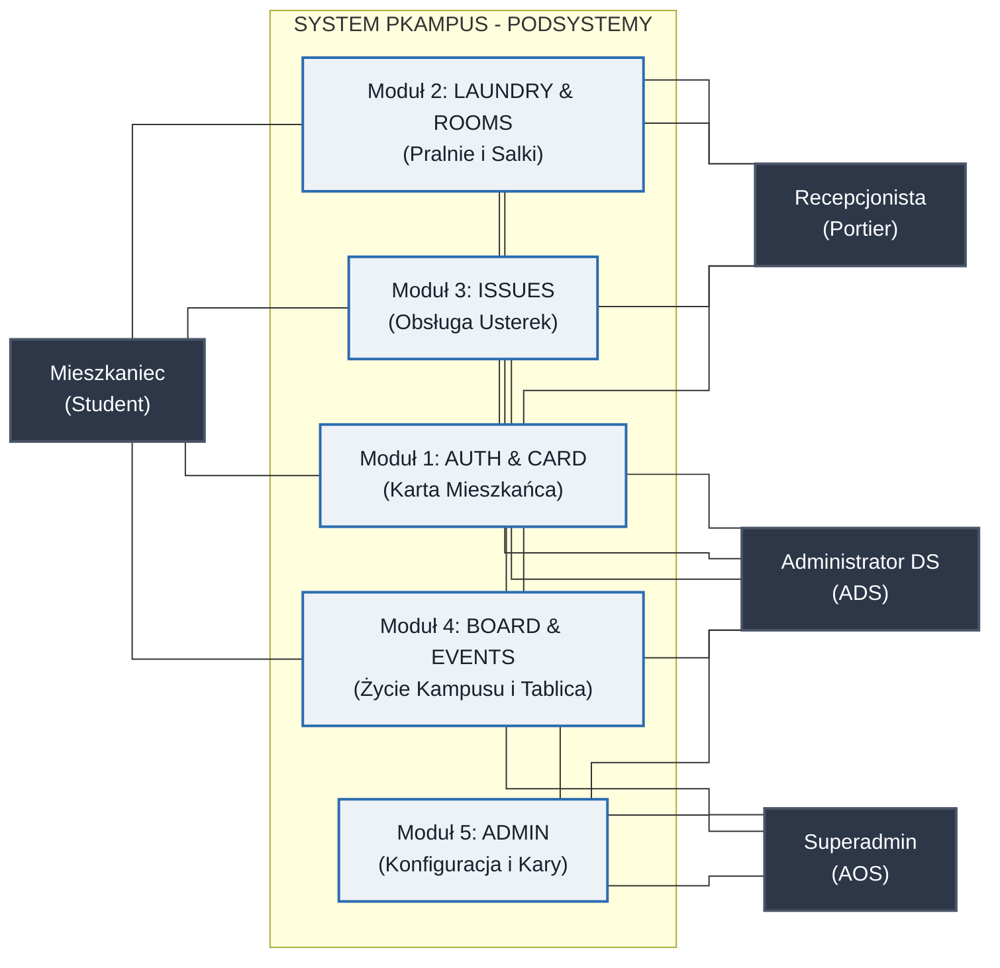
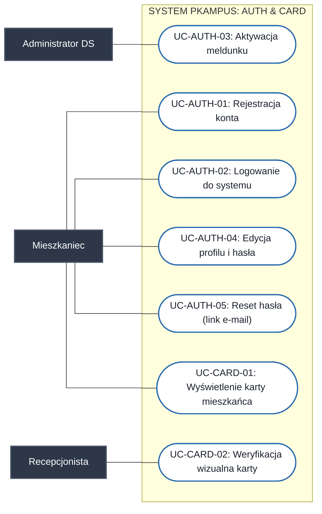
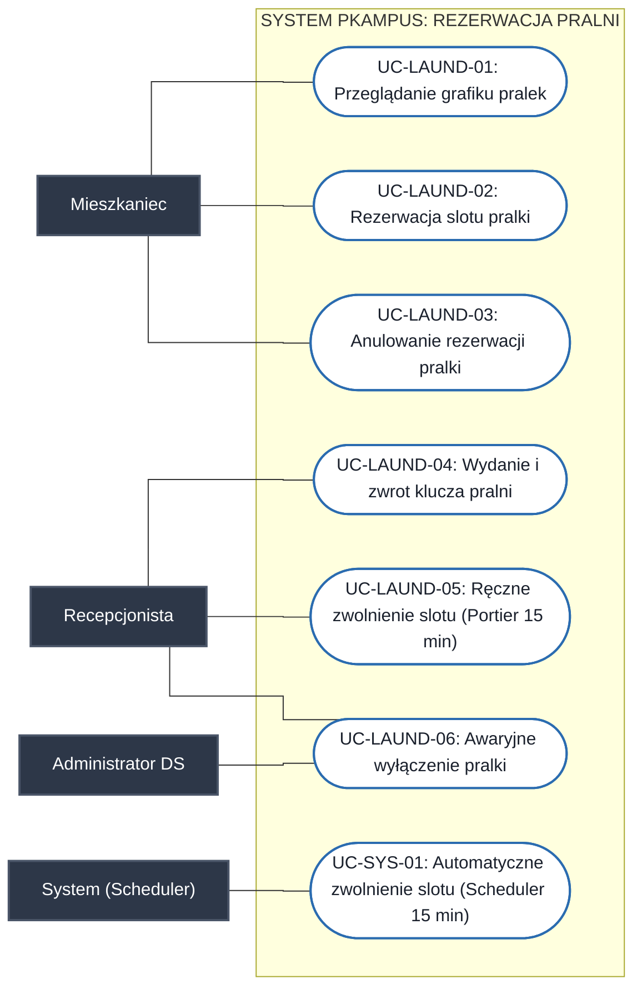
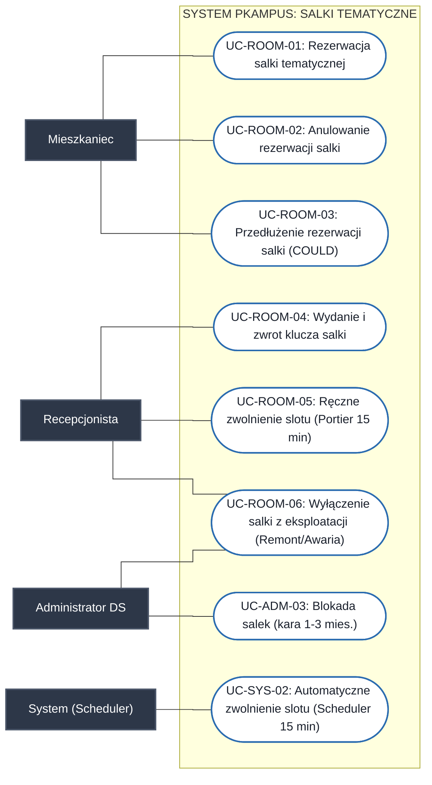
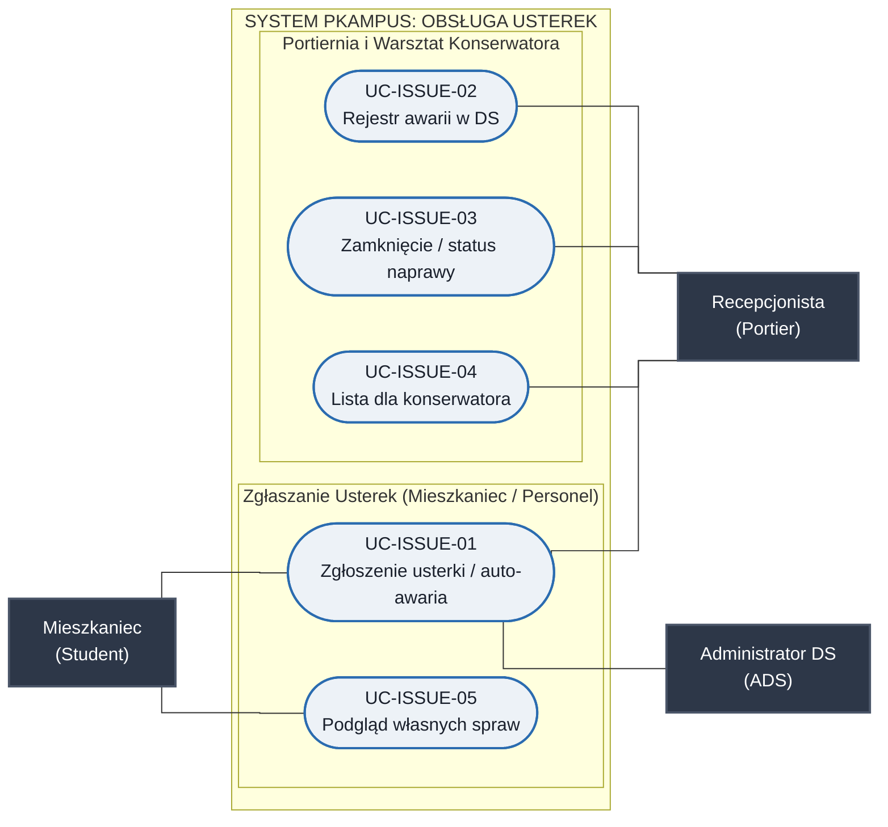
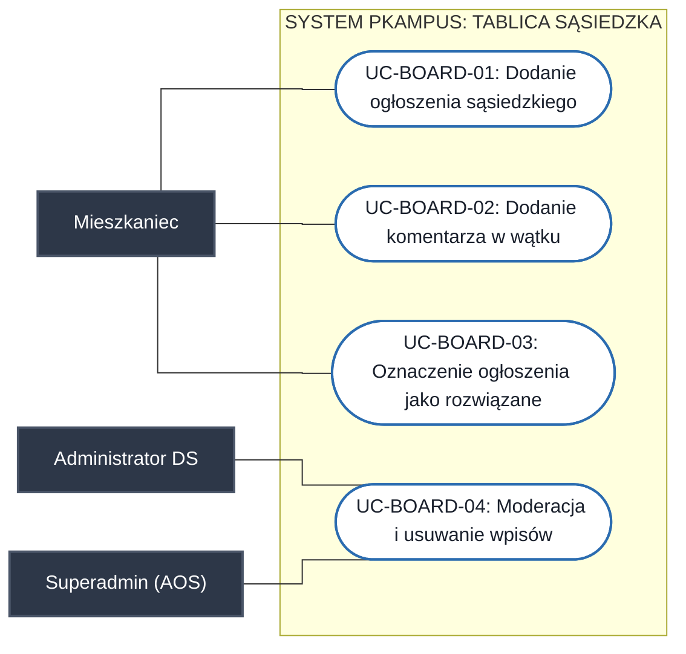
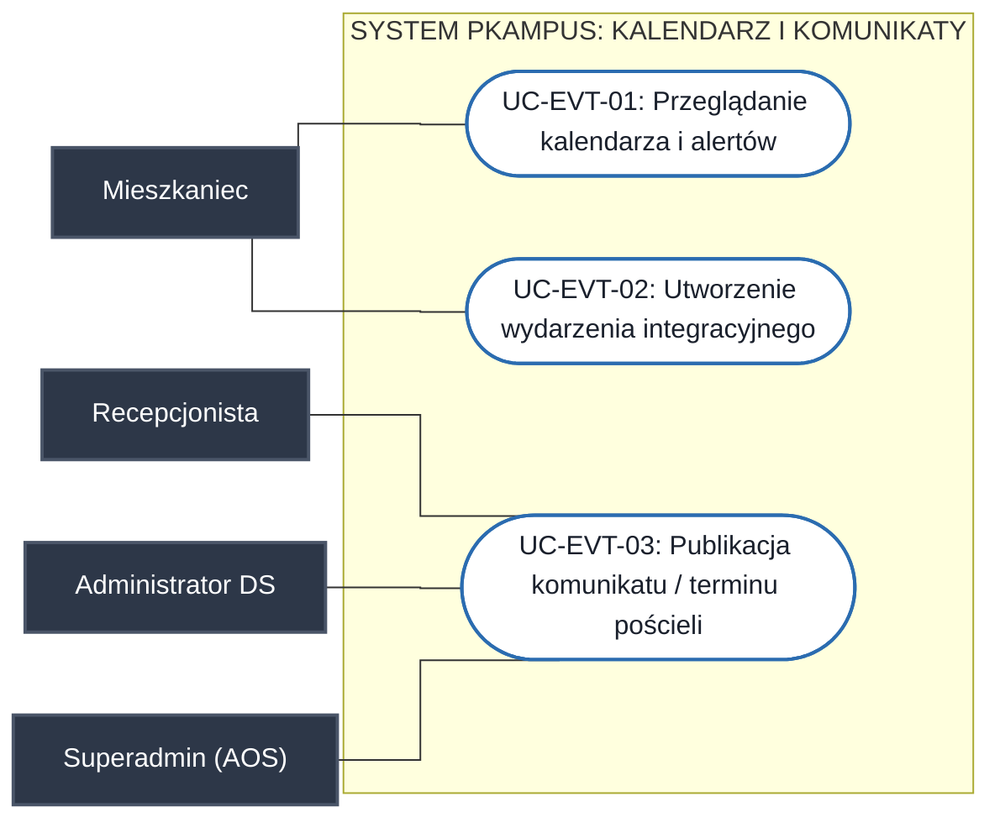
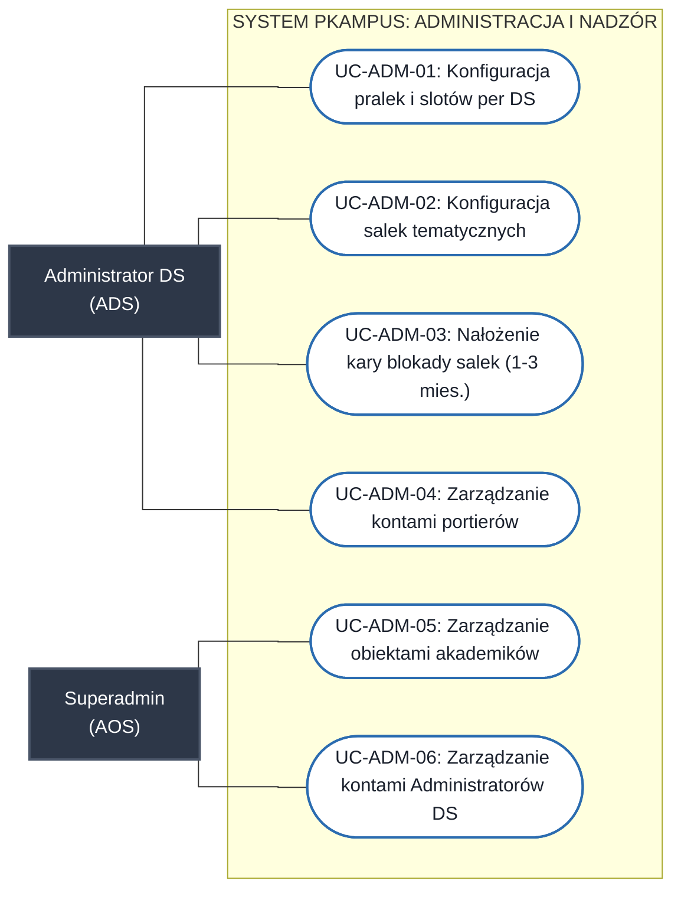

# Specyfikacja Diagramów Przypadków Użycia (UML Use Case) - System PKampus

---

## 1. Aktorzy Systemu

1. **Mieszkaniec (Student)** – zameldowany student korzystający z funkcji bytowych, rezerwacji, karty i tablicy.
2. **Recepcjonista (Portier)** – pracownik portierni (weryfikacja wejść, wydawanie/odbiór kluczy, koordynacja napraw, komunikaty dyżurne).
3. **Administrator Domu Studenckiego (ADS / DORM_ADMIN)** – Kierownik DS / pracownik Administracji Domu Studenckiego (weryfikacja meldunków, konfiguracja zasobów, nakładanie sankcji regulaminowych, oficjalne komunikaty DS).
4. **Superadmin (AOS / SUPER_ADMIN)** – Kierownik OS / pracownik Administracji Osiedla Studenckiego (zarządzanie obiektami domów studenckich, publikacja oficjalnych komunikatów ogólnokampusowych, globalna moderacja tablicy kampusu).
5. **System (Scheduler)** – automatyczny proces uwalniający nieodebrane rezerwacje po 15 minutach.

---

## 2. Diagram Ogólny Architektury Przypadków Użycia (High-Level)

### 2.1. Macierz Asocjacji: Aktorzy a Podsystemy

| Aktor | M1: AUTH & CARD | M2: LAUNDRY & ROOMS | M3: ISSUES | M4: BOARD & EVENTS | M5: ADMIN |
| :--- | :---: | :---: | :---: | :---: | :---: |
| **Mieszkaniec (Student)** | Dostęp (Karta, profil) | Dostęp (Rezerwacje) | Dostęp (Zgłoszenia) | Dostęp (Tablica, kalendarz) | Brak dostępu |
| **Recepcjonista (Portier)** | Dostęp (Weryfikacja karty) | Dostęp (Klucze, blokada awaryjna) | Rejestr napraw i zgłaszanie awarii | Dostęp (Komunikaty dyżurne, pościel) | Brak dostępu |
| **Administrator DS (ADS)** | Weryfikacja meldunku | Wyłączenie awaryjne (Nadzór) | Zgłoszenia części wspólnych i auto-awaria (FR-LAUND-06) | Komunikaty i moderacja | Konfiguracja i kary |
| **Superadmin (AOS)** | Zarządzanie kontami ADS (`DORM_ADMIN`) | Brak operacji | Brak operacji | Komunikaty kampusowe i moderacja CAMPUS | Zarządzanie osiedlem i kontami ADS |

---

## 3. Pakiet 1: Uwierzytelnianie i Wirtualna Karta Mieszkańca (AUTH & CARD)

---

## 4. Pakiet 2A: Rezerwacja Pralni (LAUNDRY)

---

## 5. Pakiet 2B: Rezerwacja Salek Tematycznych (ROOMS)

---

## 6. Pakiet 3: Ewidencja i Obsługa Usterek (ISSUES)

---

## 7. Pakiet 4A: Tablica Ogłoszeń Sąsiedzkich (BOARD)

---

## 8. Pakiet 4B: Kalendarz i Komunikaty Dyżurne (EVENTS)

---

## 9. Pakiet 5: Administracja Zasobami i Nadzór (ADMIN)

---

## 10. Macierz Śledzenia Wymagań (Traceability Matrix)

| Wymaganie FR | Identyfikator Use Case | Nazwa przypadku użycia | Główny Aktor |
| :--- | :--- | :--- | :--- |
| **FR-AUTH-01, FR-AUTH-02** | **UC-AUTH-01, UC-AUTH-03** | Rejestracja konta i aktywacja meldunku | Mieszkaniec, Admin DS |
| **FR-AUTH-03, FR-AUTH-04** | **UC-AUTH-02** | Logowanie i autoryzacja JWT (RBAC) | Wszyscy |
| **FR-AUTH-05** | **UC-ADM-04** | Zarządzanie kontami personelu portierni | Admin DS |
| **FR-AUTH-06** | **UC-AUTH-04** | Edycja profilu i zmiana hasła | Mieszkaniec |
| **FR-AUTH-07** | **UC-AUTH-05** | Procedura resetowania hasła przez link e-mail | Mieszkaniec, System |
| **FR-AUTH-08** | **UC-ADM-06** | Zarządzanie kontami Administratorów DS (AOS) | Superadmin (AOS) |
| **FR-CARD-01 .. FR-CARD-04** | **UC-CARD-01, UC-CARD-02** | Karta mieszkańca i weryfikacja wzrokowa (anty-screenshot) | Mieszkaniec, Portier |
| **FR-LAUND-01** | **UC-ADM-01** | Konfiguracja pralek i parametrów slotów per DS | Admin DS |
| **FR-LAUND-02 .. FR-LAUND-04** | **UC-LAUND-01, UC-LAUND-02, UC-LAUND-03** | Harmonogram, rezerwacja pralki i anulowanie slotu | Mieszkaniec |
| **FR-LAUND-05** | **UC-LAUND-04, UC-LAUND-05, UC-SYS-01** | Odbiór i zwrot klucza pralni, ręczne i automatyczne zwalnianie slotu po 15 min | Portier, System (Scheduler) |
| **FR-LAUND-06** | **UC-LAUND-06** | Awaryjne wyłączenie pralki, auto-anulowanie slotów i zgłoszenie naprawy | Portier, Admin DS |
| **FR-ROOM-01, FR-ROOM-02** | **UC-ADM-02** | Katalog i parametryzacja salek per DS (Kujon, Chillout) | Admin DS |
| **FR-ROOM-03, FR-ROOM-04** | **UC-ROOM-01** | Rezerwacja salki (formularz organizatora i regulamin) | Mieszkaniec |
| **FR-ROOM-05** | **UC-ROOM-04, UC-ROOM-05, UC-SYS-02** | Odbiór i zwrot klucza salki, ręczne i automatyczne zwalnianie slotu po 15 min | Portier, System (Scheduler) |
| **FR-ROOM-06** | **UC-ROOM-03** | Wniosek o przedłużenie rezerwacji salki (COULD) | Mieszkaniec |
| **FR-ROOM-07** | **UC-ADM-03** | Ewidencja kar i czarna lista salek (blokada 1–3 mies.) | Admin DS |
| **FR-ROOM-08** | **UC-ROOM-02** | Anulowanie rezerwacji salki przed startem (SHOULD) | Mieszkaniec |
| **FR-ROOM-09** | **UC-ROOM-06** | Wyłączenie salki z eksploatacji (Remont / Awaria) | Portier, Admin DS |
| **FR-ISSUE-01 .. FR-ISSUE-05** | **UC-ISSUE-01 .. UC-ISSUE-03, UC-ISSUE-05** | Zgłoszenia awarii ze zdjęciem MinIO, rejestr i obsługa | Mieszkaniec, Portier, Admin DS |
| **FR-ISSUE-06** | **UC-ISSUE-04** | Generowanie listy zadań dla konserwatora | Portier |
| **FR-BOARD-01 .. FR-BOARD-05** | **UC-BOARD-01 .. UC-BOARD-03** | Tablica ogłoszeń (SHOULD / Etap 4) | Mieszkaniec |
| **FR-BOARD-02** | **UC-BOARD-01** (widok feedu) | Filtrowanie feedu (SHOULD; bez full-text search) | Mieszkaniec |
| **FR-BOARD-06** | **UC-BOARD-04** | Moderacja i usuwanie wpisów na tablicy (SHOULD) | Admin DS, Superadmin (AOS) |
| **FR-EVENT-01, FR-EVENT-02** | **UC-EVT-03, UC-EVT-01** | Publikacja komunikatów + baner przypiętych CRITICAL | Portier, Admin DS, Superadmin (AOS), Mieszkaniec |
| **FR-EVENT-03** | **UC-EVT-01** | Kalendarz oficjalnych terminów kampusu | Mieszkaniec |
| **FR-EVENT-04** | **UC-EVT-02** | Wydarzenia mieszkańców (COULD) | Mieszkaniec |
| **FR-PORTAL-01 .. FR-PORTAL-04** | **UC-LAUND-04, UC-ROOM-04, UC-ADM-01 .. UC-ADM-04** | Dashboard recepcji, klucze, konfiguracja i meldunki | Portier, Admin DS |
| **FR-PORTAL-05** | **UC-ADM-05, UC-ADM-06, UC-EVT-03, UC-BOARD-04** | Zarządzanie obiektami akademików, kontami ADS, komunikacja ogólnokampusowa i moderacja | Superadmin (AOS) |
