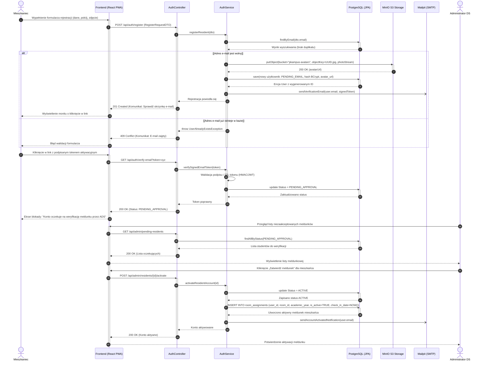
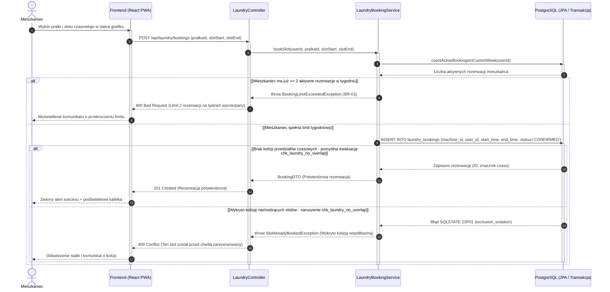
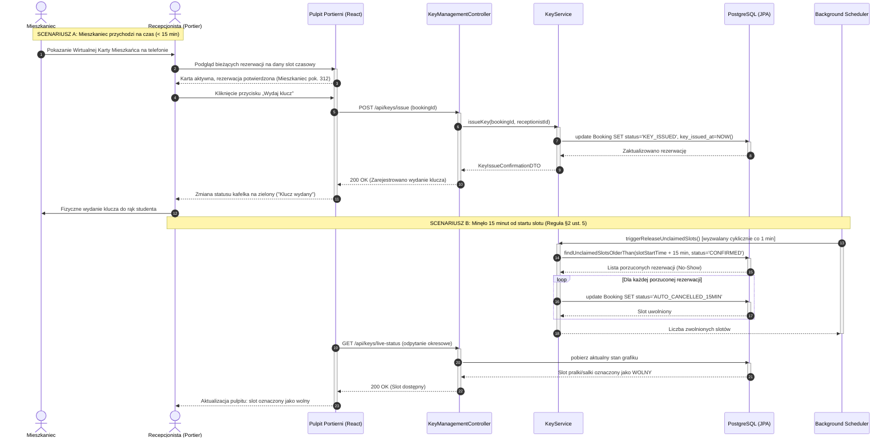
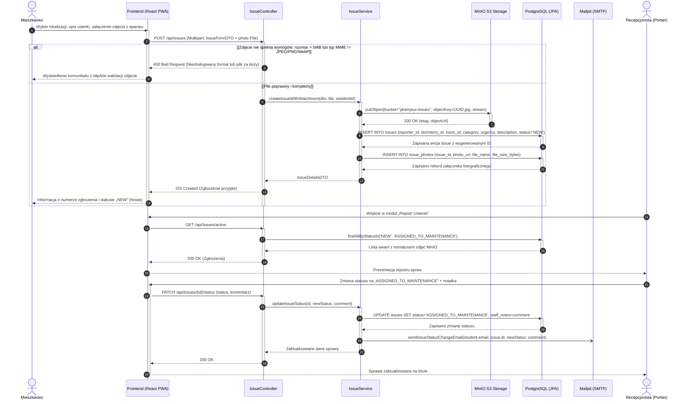
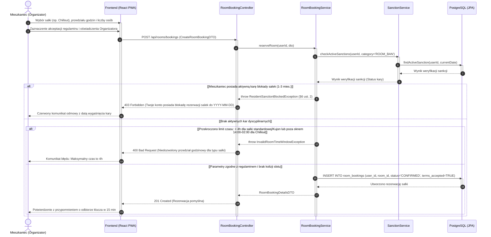
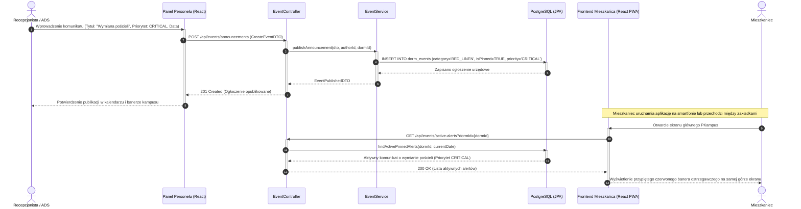
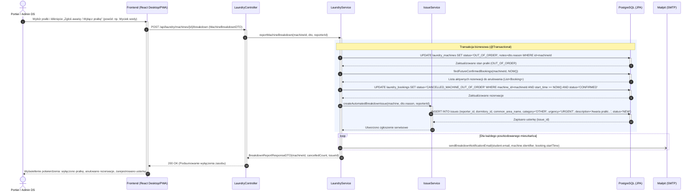
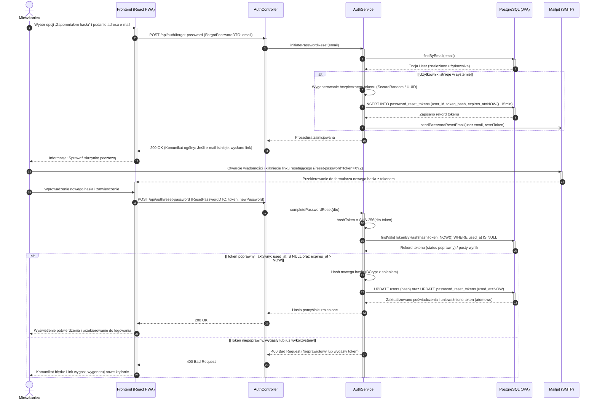

# Specyfikacja Diagramów Sekwencji (UML Sequence) - System PKampus

---

### 1. Przyjęte Standardy Notacyjne i Architektoniczne

Zgodnie z zasadami modelowania dynamiki systemów wielowarstwowych (Multi-tier Architecture / MVC):
1. **Warstwy i Linie Życia (Lifelines):**
   * **Aktor:** Reprezentuje użytkownika zewnętrznego systemu (`Mieszkaniec`, `Recepcjonista`, `Administrator DS`) lub proces systemowy (`System / Scheduler`).
   * **Frontend (React PWA):** Warstwa prezentacji SPA/PWA (komponenty React, stan lokalny, obsługa formularzy, żądania HTTP Axios/Fetch).
   * **Kontroler REST (Spring Boot Controller):** Punkt wejściowy API (walidacja DTO `@Valid`, autoryzacja ról `@PreAuthorize`, mapowanie kodów HTTP).
   * **Serwis Biznesowy (Domain / Application Service):** Warstwa logiki biznesowej i zarządzania transakcjami (`@Transactional`, reguły PK, integralność).
   * **Baza Danych (Spring Data JPA / PostgreSQL):** Warstwa utrwalania danych, blokady transakcyjne, ograniczenia wykluczające (`EXCLUDE USING gist` / SQLSTATE `23P01`).
   * **Komponenty Zewnętrzne:** Usługi wyspecjalizowane w środowisku kontenerowym Docker Compose:
     * `Mailpit (SMTP)` – asynchroniczna wysyłka powiadomień e-mail,
     * `MinIO (S3)` – magazyn obiektowy na pliki multimedialne (zdjęcia usterek, awatary).
2. **Semantyka Komunikatów:**
   * `->>` : Wywołanie synchroniczne (żądanie HTTP, wywołanie metody wewnątrzprocesowej).
   * `-)` : Wywołanie asynchroniczne (np. zadanie w tle `@Async`, delegacja do wątku pocztowego).
   * `-->>` : Komunikat powrotny (powrót sterowania, odpowiedź HTTP, wynik zapytania JPA).
3. **Paski Aktywności (`activate` / `deactivate`):**
   * Precyzyjnie obrazują czas trwania wykonania operacji na danej linii życia.
4. **Numeracja Kroków (`autonumber`):**
   * Automatyczna numeracja komunikatów ułatwiająca śledzenie sekwencji czasowej.
5. **Obsługa Wariantów i Błędów (`alt / else`):**
   * Prezentacja głównego przebiegu optymistycznego (Happy Path) oraz kluczowych scenariuszy odmowy biznesowej lub błędów walidacji.

---

## 2. Sekwencja 1: Dwuetapowa Rejestracja i Aktywacja Meldunku (AUTH & CARD)

Proces obejmuje rejestrację nowego mieszkańca, weryfikację adresu e-mail przez **podpisany, krótkotrwały token w linku** (bez tabeli tokenów aktywacyjnych), przejście konta w stan `PENDING_APPROVAL` oraz zatwierdzenie tożsamości przez Administratora DS wraz z utworzeniem meldunku w `room_assignments`.

---

## 3. Sekwencja 2: Rezerwacja Pralni z Ochroną Przed Wyścigiem (LAUNDRY & CONCURRENCY)

Proces prezentuje rezerwację slotu czasowego na konkretną pralkę. Zabezpiecza system przed zjawiskiem *Race Condition* za pomocą ograniczenia integralności PostgreSQL `chk_laundry_no_overlap` (`EXCLUDE USING gist`) na przecięciu przedziałów czasowych `tstzrange(start_time, end_time) WITH &&`, odrzucającego równoległe kolizyjne próby rezerwacji kodem błędu SQLSTATE `23P01` (`exclusion_violation`).

---

## 4. Sekwencja 3: Procedura Wydania Klucza i Reguła 15 Minut (LAUNDRY/ROOMS & SCHEDULER)

Zgodnie z §2 ust. 5 Regulaminu Osiedla Studenckiego, mieszkaniec musi odebrać klucz w ciągu 15 minut od startu rezerwacji. Diagram ilustruje dwa alternatywne warianty: pomyślny odbiór klucza na portierni oraz automatyczne zwolnienie zasobu przez harmonogram zadań w tle (`@Scheduled`).

---

## 5. Sekwencja 4: Zgłoszenie Awarii z Uploadem Zdjęcia do MinIO S3 (ISSUES)

Proces przedstawia zgłoszenie usterki technicznej przez mieszkańca z dołączeniem dokumentacji fotograficznej przesyłanej do magazynu obiektowego MinIO S3 oraz jej obsługę w warsztacie portierni.

---

## 6. Sekwencja 5: Rezerwacja Salki z Weryfikacją Czarnej Listy Kar (ROOMS & SANCTIONS)

Proces weryfikuje uprawnienia mieszkańca do rezerwacji salki tematycznej (cicha nauka „Kujon”, Funzone, Chillout) ze szczególnym uwzględnieniem ewidencji kar dyscyplinarnych (§6 ust. 2 Regulaminu: 1–3 miesiące blokady salek).

---

## 7. Sekwencja 6: Publikacja Komunikatu Dyżurnego / Wymiany Pościeli i Odbiór Alertu (BOARD & EVENTS)

Proces obrazuje publikację ważnego komunikatu technicznego lub organizacyjnego przez portiernię lub ADS oraz prezentację banera alertu u mieszkańca dla przypiętych komunikatów `CRITICAL` (bez osobnego potwierdzania odczytu per użytkownik — baner znika po odpięciu/wygaśnięciu).

---

---

## 8. Sekwencja 7: Awaryjne Wyłączenie Pralki z Eksploatacji i Kaskadowe Anulowanie Rezerwacji (LAUNDRY & ISSUES)

Proces przedstawia zgłoszenie awarii pralki przez dyżurnego pracownika recepcji (lub ADS), jej natychmiastowe wyłączenie z eksploatacji w bazie danych (`OUT_OF_ORDER`), kaskadowe anulowanie wszystkich zaplanowanych rezerwacji ze statusem `CANCELLED_MACHINE_OUT_OF_ORDER`, asynchroniczną wysyłkę powiadomień e-mail do poszkodowanych studentów oraz automatyczne wygenerowanie powiązanego zgłoszenia usterki w rejestrze warsztatu (`issues`).

---

---

## 9. Sekwencja 8: Procedura Resetowania Hasła przez Link z Tokenem E-mail (AUTH & MAIL)

Proces przedstawia bezpieczną ścieżkę odzyskiwania dostępu do konta (`FR-AUTH-07`, `UC-AUTH-07`): zgłoszenie żądania przez mieszkańca, wygenerowanie jednorazowego tokenu kryptograficznego zapisanego w `password_reset_tokens` (TTL: 15 minut), asynchroniczną wysyłkę linku e-mail (Mailpit SMTP) oraz weryfikację tokenu wraz z haszowaniem nowego hasła (BCrypt) i unieważnieniem tokenu.

---

### 10. Podsumowanie Pokrycia Dynamiki

Zaprojektowane diagramy sekwencji pokrywają **kluczowe** zachowania dynamiczne systemu PKampus (ścieżki krytyczne MVP), a nie pełną listę wszystkich FR:
1. **Asynchroniczność i integracja e-mail:** Zastosowanie kolejki zadań asynchronicznych w Spring Boot dla Mailpit (aktywacja konta, usterki, awarie sprzętu, reset hasła).
2. **Bezpieczeństwo transakcyjne:** Blokady bazodanowe i ograniczenia `EXCLUDE USING gist` wykluczające nakładające się rezerwacje w pralniach i salkach.
3. **Automatyzacja procesów w tle:** Dedykowany Spring Scheduler realizujący regułę 15 minut (§2 ust. 5 Regulaminu).
4. **Zarządzanie mediami:** Bezpośrednia integracja backendu z magazynem obiektowym MinIO (S3) przy obsłudze usterek i zdjęć profilowych.
5. **Egzekwowanie prawa wewnętrznego PK:** Walidacja czarnej listy kar dyscyplinarnych (§6 ust. 2) przed dopuszczeniem do zasobów.
6. **Kaskadowa reakcja na awarie zasobów:** Automatyczne wyłączenie sprzętu, anulowanie rezerwacji, dyspozycja naprawy i powiadomienia mieszkańców.
7. **Bezpieczne zarządzanie tożsamością (IdM):** Dwuetapowa weryfikacja meldunku przez ADS oraz jednorazowe kryptograficzne tokeny resetu hasła (TTL 15 min).
