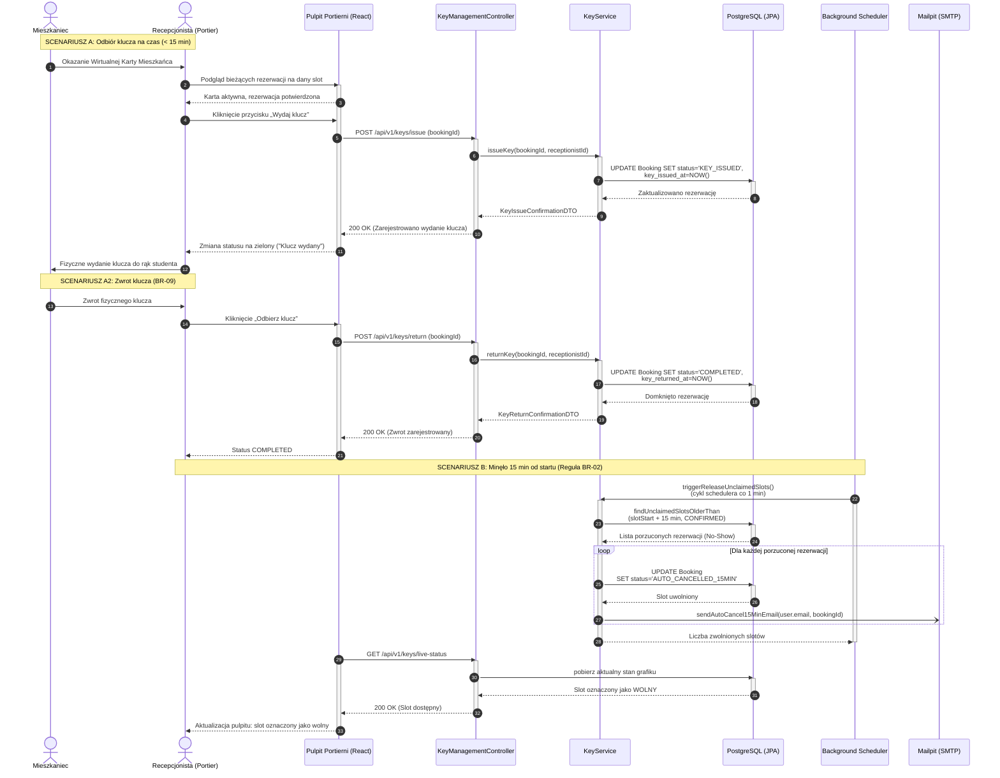
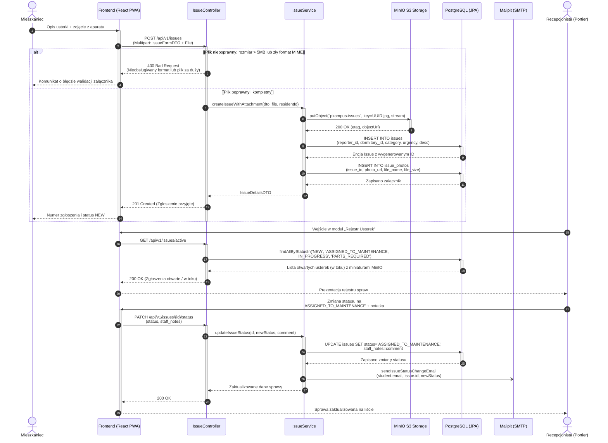
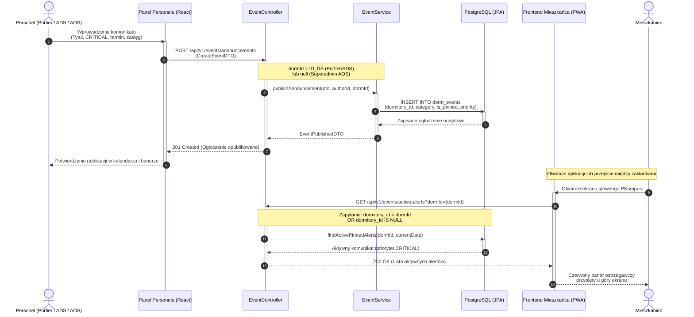
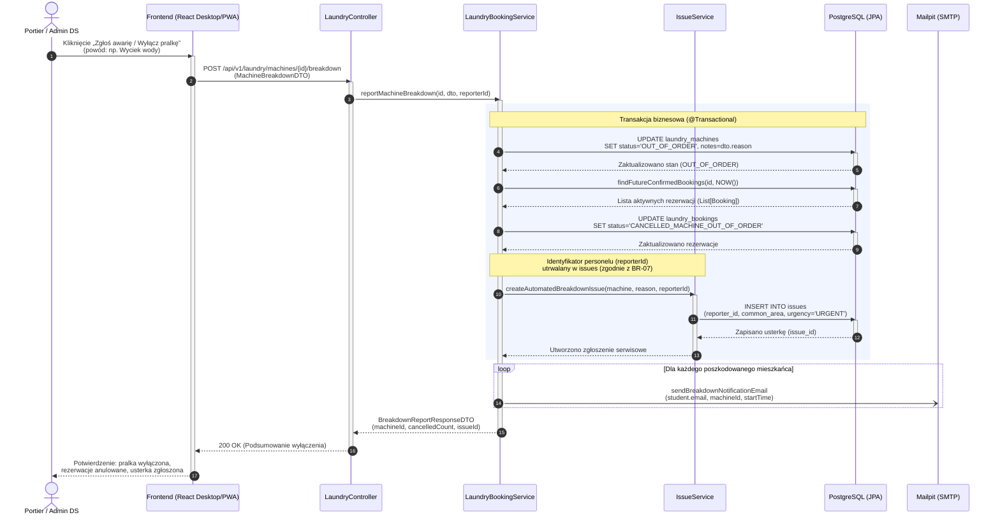
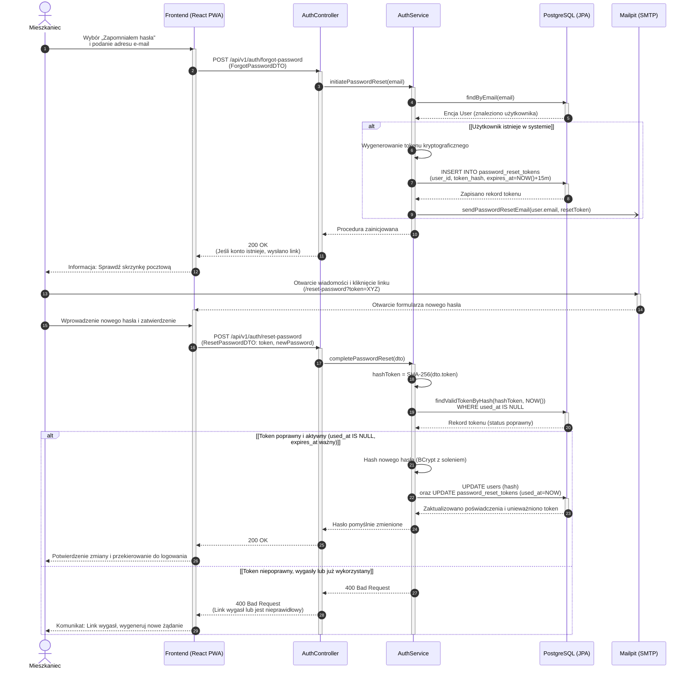
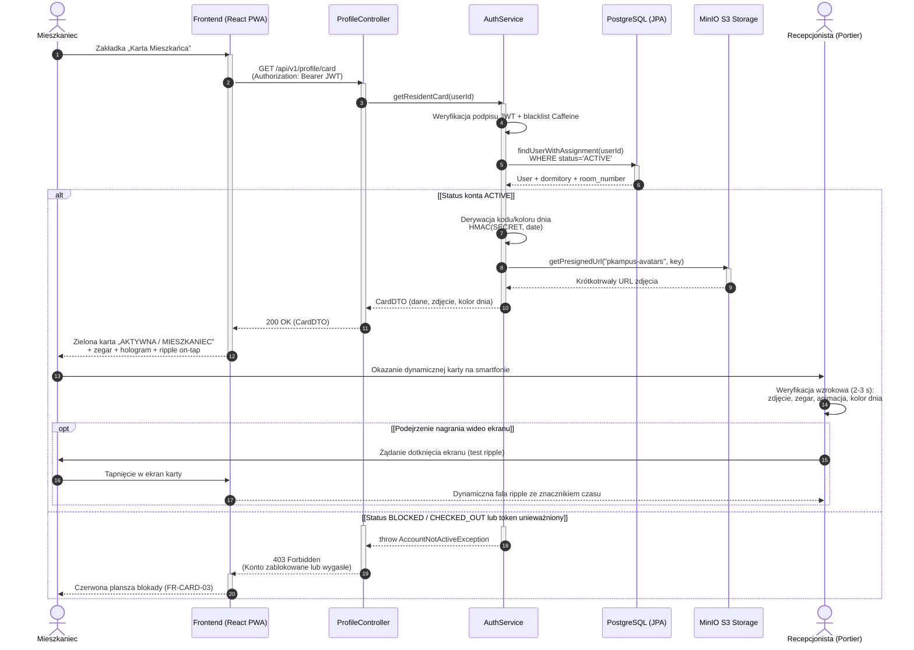

# Specyfikacja Diagramów Sekwencji (UML Sequence) - System PKampus

---

### 1. Przyjęte Standardy Notacyjne i Architektoniczne

Zgodnie z zasadami modelowania dynamiki systemów wielowarstwowych (Multi-tier Architecture / MVC):
1. **Warstwy i Linie Życia (Lifelines):**
   * **Aktor:** Reprezentuje użytkownika zewnętrznego systemu (`Mieszkaniec`, `Recepcjonista`, `Administrator DS`) lub proces systemowy (`System / Scheduler`).
   * **Frontend (React PWA):** Warstwa prezentacji SPA/PWA (komponenty React, stan lokalny, obsługa formularzy, żądania HTTP Axios/Fetch).
   * **Kontroler REST (Spring Boot Controller):** Punkt wejściowy API (walidacja DTO `@Valid`, autoryzacja ról `@PreAuthorize`, mapowanie kodów HTTP).
   * **Serwis Biznesowy (Domain / Application Service):** Warstwa logiki biznesowej i zarządzania transakcjami (`@Transactional`, reguły PK, integralność).
   * **Baza Danych (Spring Data JPA / PostgreSQL):** Warstwa utrwalania danych, blokady transakcyjne, ograniczenia wykluczające (`EXCLUDE USING gist` / SQLSTATE `23P01`).
   * **Komponenty Zewnętrzne:** Usługi wyspecjalizowane w środowisku kontenerowym Docker Compose:
     * `Mailpit (SMTP)` – asynchroniczna wysyłka powiadomień e-mail,
     * `MinIO (S3)` – magazyn obiektowy na pliki multimedialne (zdjęcia usterek, awatary).
2. **Semantyka Komunikatów:**
   * `->>` : Wywołanie synchroniczne (żądanie HTTP, wywołanie metody wewnątrzprocesowej).
   * `-)` : Wywołanie asynchroniczne (np. zadanie w tle `@Async`, delegacja do wątku pocztowego).
   * `-->>` : Komunikat powrotny (powrót sterowania, odpowiedź HTTP, wynik zapytania JPA).
3. **Paski Aktywności (`activate` / `deactivate`):**
   * Precyzyjnie obrazują czas trwania wykonania operacji na danej linii życia.
4. **Numeracja Kroków (`autonumber`):**
   * Automatyczna numeracja komunikatów ułatwiająca śledzenie sekwencji czasowej.
5. **Obsługa Wariantów i Błędów (`alt / else`):**
   * Prezentacja głównego przebiegu optymistycznego (Happy Path) oraz kluczowych scenariuszy odmowy biznesowej lub błędów walidacji.
6. **Konwencja kodów HTTP błędów biznesowych (API REST):**
   * **`422 Unprocessable Entity`** — walidacja logiczna / reguły formularza (np. horyzont 7 dni i limit 2× `CONFIRMED`/`KEY_ISSUED`/tydzień `BR-01`, pojemność salki, okno godzinowe `BR-03` wg typu salki, niepoprawny przedział przed zapisem).
   * **`409 Conflict`** — kolizja współbieżna lub naruszenie ograniczenia wykluczającego w PostgreSQL (`chk_laundry_no_overlap` / `chk_room_no_overlap`, SQLSTATE `23P01`).
   * **`403 Forbidden`** — brak uprawnień / sankcja (`ROOM_BAN`), konto nieaktywne.
   * **`400 Bad Request`** — błędy składni żądania, MIME/rozmiar pliku, token resetu nieprawidłowy.

---

## 2. Sekwencja 1: Dwuetapowa Rejestracja i Aktywacja Meldunku (AUTH & CARD)

Proces obejmuje rejestrację nowego mieszkańca **w jednym żądaniu HTTP** `multipart/form-data` (pola formularza + wymagane zdjęcie twarzy — `FR-AUTH-01`, `UC-AUTH-01`, analogicznie do uploadu w Sekwencji 4), weryfikację adresu e-mail przez **podpisany, krótkotrwały token w linku** (bez tabeli tokenów aktywacyjnych), przejście konta w stan `PENDING_APPROVAL` oraz zatwierdzenie tożsamości przez Administratora DS wraz z utworzeniem meldunku w `room_assignments`.

```mermaid
sequenceDiagram
    autonumber
    actor M as Mieszkaniec
    participant UI as Frontend (React PWA)
    participant CTL as AuthController
    participant ADM as AdminController
    participant SVC as AuthService
    participant DB as PostgreSQL (JPA)
    participant S3 as MinIO S3 Storage
    participant MAIL as Mailpit (SMTP)
    actor ADS as Administrator DS

    M->>UI: Wypełnienie formularza rejestracji<br/>(dane, pokój, zdjęcie twarzy JPEG/PNG/WebP)
    activate UI
    UI->>CTL: POST /api/v1/auth/register<br/>(multipart/form-data: RegisterRequestDTO + photo File)
    activate CTL

    alt [Zdjęcie nie spełnia wymogów: rozmiar > 5 MB lub MIME ≠ JPEG/PNG/WebP]
        CTL-->>UI: 400 Bad Request<br/>(Nieobsługiwany format lub plik za duży)
        UI-->>M: Komunikat o błędzie walidacji załącznika (NFR-SEC-03)
    else [Plik poprawny — Content-Type: multipart/form-data]
        CTL->>SVC: registerResident(dto, photoFile)
        activate SVC

        SVC->>DB: findByEmail(dto.email)
        activate DB
        DB-->>SVC: Wynik wyszukiwania (brak duplikatu)
        deactivate DB

        alt [Adres e-mail jest wolny]
            SVC->>S3: putObject(bucket="pkampus-avatars",<br/>objectKey=UUID.jpg, photoStream)
            activate S3
            S3-->>SVC: 200 OK (avatarUrl)
            deactivate S3

            SVC->>DB: save(User: PENDING_EMAIL,<br/>hash BCrypt, avatar_url, pokój)
            activate DB
            DB-->>SVC: Encja User z wygenerowanym ID
            deactivate DB

            SVC-)MAIL: sendVerificationEmail(user.email, signedToken)
            SVC-->>CTL: Rejestracja powiodła się
            CTL-->>UI: 201 Created<br/>(Sprawdź skrzynkę e-mail)
            UI-->>M: Wyświetlenie monitu o kliknięcie w link
        else [Adres e-mail już istnieje w bazie (Anti-enumeration)]
            SVC-->>CTL: Rejestracja zignorowana (anti-enumeration)
            CTL-->>UI: 200 OK<br/>(Jeśli konto istnieje, wysłano link)
            UI-->>M: Monit: Sprawdź skrzynkę e-mail
        end
        deactivate SVC
    end
    deactivate CTL
    deactivate UI

    %% Etap 2: Potwierdzenie e-mail
    M->>UI: Kliknięcie w link z tokenem aktywacyjnym
    activate UI
    UI->>CTL: GET /api/v1/auth/verify-email?token=xyz
    activate CTL
    CTL->>SVC: verifySignedEmailToken(token)
    activate SVC
    alt [Token wygasł (>24h) lub nieprawidłowy podpis]
        SVC-->>CTL: throw EmailVerificationTokenInvalidException
        deactivate SVC
        CTL-->>UI: 410 Gone<br/>(Link aktywacyjny wygasł lub jest nieprawidłowy)
        deactivate CTL
        UI-->>M: Komunikat: Link nieważny — zleć ponowne wysłanie
        deactivate UI
    else [Token HMAC ważny]
        SVC->>DB: UPDATE users SET status='PENDING_APPROVAL'
        activate DB
        DB-->>SVC: Zaktualizowano status
        deactivate DB
        SVC-->>CTL: Token poprawny
        deactivate SVC
        CTL-->>UI: 200 OK (Status: PENDING_APPROVAL)
        deactivate CTL
        UI-->>M: Ekran informacyjny:<br/>"Oczekiwanie na weryfikację meldunku"
        deactivate UI
    end

    %% Etap 3: Akceptacja przez ADS (AdminController /api/v1/admin/*)
    ADS->>UI: Przegląd listy meldunków
    activate UI
    UI->>ADM: GET /api/v1/admin/pending-residents
    activate ADM
    ADM->>DB: findAllByStatus(PENDING_APPROVAL)
    activate DB
    DB-->>ADM: Lista studentów do weryfikacji
    deactivate DB
    ADM-->>UI: 200 OK (Lista oczekujących wniosków)
    deactivate ADM
    UI-->>ADS: Prezentacja listy meldunkowej

    ADS->>UI: Weryfikacja z listą uczelni<br/>i kliknięcie „Zatwierdź meldunek”
    UI->>ADM: POST /api/v1/admin/residents/{id}/activate
    activate ADM
    ADM->>SVC: activateResidentAccount(id)
    activate SVC
    SVC->>DB: findById(id) (odczyt DS i pokoju)
    activate DB
    DB-->>SVC: Dane studenta
    SVC->>DB: findByDormitoryAndRoomNumber(...)
    DB-->>SVC: Encja Room (room_id)
    SVC->>DB: UPDATE users SET status='ACTIVE'
    DB-->>SVC: Zapisano status ACTIVE
    SVC->>DB: INSERT INTO room_assignments<br/>(user_id, room_id, is_active=TRUE)
    DB-->>SVC: Utworzono aktywny meldunek
    deactivate DB
    SVC-)MAIL: sendAccountActivatedNotification(user.email)
    SVC-->>ADM: Konto aktywowane
    deactivate SVC
    ADM-->>UI: 200 OK (Konto aktywne)
    deactivate ADM
    UI-->>ADS: Potwierdzenie aktywacji meldunku
    deactivate UI
```

---

## 3. Sekwencja 2: Rezerwacja Pralni z Ochroną Przed Wyścigiem (LAUNDRY & CONCURRENCY)

Proces prezentuje rezerwację slotu czasowego na konkretną pralkę. Zabezpiecza system przed zjawiskiem *Race Condition* za pomocą ograniczenia integralności PostgreSQL `chk_laundry_no_overlap` (`EXCLUDE USING gist`) na przecięciu przedziałów czasowych `tstzrange(start_time, end_time) WITH &&`, odrzucającego równoległe kolizyjne próby rezerwacji kodem błędu SQLSTATE `23P01` (`exclusion_violation`) mapowanym na **HTTP 409 Conflict**. Reguły `BR-01` (horyzont max 7 dni w przód oraz limit **2** aktywnych = `CONFIRMED`/`KEY_ISSUED` w tygodniu kalendarzowym pon–niedz. `Europe/Warsaw`) są walidacją logiczną przed INSERT i zwracają **HTTP 422 Unprocessable Entity** (por. §1 pkt 6).

```mermaid
sequenceDiagram
    autonumber
    actor M as Mieszkaniec
    participant UI as Frontend (React PWA)
    participant CTL as LaundryController
    participant SVC as LaundryBookingService
    participant DB as PostgreSQL (JPA / Transakcja)

    M->>UI: Wybór pralki i slotu w siatce grafiku
    activate UI
    UI->>CTL: POST /api/v1/laundry/bookings<br/>(pralkaId, slotStart, slotEnd)
    activate CTL
    CTL->>SVC: bookSlot(userId, pralkaId, slotStart, slotEnd)
    activate SVC

    %% Sprawdzenie reguł biznesowych BR-01
    alt [slotStart poza horyzontem > 7 dni w przód (BR-01)]
        SVC-->>CTL: throw BookingHorizonExceededException
        CTL-->>UI: 422 Unprocessable Entity<br/>(Rezerwacja tylko do 7 dni w przód)
        UI-->>M: Komunikat: Slot poza dozwolonym horyzontem
    else [Horyzont 7 dni OK]
        SVC->>DB: countActiveBookingsInCurrentWeek(userId)<br/>(status IN CONFIRMED,KEY_ISSUED;<br/>start_time w pon–niedz. Europe/Warsaw)
        activate DB
        DB-->>SVC: Liczba aktywnych rezerwacji mieszkańca
        deactivate DB

        alt [Mieszkaniec ma już >= 2 aktywne CONFIRMED/KEY_ISSUED (BR-01)]
            SVC-->>CTL: throw BookingLimitExceededException
            CTL-->>UI: 422 Unprocessable Entity<br/>(Wyczerpano limit 2 rezerwacji/tydzień)
            UI-->>M: Komunikat: Przekroczono limit rezerwacji
        else [Mieszkaniec spełnia limit tygodniowy]
            SVC->>DB: INSERT INTO laundry_bookings<br/>(machine_id, user_id, start_time, end_time)
            activate DB

            alt [Brak kolizji slotów (sukces chk_laundry_no_overlap)]
                DB-->>SVC: Zapisano rezerwację (ID, znacznik czasu)
                SVC-->>CTL: BookingDTO (Potwierdzona rezerwacja)
                CTL-->>UI: 201 Created (Rezerwacja potwierdzona)
                UI-->>M: Zielony alert sukcesu + podświetlenie kafelka
            else [Kolizja przedziałów czasowych (błąd chk_laundry_no_overlap)]
                DB-->>SVC: Błąd SQLSTATE 23P01 (exclusion_violation)
                SVC-->>CTL: throw SlotAlreadyBookedException
                CTL-->>UI: 409 Conflict<br/>(Slot został przed chwilą zajęty)
                UI-->>M: Odświeżenie siatki i komunikat o kolizji
            end
            deactivate DB
        end
    end
    deactivate SVC
    deactivate CTL
    deactivate UI
```

---

## 4. Sekwencja 3: Procedura Wydania Klucza i Reguła 15 Minut (LAUNDRY/ROOMS & SCHEDULER)

Zgodnie z §2 ust. 5 Regulaminu korzystania z salek tematycznych (oraz analogiczną decyzją projektową przyjętą dla pralni w celu zapobiegania blokowaniu slotów), mieszkaniec musi odebrać klucz w ciągu 15 minut od startu rezerwacji. Diagram ilustruje trzy warianty: pomyślny odbiór klucza, automatyczne zwolnienie slotu przez scheduler (`AUTO_CANCELLED_15MIN` + e-mail) oraz zwrot klucza z domknięciem do `COMPLETED` (`BR-09` / `FR-PORTAL-02`).



---

## 5. Sekwencja 4: Zgłoszenie Awarii z Uploadem Zdjęcia do MinIO S3 (ISSUES)

Proces przedstawia zgłoszenie usterki technicznej przez mieszkańca z dołączeniem dokumentacji fotograficznej przesyłanej do magazynu obiektowego MinIO S3 oraz jej obsługę w warsztacie portierni.



---

## 6. Sekwencja 5: Rezerwacja Salki z Weryfikacją Czarnej Listy Kar (ROOMS & SANCTIONS)

Proces weryfikuje uprawnienia mieszkańca do rezerwacji salki tematycznej (cicha nauka „Kujon”, Funzone, Chillout) ze szczególnym uwzględnieniem ewidencji kar dyscyplinarnych (§6 ust. 2 Regulaminu: 1–3 miesiące blokady salek). Kody HTTP: `403` przy `ROOM_BAN`, `422` przy walidacji pojemności oraz okna `BR-03` (Kujon/std: 06:00–23:30 max 4 h; Chillout: 14:00–02:00 max 12 h), `409` przy kolizji `chk_room_no_overlap` (SQLSTATE `23P01`) — zgodnie z konwencją §1 pkt 6.

```mermaid
sequenceDiagram
    autonumber
    actor M as Mieszkaniec (Organizator)
    participant UI as Frontend (React PWA)
    participant CTL as RoomController
    participant SVC as RoomBookingService
    participant SANCT as SanctionService
    participant DB as PostgreSQL (JPA)

    M->>UI: Wybór salki (np. Chillout),<br/>przedziału godzin i liczby osób
    activate UI
    M->>UI: Akceptacja regulaminu i oświadczenie Organizatora
    UI->>CTL: POST /api/v1/rooms/bookings<br/>(CreateRoomBookingDTO)
    activate CTL
    CTL->>SVC: reserveRoom(userId, dto)
    activate SVC

    %% Krok 1: Weryfikacja czarnej listy kar regulaminowych
    SVC->>SANCT: checkActiveSanctions(userId, 'ROOM_BAN')
    activate SANCT
    SANCT->>DB: findActiveSanction(userId, currentDate)
    activate DB
    DB-->>SANCT: Wynik weryfikacji sankcji
    deactivate DB
    SANCT-->>SVC: Wynik weryfikacji (Status kary)
    deactivate SANCT

    alt [Mieszkaniec posiada aktywną karę ROOM_BAN (1-3 mies.)]
        SVC-->>CTL: throw ResidentSanctionBlockedException
        CTL-->>UI: 403 Forbidden<br/>(Blokada rezerwacji salek do YYYY-MM-DD)
        UI-->>M: Odmowa: Aktywna blokada salek z datą wygaśnięcia
    else [Brak aktywnych kar dyscyplinarnych]

        alt [Przekroczona pojemność salki (uczestnicy > max_capacity)]
            SVC-->>CTL: throw RoomCapacityExceededException
            CTL-->>UI: 422 Unprocessable Entity<br/>(Przekroczono limit osób w salce)
            UI-->>M: Komunikat: Zbyt duża liczba uczestników
        else [Pojemność salki poprawna]

            alt [Naruszenie BR-03 wg typu salki<br/>(Kujon/std: poza 06:00–23:30 lub >4h;<br/>Chillout: poza 14:00–02:00 lub >12h)]
                SVC-->>CTL: throw InvalidRoomTimeWindowException
                CTL-->>UI: 422 Unprocessable Entity<br/>(Niedozwolony przedział godzinowy)
                UI-->>M: Błąd: Przedział niezgodny z regulaminem salki
            else [Parametry zgodne z BR-03]
                SVC->>DB: INSERT INTO room_bookings<br/>(user_id, room_id, status='CONFIRMED')
                activate DB
                alt [Brak kolizji (sukces chk_room_no_overlap)]
                    DB-->>SVC: Utworzono rezerwację salki
                    deactivate DB
                    SVC-->>CTL: RoomBookingDetailsDTO
                    CTL-->>UI: 201 Created (Rezerwacja pomyślna)
                    UI-->>M: Potwierdzenie z przypomnieniem o odbiorze w 15 min
                else [Kolizja przedziałów (chk_room_no_overlap / 23P01)]
                    DB-->>SVC: Błąd SQLSTATE 23P01 (exclusion_violation)
                    deactivate DB
                    SVC-->>CTL: throw SlotAlreadyBookedException
                    CTL-->>UI: 409 Conflict<br/>(Slot salki został przed chwilą zajęty)
                    UI-->>M: Odświeżenie grafiku i komunikat o kolizji
                end
            end
        end
    end
    deactivate SVC
    deactivate CTL
    deactivate UI
```

---

## 7. Sekwencja 6: Publikacja Komunikatu Dyżurnego / Wymiany Pościeli i Odbiór Alertu (EVENTS)

Proces obrazuje publikację ważnego komunikatu technicznego lub organizacyjnego przez personel (portiernię/ADS dla danego DS lub Superadmina AOS o zasięgu ogólnokampusowym, `dormId = NULL`) oraz prezentację banera alertu u mieszkańca dla przypiętych komunikatów `CRITICAL` (bez osobnego potwierdzania odczytu per użytkownik — baner znika po odpięciu/wygaśnięciu).



---

---

## 8. Sekwencja 7: Awaryjne Wyłączenie Pralki z Eksploatacji i Kaskadowe Anulowanie Rezerwacji (LAUNDRY & ISSUES)

Proces przedstawia zgłoszenie awarii pralki przez dyżurnego pracownika recepcji (lub ADS), jej natychmiastowe wyłączenie z eksploatacji w bazie danych (`OUT_OF_ORDER`), kaskadowe anulowanie wszystkich zaplanowanych rezerwacji ze statusem `CANCELLED_MACHINE_OUT_OF_ORDER`, asynchroniczną wysyłkę powiadomień e-mail do poszkodowanych studentów oraz automatyczne wygenerowanie powiązanego zgłoszenia usterki w rejestrze warsztatu (`issues`).

> **Adnotacja — analogia dla salek tematycznych (`FR-ROOM-09`, `UC-ROOM-06`, `ADR-06`):** Osobny diagram sekwencji dla wyłączenia salki nie jest wymagany w MVP. Przebieg jest **izomorficzny** z poniższą Sekwencją 7, z podstawieniami: zasób `thematic_rooms` zamiast `laundry_machines`; status zasobu `MAINTENANCE` zamiast `OUT_OF_ORDER`; kaskada `room_bookings.status = 'CANCELLED_ROOM_MAINTENANCE'` zamiast `CANCELLED_MACHINE_OUT_OF_ORDER` (tylko przyszłe `CONFIRMED`); endpoint `POST /api/v1/rooms/{id}/maintenance` (RoomController / RoomBookingService) zamiast `POST /api/v1/laundry/machines/{id}/breakdown`; treść auto-zgłoszenia w `issues` dotyczy salki (część wspólna). Powiadomienia e-mail do Organizatorów oraz utrwalenie `reporter_id` personelu (`BR-07`) pozostają bez zmian. Stany i reguły przejść: `Diagramy_Maszyny_Stanow.md` (MS-3 rezerwacje, MS-7 status salki) oraz ERD (`thematic_rooms.status`, `room_bookings`).



---

## 9. Sekwencja 8: Procedura Resetowania Hasła przez Link z Tokenem E-mail (AUTH & MAIL)

Proces przedstawia bezpieczną ścieżkę odzyskiwania dostępu do konta (`FR-AUTH-07`, `UC-AUTH-05`): zgłoszenie żądania przez mieszkańca, wygenerowanie jednorazowego tokenu kryptograficznego zapisanego w `password_reset_tokens` (TTL: 15 minut), asynchroniczną wysyłkę linku e-mail (Mailpit SMTP) oraz weryfikację tokenu wraz z haszowaniem nowego hasła (BCrypt) i unieważnieniem tokenu.



---

## 9. Sekwencja 9: Wyświetlenie i Weryfikacja Karty Mieszkańca On-line (CARD & ANTI-FRAUD)

Proces przedstawia pobranie dynamicznej karty mieszkańca (`FR-CARD-01..04`, `UC-CARD-01/02`): weryfikację JWT i statusu konta w `users`, derywację kodu/koloru dnia (HMAC bez tabeli), renderowanie zegara serwera i hologramu CSS oraz interaktywny test dotykowy przeciw screenshotom i nagraniom. Weryfikacja wzrokowa na portierni (2–3 s) bez obsługi komputera.



---

### 10. Podsumowanie Pokrycia Dynamiki

Zaprojektowane diagramy sekwencji pokrywają **kluczowe** zachowania dynamiczne systemu PKampus (ścieżki krytyczne MVP):
1. **Asynchroniczność i integracja e-mail:** Zastosowanie kolejki zadań asynchronicznych w Spring Boot dla Mailpit (aktywacja konta, usterki, awarie sprzętu, reset hasła).
2. **Bezpieczeństwo transakcyjne:** Blokady bazodanowe i ograniczenia `EXCLUDE USING gist` wykluczające nakładające się rezerwacje w pralniach i salkach.
3. **Automatyzacja procesów w tle:** Dedykowany Spring Scheduler realizujący regułę 15 minut (§2 ust. 5 Regulaminu salek oraz analogiczną zasadę dla pralni).
4. **Zarządzanie mediami:** Bezpośrednia integracja backendu z magazynem obiektowym MinIO (S3) przy obsłudze usterek i zdjęć profilowych.
5. **Egzekwowanie prawa wewnętrznego PK:** Walidacja czarnej listy kar dyscyplinarnych (§6 ust. 2) przed dopuszczeniem do zasobów.
6. **Kaskadowa reakcja na awarie zasobów:** Automatyczne wyłączenie sprzętu, anulowanie **przyszłych** rezerwacji `CONFIRMED`, dyspozycja naprawy i powiadomienia mieszkańców (Sekwencja 7 dla pralek; **identyczny przebieg dla salek** wg adnotacji przy Sekwencji 7 / `FR-ROOM-09`: `MAINTENANCE` → `CANCELLED_ROOM_MAINTENANCE` + auto-issue).
7. **Bezpieczne zarządzanie tożsamością (IdM):** Dwuetapowa weryfikacja meldunku przez ADS oraz jednorazowe kryptograficzne tokeny resetu hasła (TTL 15 min).
8. **Weryfikacja anty-fraud karty:** Dynamiczna karta on-line z zegarem serwera, testem dotykowym i kodem/kolorem dnia (bez trybu offline).
