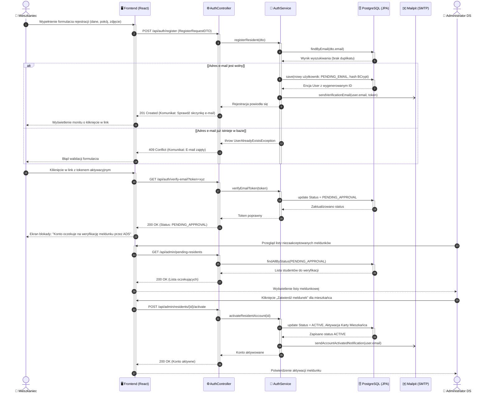
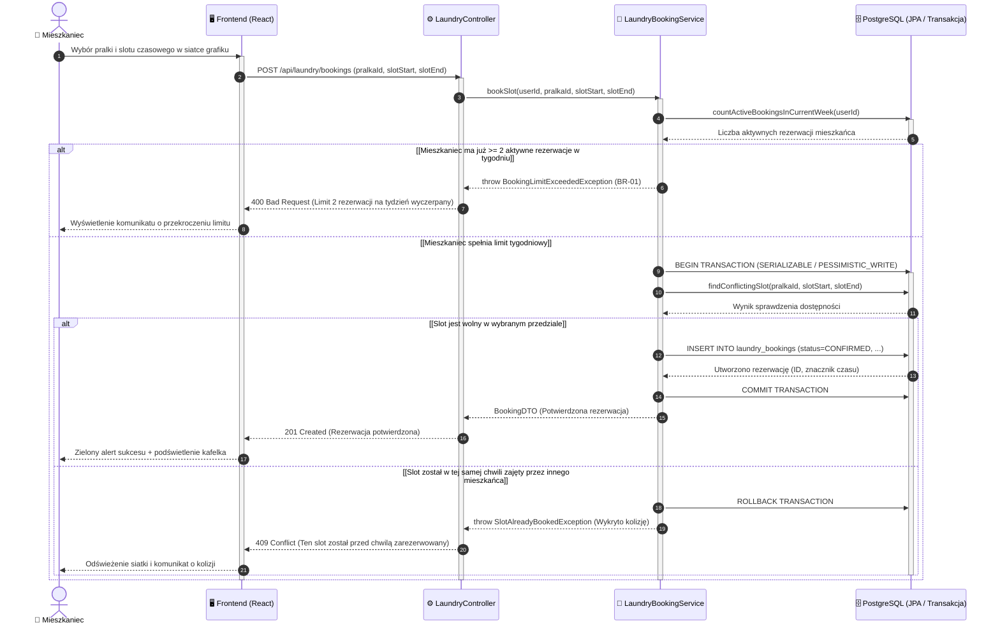
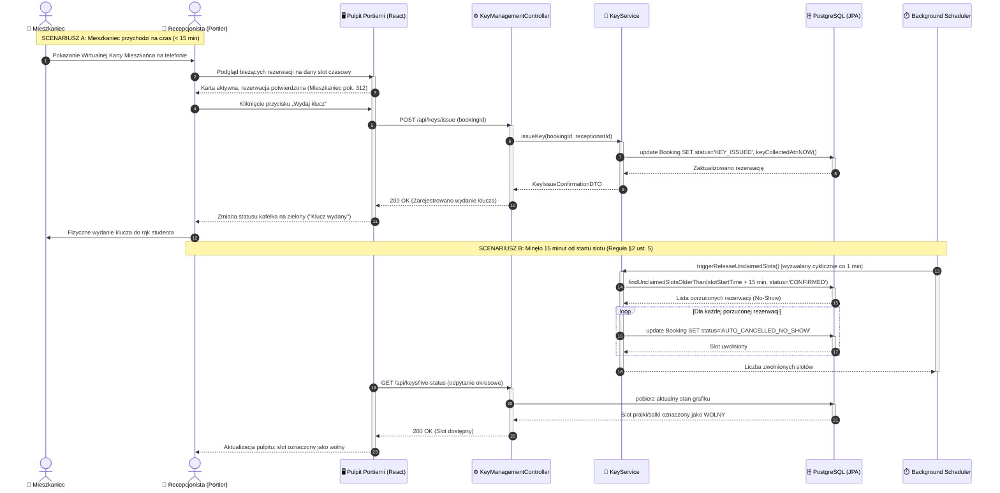
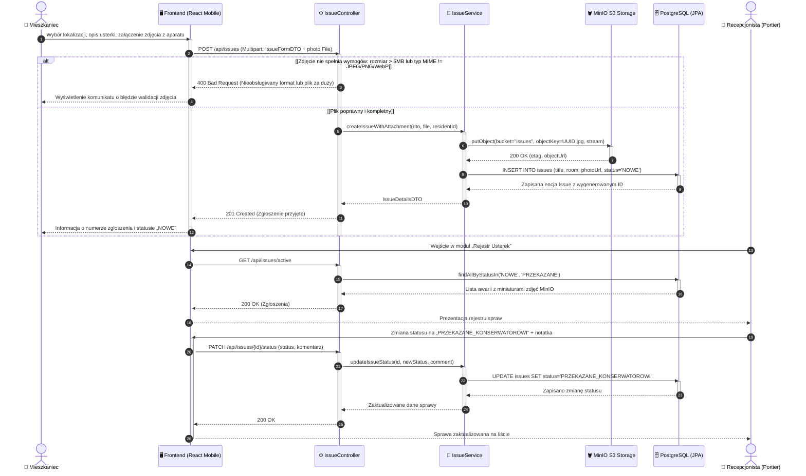
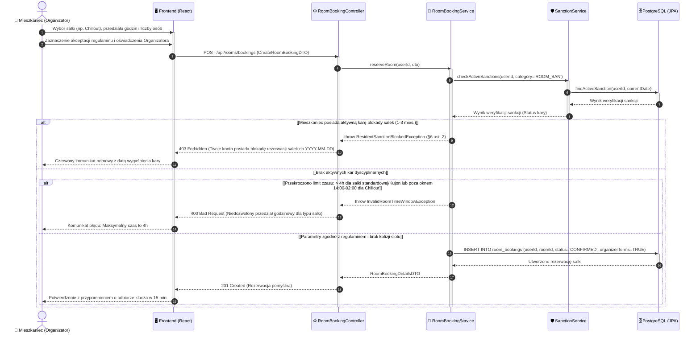
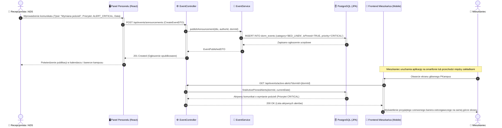

# Specyfikacja Diagramów Sekwencji (UML Sequence) - System PKampus

---

### 1. Przyjęte Standardy Notacyjne i Architektoniczne

Zgodnie z zasadami modelowania dynamiki systemów wielowarstwowych (Multi-tier Architecture / MVC):
1. **Warstwy i Linie Życia (Lifelines):**
   * **Aktor:** Reprezentuje użytkownika zewnętrznego systemu (`👤 Mieszkaniec`, `👤 Recepcjonista`, `👤 Administrator DS`) lub proces systemowy (`⏱️ System / Scheduler`).
   * **Frontend (React UI):** Warstwa prezentacji SPA (komponenty React, stan lokalny, obsługa formularzy, żądania HTTP Axios/Fetch).
   * **Kontroler REST (Spring Boot Controller):** Punkt wejściowy API (walidacja DTO `@Valid`, autoryzacja ról `@PreAuthorize`, mapowanie kodów HTTP).
   * **Serwis Biznesowy (Domain / Application Service):** Warstwa logiki biznesowej i zarządzania transakcjami (`@Transactional`, reguły PK, integralność).
   * **Baza Danych (Spring Data JPA / PostgreSQL):** Warstwa utrwalania danych, blokady transakcyjne, ograniczenia unikalności (`UNIQUE constraints`).
   * **Komponenty Zewnętrzne:** Usługi wyspecjalizowane w środowisku kontenerowym Docker Compose:
     * `✉️ Mailpit (SMTP)` – asynchroniczna wysyłka powiadomień e-mail,
     * `🪣 MinIO (S3)` – magazyn obiektowy na pliki multimedialne (zdjęcia usterek, awatary).
2. **Semantyka Komunikatów:**
   * `->>` : Wywołanie synchroniczne (żądanie HTTP, wywołanie metody wewnątrzprocesowej).
   * `-)` : Wywołanie asynchroniczne (np. zadanie w tle `@Async`, delegacja do wątku pocztowego).
   * `-->>` : Komunikat powrotny (powrót sterowania, odpowiedź HTTP, wynik zapytania JPA).
3. **Paski Aktywności (`activate` / `deactivate`):**
   * Precyzyjnie obrazują czas trwania wykonania operacji na danej linii życia.
4. **Numeracja Kroków (`autonumber`):**
   * Automatyczna numeracja komunikatów ułatwiająca śledzenie sekwencji czasowej.
5. **Obsługa Wariantów i Błędów (`alt / else`):**
   * Prezentacja głównego przebiegu optymistycznego (Happy Path) oraz kluczowych scenariuszy odmowy biznesowej lub błędów walidacji.

---

## 2. Sekwencja 1: Dwuetapowa Rejestracja i Aktywacja Meldunku (AUTH & CARD)

Proces obejmuje rejestrację nowego mieszkańca, weryfikację adresu e-mail, przejście konta w stan oczekiwania na potwierdzenie meldunku (`PENDING_APPROVAL`) oraz zatwierdzenie tożsamości przez Administratora DS.

---

## 3. Sekwencja 2: Rezerwacja Pralni z Ochroną Przed Wyścigiem (LAUNDRY & CONCURRENCY)

Proces prezentuje rezerwację slotu czasowego na konkretną pralkę. Zabezpiecza system przed zjawiskiem *Race Condition* (równoległą próbą zajęcia tego samego slotu przez dwóch studentów) za pomocą izolacji transakcji i unikalnych ograniczeń bazodanowych.

---

## 4. Sekwencja 3: Procedura Wydania Klucza i Reguła 15 Minut (LAUNDRY/ROOMS & SCHEDULER)

Zgodnie z §2 ust. 5 Regulaminu Osiedla Studenckiego, mieszkaniec musi odebrać klucz w ciągu 15 minut od startu rezerwacji. Diagram ilustruje dwa alternatywne warianty: pomyślny odbiór klucza na portierni oraz automatyczne zwolnienie zasobu przez harmonogram zadań w tle (`@Scheduled`).

---

## 5. Sekwencja 4: Zgłoszenie Awarii z Uploadem Zdjęcia do MinIO S3 (ISSUES)

Proces przedstawia zgłoszenie usterki technicznej przez mieszkańca z dołączeniem dokumentacji fotograficznej przesyłanej do magazynu obiektowego MinIO S3 oraz jej obsługę w warsztacie portierni.

---

## 6. Sekwencja 5: Rezerwacja Salki z Weryfikacją Czarnej Listy Kar (ROOMS & SANCTIONS)

Proces weryfikuje uprawnienia mieszkańca do rezerwacji salki tematycznej (cicha nauka „Kujon”, Funzone, Chillout) ze szczególnym uwzględnieniem ewidencji kar dyscyplinarnych (§6 ust. 2 Regulaminu: 1–3 miesiące blokady salek).

---

## 7. Sekwencja 6: Publikacja Komunikatu Dyżurnego / Wymiany Pościeli i Odbiór Alertu (BOARD & EVENTS)

Proces obrazuje publikację ważnego komunikatu technicznego lub organizacyjnego (np. cykliczna wymiana pościeli wg §27 pkt 10 Regulaminu OS PK, awaria dostaw ciepłej wody) przez pracownika portierni lub ADS oraz jego natychmiastową prezentację na smartfonie mieszkańca w postaci wyróżnionego banera alertu.

---

### 8. Podsumowanie Pokrycia Dynamiki

Zaprojektowane diagramy sekwencji pokrywają pełne spektrum zachowań dynamicznych systemu PKampus:
1. **Asynchroniczność i integracja e-mail:** Zastosowanie kolejki zadań asynchronicznych w Spring Boot dla Mailpit.
2. **Bezpieczeństwo transakcyjne:** Blokady bazodanowe i unikalne indeksy wykluczające podwójne rezerwacje w pralniach i salkach.
3. **Automatyzacja procesów w tle:** Dedykowany Spring Scheduler realizujący regułę 15 minut (§2 ust. 5 Regulaminu).
4. **Zarządzanie mediami:** Bezpośrednia integracja backendu z magazynem obiektowym MinIO (S3) przy obsłudze usterek.
5. **Egzekwowanie prawa wewnętrznego PK:** Walidacja czarnej listy kar dyscyplinarnych (§6 ust. 2) przed dopuszczeniem do zasobów.
