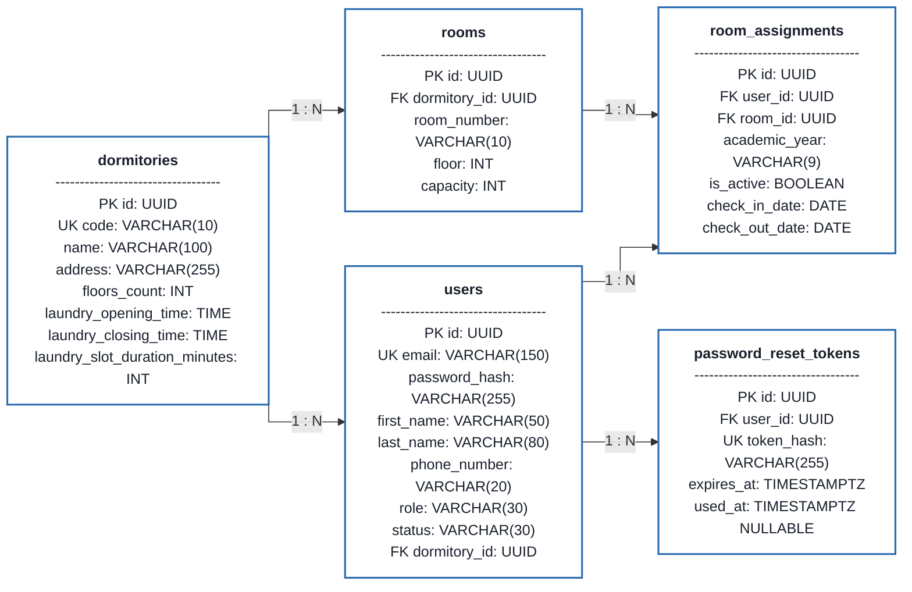
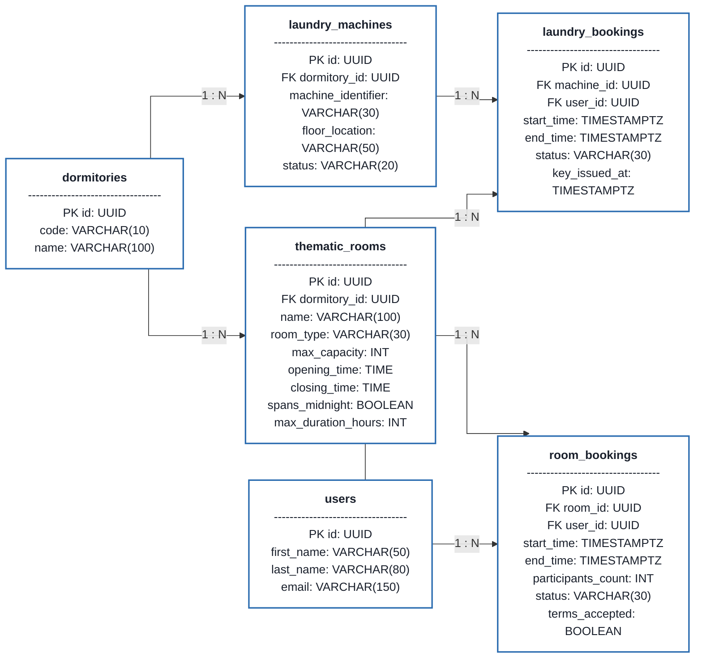
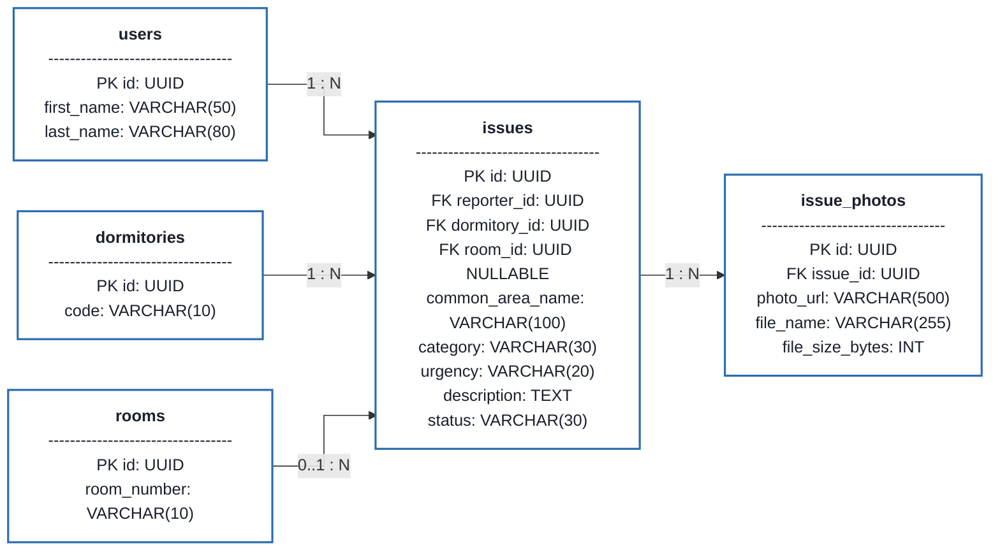
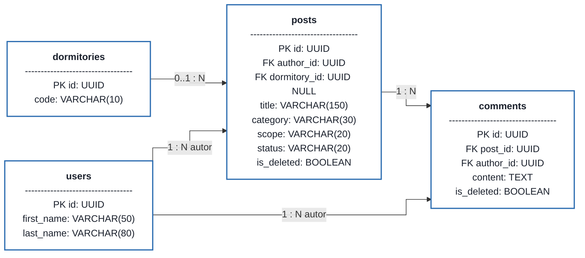
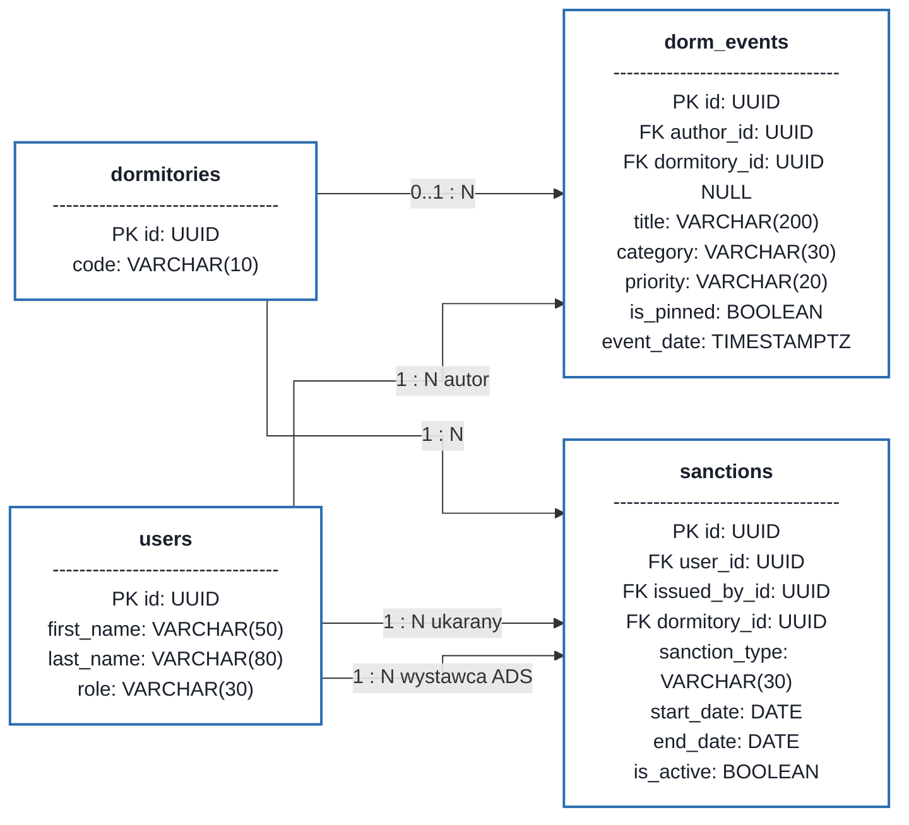

# Model Statyczny Bazy Danych (ERD) - System PKampus

---

## 1. Założenia Projektowe i Integralność Danych

1. **Silnik Bazy Danych:** PostgreSQL 16 (zgodność z ACID, wysoka wydajność współbieżna, natywna obsługa typów `UUID`, `TIMESTAMPTZ`, `JSONB`).
2. **Standard Identyfikatorów (Primary Keys):** Wszystkie encje posiadają klucz główny typu `UUIDv4` generowany automatycznie (`DEFAULT gen_random_uuid()`), co zapobiega podatnościom typu *Insecure Direct Object References* (IDOR) oraz zgadywaniu identyfikatorów w REST API.
3. **Czas i Strefy Czasowe:** Wszystkie znaczniki czasowe operacji i rezerwacji zapisywane są w formacie `TIMESTAMPTZ` (UTC).
4. **Obsługa Corocznej Rotacji Mieszkańców (Wymeldowania na Koniec Roku):**
   * Pokoje fizyczne (`rooms`) są stałymi obiektami przypisanymi do danego akademika.
   * Relacja studenta z pokojem jest modelowana za pomocą dedykowanej tabeli meldunkowej **`room_assignments`** z polem `academic_year` (np. `"2025/2026"`), statusem `is_active` oraz datami kwaterunku.
   * Na koniec roku akademickiego następuje masowe zamknięcie aktywnego meldunku (`is_active = FALSE`, data wymeldowania), co uwalnia pokój dla nowego rocznika, zachowując pełną historię zgłoszeń usterek i rezerwacji bez naruszania integralności referencyjnej.
5. **Ochrona Przed Kolizją Rezerwacji (Anti-Race Condition):**
   * Rezerwacje slotów pralki i salek zabezpieczone są na poziomie jądra bazy za pomocą **ograniczeń wykluczających** `EXCLUDE USING gist` (rozszerzenie `btree_gist`) na równości identyfikatora zasobu oraz przecięciu przedziałów `tstzrange(start_time, end_time)`. Baza odrzuca nachodzące aktywne rezerwacje (`CONFIRMED`, `KEY_ISSUED`) kodem SQLSTATE **`23P01` (`exclusion_violation`)** — nie `23505`.
6. **Polityka Usuwania Danych (Soft Delete):**
   * Posty i komentarze na tablicy sąsiedzkiej podlegają mechanizmowi miękkiego usuwania (`is_deleted BOOLEAN`, `deleted_at TIMESTAMPTZ`), co zapewnia ślad audytowy moderacji dla Administratora DS.

---

### 2. Diagramy Relacji Encji 


### 2.1. Domena 1: Struktura Miasteczka, Pokoje i Meldunki (AUTH & DORMITORIES)

Diagram modeluje strukturę budynków, pokoje, konta użytkowników oraz mechanizm meldunkowy (`room_assignments`) obsługujący coroczną rotację studentów.



---

### 2.2. Domena 2: Rezerwacje Pralni i Salek Tematycznych (LAUNDRY & ROOMS)

Diagram modeluje zasoby bytowe oraz rezerwacje slotów czasowych chronione przed zjawiskiem *Race Condition*. Relacje ułożone są w dwóch niezależnych torach (pralnie oraz salki).



---

### 2.3. Domena 3: Ewidencja Usterek i Załączniki MinIO (ISSUES)

Diagram modeluje zgłoszenia awarii w pokojach oraz częściach wspólnych wraz z dokumentacją fotograficzną.



---

### 2.4. Domena 4: Tablica Ogłoszeń i Dyskusje Sąsiedzkie (BOARD)

Diagram modeluje wątki dyskusyjne mieszkańców (z mechanizmem Soft Delete) oraz powiązane komentarze.



---

### 2.5. Domena 5: Komunikaty Urzędowe i Kary Dyscyplinarne (EVENTS & SANCTIONS)

Diagram modeluje oficjalne komunikaty i wydarzenia administracji (dyżury, wymiana pościeli, przeglądy) oraz ewidencję sankcji regulaminowych i blokad (§6 ust. 2 Regulaminu).



---

## 3. Słownik Danych (Data Dictionary)

### 3.1. Tabela `dormitories` (Domy Studenckie)
Przechowuje obiekty akademików wchodzących w skład Osiedla Studenckiego Politechniki Krakowskiej (np. DS-1, DS-2, DS-3, DS-4, DS B-1).

| Kolumna | Typ danych | Ograniczenia | Opis |
| :--- | :--- | :--- | :--- |
| `id` | `UUID` | `PK, DEFAULT gen_random_uuid()` | Unikalny identyfikator akademika |
| `name` | `VARCHAR(100)` | `NOT NULL` | Pełna nazwa (np. "DS-1 Rumcajs") |
| `code` | `VARCHAR(10)` | `NOT NULL, UNIQUE` | Skrót identyfikacyjny (np. "DS1") |
| `address` | `VARCHAR(255)` | `NOT NULL` | Adres fizyczny (np. "ul. Skarżyńskiego 3") |
| `floors_count` | `INT` | `NOT NULL, CHECK (floors_count > 0)` | Liczba kondygnacji mieszkalnych |
| `laundry_opening_time` | `TIME` | `NOT NULL, DEFAULT '07:00:00'` | Godzina otwarcia pralni w danym DS |
| `laundry_closing_time` | `TIME` | `NOT NULL, DEFAULT '23:00:00'` | Godzina zamknięcia pralni w danym DS |
| `laundry_slot_duration_minutes` | `INT` | `NOT NULL, DEFAULT 90, CHECK (laundry_slot_duration_minutes > 0)` | Długość slotu prania w min (np. 90, 120) |
| `created_at` | `TIMESTAMP` | `NOT NULL, DEFAULT CURRENT_TIMESTAMP` | Data dodania obiektu do systemu |

---

### 3.2. Tabela `rooms` (Pokoje w Akademikach)
Fizyczne pokoje w danym akademiku. Trwałe obiekty niezmieniające się co roku.

| Kolumna | Typ danych | Ograniczenia | Opis |
| :--- | :--- | :--- | :--- |
| `id` | `UUID` | `PK, DEFAULT gen_random_uuid()` | Identyfikator pokoju |
| `dormitory_id` | `UUID` | `FK -> dormitories(id), NOT NULL` | Przypisany akademik |
| `room_number` | `VARCHAR(10)` | `NOT NULL` | Numer pokoju (np. "204", "12B") |
| `floor` | `INT` | `NOT NULL` | Piętro (np. 2) |
| `capacity` | `INT` | `NOT NULL, DEFAULT 2` | Pojemność osobowa (np. 1, 2, 3) |
| `created_at` | `TIMESTAMP` | `NOT NULL, DEFAULT CURRENT_TIMESTAMP` | Znacznik czasu |

*Ograniczenie unikalności:* `UNIQUE(dormitory_id, room_number)` – w ramach jednego DS numer pokoju jest unikalny.

---

### 3.3. Tabela `users` (Konta Użytkowników i Personelu)
Główna tabela użytkowników systemu (studenci, recepcjoniści, kierownicy DS, superadmin).

| Kolumna | Typ danych | Ograniczenia | Opis |
| :--- | :--- | :--- | :--- |
| `id` | `UUID` | `PK, DEFAULT gen_random_uuid()` | Identyfikator użytkownika |
| `email` | `VARCHAR(150)` | `NOT NULL, UNIQUE` | Adres e-mail (login) |
| `password_hash` | `VARCHAR(255)` | `NOT NULL` | Skrót hasła (BCrypt) |
| `first_name` | `VARCHAR(50)` | `NOT NULL` | Imię |
| `last_name` | `VARCHAR(80)` | `NOT NULL` | Nazwisko |
| `phone_number` | `VARCHAR(20)` | `NOT NULL` | Numer telefonu kontaktowego |
| `avatar_url` | `VARCHAR(500)` | `NULLABLE` | Ścieżka do zdjęcia w MinIO S3 (karta) |
| `role` | `VARCHAR(30)` | `NOT NULL, CHECK (role IN ('RESIDENT', 'RECEPTIONIST', 'DORM_ADMIN', 'SUPER_ADMIN'))` | Rola w systemie (RBAC) |
| `status` | `VARCHAR(30)` | `NOT NULL, CHECK (status IN ('PENDING_EMAIL', 'PENDING_APPROVAL', 'ACTIVE', 'BLOCKED', 'CHECKED_OUT'))` | Status cyklu życia konta |
| `dormitory_id` | `UUID` | `FK -> dormitories(id), NULLABLE` | Przypisany akademik (dla Portiera/ADS) |
| `created_at` | `TIMESTAMP` | `NOT NULL, DEFAULT CURRENT_TIMESTAMP` | Data rejestracji |
| `updated_at` | `TIMESTAMP` | `NOT NULL, DEFAULT CURRENT_TIMESTAMP` | Data ostatniej edycji |

---

### 3.4. Tabela `room_assignments` (Historia Kwaterunku / Meldunki)
Obsługuje cykl życia studenta w akademiku oraz coroczną rotację pod koniec roku akademickiego.

| Kolumna | Typ danych | Ograniczenia | Opis |
| :--- | :--- | :--- | :--- |
| `id` | `UUID` | `PK, DEFAULT gen_random_uuid()` | Identyfikator rekordu meldunku |
| `user_id` | `UUID` | `FK -> users(id), NOT NULL` | Zameldowany student |
| `room_id` | `UUID` | `FK -> rooms(id), NOT NULL` | Przydzielony pokój |
| `academic_year` | `VARCHAR(9)` | `NOT NULL` | Rok akademicki (np. "2025/2026") |
| `is_active` | `BOOLEAN` | `NOT NULL, DEFAULT TRUE` | Flaga bieżącego aktywnego kwaterunku |
| `check_in_date` | `DATE` | `NOT NULL` | Data zameldowania |
| `check_out_date` | `DATE` | `NULLABLE` | Data wymeldowania (wypełniana na koniec roku) |
| `created_at` | `TIMESTAMP` | `NOT NULL, DEFAULT CURRENT_TIMESTAMP` | Znacznik czasu meldunku |

*Ograniczenie unikalności częściowej:* `CREATE UNIQUE INDEX idx_active_user_assignment ON room_assignments (user_id) WHERE is_active = TRUE;` – student może posiadać tylko jeden aktywny meldunek naraz.

---

### 3.5. Tabela `laundry_machines` (Pralki w Pralniach)
Zasoby pralnicze definiowane per akademik.

| Kolumna | Typ danych | Ograniczenia | Opis |
| :--- | :--- | :--- | :--- |
| `id` | `UUID` | `PK, DEFAULT gen_random_uuid()` | Identyfikator pralki |
| `dormitory_id` | `UUID` | `FK -> dormitories(id), NOT NULL` | Akademik |
| `machine_identifier`| `VARCHAR(30)` | `NOT NULL` | Oznaczenie fizyczne (np. "Pralka 1 - Piętro 0") |
| `floor_location` | `VARCHAR(50)` | `NOT NULL` | Lokalizacja pralni (np. "Piwnica / Sektor A") |
| `status` | `VARCHAR(20)` | `NOT NULL, CHECK (status IN ('AVAILABLE', 'OUT_OF_ORDER'))` | Stan techniczny |
| `notes` | `TEXT` | `NULLABLE` | Informacja o awarii lub serwisie |
| `created_at` | `TIMESTAMP` | `NOT NULL, DEFAULT CURRENT_TIMESTAMP` | Znacznik czasu |

---

### 3.6. Tabela `laundry_bookings` (Rezerwacje Pralek)
Rezerwacje slotów pralki z zabezpieczeniem współbieżności.

| Kolumna | Typ danych | Ograniczenia | Opis |
| :--- | :--- | :--- | :--- |
| `id` | `UUID` | `PK, DEFAULT gen_random_uuid()` | Identyfikator rezerwacji |
| `machine_id` | `UUID` | `FK -> laundry_machines(id), NOT NULL` | Wybrana pralka |
| `user_id` | `UUID` | `FK -> users(id), NOT NULL` | Rezerwujący mieszkaniec |
| `start_time` | `TIMESTAMPTZ` | `NOT NULL` | Czas rozpoczęcia slotu |
| `end_time` | `TIMESTAMPTZ` | `NOT NULL` | Czas zakończenia slotu |
| `status` | `VARCHAR(35)` | `NOT NULL, CHECK (status IN ('CONFIRMED', 'KEY_ISSUED', 'COMPLETED', 'CANCELLED_USER', 'AUTO_CANCELLED_15MIN', 'CANCELLED_MACHINE_OUT_OF_ORDER'))` | Status cyklu życia rezerwacji |
| `key_issued_at` | `TIMESTAMPTZ` | `NULLABLE` | Czas fizycznego wydania klucza |
| `key_returned_at` | `TIMESTAMPTZ` | `NULLABLE` | Czas zwrotu klucza na portiernię |
| `created_at` | `TIMESTAMP` | `NOT NULL, DEFAULT CURRENT_TIMESTAMP` | Znacznik czasu złożenia rezerwacji |

*Kluczowe ograniczenie integralności (Anti-Overlap):*
`ALTER TABLE laundry_bookings ADD CONSTRAINT chk_laundry_no_overlap EXCLUDE USING gist (machine_id WITH =, tstzrange(start_time, end_time) WITH &&) WHERE (status IN ('CONFIRMED', 'KEY_ISSUED'));` — gwarantuje na poziomie silnika PostgreSQL brak jakichkolwiek nachodzących na siebie przedziałów czasowych rezerwacji dla tej samej pralki.

---

### 3.7. Tabela `thematic_rooms` (Salki Tematyczne)
Pomieszczenia wspólne zgodnie z Zarządzeniem Rektora PK ws. salek tematycznych.

| Kolumna | Typ danych | Ograniczenia | Opis |
| :--- | :--- | :--- | :--- |
| `id` | `UUID` | `PK, DEFAULT gen_random_uuid()` | Identyfikator salki |
| `dormitory_id` | `UUID` | `FK -> dormitories(id), NOT NULL` | Akademik |
| `name` | `VARCHAR(100)` | `NOT NULL` | Nazwa salki (np. "Cicha nauka Kujon", "Chillout") |
| `room_type` | `VARCHAR(30)` | `NOT NULL, CHECK (room_type IN ('STANDARD', 'QUIET_STUDY_KUJON', 'CHILLOUT', 'CLUB'))` | Typ regulaminowy |
| `max_capacity` | `INT` | `NOT NULL, CHECK (max_capacity > 0)` | Limit osób (Kujon: 16, Chillout: 30) |
| `opening_time` | `TIME` | `NOT NULL, DEFAULT '06:00:00'` | Godzina otwarcia (standard/Kujon: 06:00, Chillout: 14:00) |
| `closing_time` | `TIME` | `NOT NULL, DEFAULT '23:30:00'` | Godzina zamknięcia (standard/Kujon: 23:30, Chillout: 02:00) |
| `spans_midnight` | `BOOLEAN` | `NOT NULL, DEFAULT FALSE` | Flaga przejścia przez północ (dla Chillout: TRUE) |
| `max_duration_hours`| `INT` | `NOT NULL, DEFAULT 4` | Max czas jednorazowej rezerwacji (standard/Kujon: 4h, Chillout: 12h) |
| `description` | `TEXT` | `NULLABLE` | Wyposażenie i regulamin salki |
| `status` | `VARCHAR(20)` | `NOT NULL, CHECK (status IN ('AVAILABLE', 'MAINTENANCE'))` | Dostępność |
| `created_at` | `TIMESTAMP` | `NOT NULL, DEFAULT CURRENT_TIMESTAMP` | Znacznik czasu |

*Specyfika salki Chillout (§5 ust. 8 Regulaminu salek):* Dla salki typu `CHILLOUT` parametry konfiguracyjne wynoszą: `opening_time = '14:00:00'`, `closing_time = '02:00:00'`, `spans_midnight = TRUE` oraz `max_duration_hours = 12`. Flaga `spans_midnight = TRUE` jednoznacznie definiuje, że `closing_time < opening_time` oznacza przejście przez północ (koniec rezerwacji w dobie kolejnej), a dozwolony czas trwania rezerwacji wynosi do 12 godzin.

---

### 3.8. Tabela `room_bookings` (Rezerwacje Salek Tematycznych)
Rezerwacje salek z oświadczeniem Organizatora (§2 ust. 2 Regulaminu).

| Kolumna | Typ danych | Ograniczenia | Opis |
| :--- | :--- | :--- | :--- |
| `id` | `UUID` | `PK, DEFAULT gen_random_uuid()` | Identyfikator rezerwacji |
| `room_id` | `UUID` | `FK -> thematic_rooms(id), NOT NULL` | Rezerwowana salka |
| `user_id` | `UUID` | `FK -> users(id), NOT NULL` | Organizator (Mieszkaniec) |
| `start_time` | `TIMESTAMPTZ` | `NOT NULL` | Początek rezerwacji |
| `end_time` | `TIMESTAMPTZ` | `NOT NULL` | Koniec rezerwacji |
| `participants_count`| `INT` | `NOT NULL, CHECK (participants_count > 0)` | Deklarowana liczba uczestników |
| `purpose` | `VARCHAR(255)` | `NOT NULL` | Cel rezerwacji |
| `status` | `VARCHAR(30)` | `NOT NULL, CHECK (status IN ('CONFIRMED', 'KEY_ISSUED', 'COMPLETED', 'CANCELLED_USER', 'AUTO_CANCELLED_15MIN'))` | Status rezerwacji |
| `terms_accepted` | `BOOLEAN` | `NOT NULL, CHECK (terms_accepted = TRUE)` | Zgoda na regulamin i odpowiedzialność |
| `key_issued_at` | `TIMESTAMPTZ` | `NULLABLE` | Godzina odbioru klucza |
| `key_returned_at` | `TIMESTAMPTZ` | `NULLABLE` | Godzina zwrotu klucza |
| `created_at` | `TIMESTAMP` | `NOT NULL, DEFAULT CURRENT_TIMESTAMP` | Data rezerwacji |

*Kluczowe ograniczenie integralności (Anti-Overlap):*
`ALTER TABLE room_bookings ADD CONSTRAINT chk_room_no_overlap EXCLUDE USING gist (room_id WITH =, tstzrange(start_time, end_time) WITH &&) WHERE (status IN ('CONFIRMED', 'KEY_ISSUED'));` — gwarantuje wykluczenie nakładających się rezerwacji salki w bazie.

*Reguła zwrotu klucza dla salki Chillout (BR-08 / §3 ust. 7):* Dla rezerwacji kończących się w oknie nocnym (do 02:00) portiernia egzekwuje zwrot klucza do 10:00 operacyjnie. System przechowuje `key_issued_at` / `key_returned_at`; automatyczna blokada kolejnych wydań klucza nie jest wymagana w MVP.

---

### 3.9. Tabela `issues` (Ewidencja Usterek i Awarii)
Cyfrowy zeszyt napraw na portierni.

| Kolumna | Typ danych | Ograniczenia | Opis |
| :--- | :--- | :--- | :--- |
| `id` | `UUID` | `PK, DEFAULT gen_random_uuid()` | Identyfikator zgłoszenia |
| `reporter_id` | `UUID` | `FK -> users(id), NOT NULL` | Zgłaszający mieszkaniec |
| `dormitory_id` | `UUID` | `FK -> dormitories(id), NOT NULL` | Akademik |
| `room_id` | `UUID` | `FK -> rooms(id) ON DELETE RESTRICT, NULLABLE` | Pokój (jeśli usterka w pokoju; NULL dla części wspólnych) |
| `common_area_name`| `VARCHAR(100)` | `NULLABLE` | Część wspólna (kuchnia, pralnia, winda) |
| `category` | `VARCHAR(30)` | `NOT NULL, CHECK (category IN ('PLUMBING', 'ELECTRICAL', 'FURNITURE', 'LOCKSMITH', 'OTHER'))` | Branża awarii |
| `urgency` | `VARCHAR(20)` | `NOT NULL, CHECK (urgency IN ('NORMAL', 'URGENT'))` | Stopień pilności |
| `description` | `TEXT` | `NOT NULL` | Szczegółowy opis usterki |
| `status` | `VARCHAR(30)` | `NOT NULL, CHECK (status IN ('NEW', 'ASSIGNED_TO_MAINTENANCE', 'IN_PROGRESS', 'RESOLVED', 'REJECTED', 'PARTS_REQUIRED'))` | Status realizacji (w UI: Nowe, Przekazane konserwatorowi, W trakcie naprawy, Naprawione, Odrzucone, Wymaga części) |
| `staff_notes` | `TEXT` | `NULLABLE` | Bieżąca (ostatnia) notatka portiera dla studenta — nadpisywana przy kolejnej aktualizacji; brak tabeli historii komentarzy w MVP |
| `created_at` | `TIMESTAMP` | `NOT NULL, DEFAULT CURRENT_TIMESTAMP` | Data zgłoszenia |
| `updated_at` | `TIMESTAMP` | `NOT NULL, DEFAULT CURRENT_TIMESTAMP` | Data aktualizacji |

*Więz integralności lokalizacji:* `CONSTRAINT chk_issue_location CHECK ((room_id IS NOT NULL AND common_area_name IS NULL) OR (room_id IS NULL AND common_area_name IS NOT NULL))` – gwarantuje, że usterka dotyczy dokładnie jednego miejsca (albo pokoju, albo części wspólnej).

---

### 3.10. Tabela `issue_photos` (Zdjęcia Załączone do Usterek)
Dokumentacja fotograficzna przechowywana w MinIO S3.

| Kolumna | Typ danych | Ograniczenia | Opis |
| :--- | :--- | :--- | :--- |
| `id` | `UUID` | `PK, DEFAULT gen_random_uuid()` | Identyfikator zdjęcia |
| `issue_id` | `UUID` | `FK -> issues(id) ON DELETE CASCADE, NOT NULL` | Powiązane zgłoszenie |
| `photo_url` | `VARCHAR(500)` | `NOT NULL` | Klucz obiektu / URL w MinIO S3 |
| `file_name` | `VARCHAR(255)` | `NOT NULL` | Oryginalna nazwa pliku |
| `file_size_bytes`| `INT` | `NOT NULL` | Rozmiar pliku w bajtach |
| `created_at` | `TIMESTAMP` | `NOT NULL, DEFAULT CURRENT_TIMESTAMP` | Znacznik czasu |

---

### 3.11. Tabela `posts` (Tablica Ogłoszeń Sąsiedzkich)
Wpisy na tablicy studenckiej z podziałem na zasięg (mój DS / cały kampus).

| Kolumna | Typ danych | Ograniczenia | Opis |
| :--- | :--- | :--- | :--- |
| `id` | `UUID` | `PK, DEFAULT gen_random_uuid()` | Identyfikator posta |
| `author_id` | `UUID` | `FK -> users(id), NOT NULL` | Autor (Mieszkaniec) |
| `dormitory_id` | `UUID` | `FK -> dormitories(id), NULLABLE` | DS (NULL jeśli post ogólnokampusowy) |
| `title` | `VARCHAR(150)` | `NOT NULL` | Tytuł ogłoszenia |
| `content` | `TEXT` | `NOT NULL` | Treść wpisu |
| `category` | `VARCHAR(30)` | `NOT NULL, CHECK (category IN ('BORROW_HELP', 'BUY_SELL', 'LOST_FOUND', 'GENERAL'))` | Kategoria wpisu |
| `scope` | `VARCHAR(20)` | `NOT NULL, CHECK (scope IN ('DORMITORY', 'CAMPUS'))` | Zasięg widoczności |
| `status` | `VARCHAR(20)` | `NOT NULL, DEFAULT 'ACTIVE', CHECK (status IN ('ACTIVE', 'RESOLVED', 'REMOVED_MODERATOR'))` | Stan ogłoszenia |
| `is_deleted` | `BOOLEAN` | `NOT NULL, DEFAULT FALSE` | Flaga miękkiego usunięcia (Soft Delete) |
| `deleted_at` | `TIMESTAMP` | `NULLABLE` | Czas usunięcia wpisu |
| `created_at` | `TIMESTAMP` | `NOT NULL, DEFAULT CURRENT_TIMESTAMP` | Data dodania |
| `updated_at` | `TIMESTAMP` | `NOT NULL, DEFAULT CURRENT_TIMESTAMP` | Data modyfikacji |

---

### 3.12. Tabela `comments` (Komentarze pod Ogłoszeniami)
Wątki dyskusyjne pod postami sąsiedzkimi.

| Kolumna | Typ danych | Ograniczenia | Opis |
| :--- | :--- | :--- | :--- |
| `id` | `UUID` | `PK, DEFAULT gen_random_uuid()` | Identyfikator komentarza |
| `post_id` | `UUID` | `FK -> posts(id) ON DELETE CASCADE, NOT NULL` | Powiązany post |
| `author_id` | `UUID` | `FK -> users(id), NOT NULL` | Autor wypowiedzi |
| `content` | `TEXT` | `NOT NULL` | Treść komentarza |
| `is_deleted` | `BOOLEAN` | `NOT NULL, DEFAULT FALSE` | Flaga Soft Delete |
| `deleted_at` | `TIMESTAMP` | `NULLABLE` | Czas usunięcia komentarza |
| `created_at` | `TIMESTAMP` | `NOT NULL, DEFAULT CURRENT_TIMESTAMP` | Znacznik czasu |

---

### 3.13. Tabela `dorm_events` (Kalendarz i Komunikaty Dyżurne)
Ogłoszenia techniczno-organizacyjne (wymiana pościeli, przerwa w dostawie wody) oraz wydarzenia integracyjne.

| Kolumna | Typ danych | Ograniczenia | Opis |
| :--- | :--- | :--- | :--- |
| `id` | `UUID` | `PK, DEFAULT gen_random_uuid()` | Identyfikator wydarzenia |
| `author_id` | `UUID` | `FK -> users(id), NOT NULL` | Twórca (Portier, ADS, Student) |
| `dormitory_id` | `UUID` | `FK -> dormitories(id), NULLABLE` | Obiekt (NULL dla całego kampusu) |
| `title` | `VARCHAR(200)` | `NOT NULL` | Nagłówek komunikatu |
| `description` | `TEXT` | `NOT NULL` | Szczegóły ogłoszenia |
| `category` | `VARCHAR(30)` | `NOT NULL, CHECK (category IN ('BED_LINEN', 'TECHNICAL_OUTAGE', 'ADMIN_NOTICE', 'STUDENT_EVENT'))` | Typ komunikatu |
| `priority` | `VARCHAR(20)` | `NOT NULL, CHECK (priority IN ('INFO', 'WARNING', 'CRITICAL'))` | Waga alertu |
| `is_pinned` | `BOOLEAN` | `NOT NULL, DEFAULT FALSE` | Czy wyświetlać jako czerwony baner u góry |
| `event_date` | `TIMESTAMPTZ` | `NOT NULL` | Data rozpoczęcia / termin wymiany |
| `end_date` | `TIMESTAMPTZ` | `NULLABLE` | Data zakończenia akcji |
| `created_at` | `TIMESTAMP` | `NOT NULL, DEFAULT CURRENT_TIMESTAMP` | Znacznik czasu publikacji |

---

### 3.14. Tabela `sanctions` (Rejestr Kar Regulaminowych - Czarna Lista)
Ewidencja sankcji nakładanych przez Kierownika DS (§6 ust. 2 Regulaminu: 1–3 miesiące blokady salek).

| Kolumna | Typ danych | Ograniczenia | Opis |
| :--- | :--- | :--- | :--- |
| `id` | `UUID` | `PK, DEFAULT gen_random_uuid()` | Identyfikator sankcji |
| `user_id` | `UUID` | `FK -> users(id), NOT NULL` | Ukarany student |
| `issued_by_id` | `UUID` | `FK -> users(id), NOT NULL` | Administrator nakładający karę (ADS) |
| `dormitory_id` | `UUID` | `FK -> dormitories(id), NOT NULL` | Akademik |
| `sanction_type`| `VARCHAR(30)` | `NOT NULL, CHECK (sanction_type IN ('ROOM_BAN'))` | Rodzaj kary (blokada salek) |
| `reason` | `TEXT` | `NOT NULL` | Uzasadnienie (np. nieporządek, zakłócanie ciszy) |
| `start_date` | `DATE` | `NOT NULL` | Data początkowa kary |
| `end_date` | `DATE` | `NOT NULL` | Data końcowa (1–3 mies. od startu) |
| `is_active` | `BOOLEAN` | `NOT NULL, DEFAULT TRUE` | Status obowiązywania kary |
| `created_at` | `TIMESTAMP` | `NOT NULL, DEFAULT CURRENT_TIMESTAMP` | Znacznik czasu nałożenia |

---

### 3.15. Tabela `password_reset_tokens` (Tokeny Resetowania Hasła)
Tymczasowe tokeny kryptograficzne do bezpiecznej procedury odzyskiwania hasła przez e-mail (FR-AUTH-07).

| Kolumna | Typ danych | Ograniczenia | Opis |
| :--- | :--- | :--- | :--- |
| `id` | `UUID` | `PK, DEFAULT gen_random_uuid()` | Identyfikator tokenu |
| `user_id` | `UUID` | `FK -> users(id), NOT NULL` | Użytkownik resetujący hasło |
| `token_hash` | `VARCHAR(255)` | `NOT NULL, UNIQUE` | Skrót kryptograficzny tokenu wysłanego w linku |
| `expires_at` | `TIMESTAMPTZ` | `NOT NULL` | Data i czas wygaśnięcia tokenu (15 minut od wygenerowania) |
| `used_at` | `TIMESTAMPTZ` | `NULLABLE` | Znacznik czasu wykorzystania tokenu (unieważnienie) |
| `created_at` | `TIMESTAMP` | `NOT NULL, DEFAULT CURRENT_TIMESTAMP` | Czas wygenerowania żądania |

---

## 4. Skrypt DDL SQL (PostgreSQL 16)

Poniższy skrypt DDL jest w 100% gotowy do uruchomienia przy inicjalizacji kontenera bazy danych PostgreSQL (np. w katalogu `/docker-entrypoint-initdb.d/01_init.sql` lub jako migracja Flyway/Liquibase).

```sql
-- Włączenie rozszerzenia do generowania UUID oraz indeksowania przedziałów czasowych GiST
CREATE EXTENSION IF NOT EXISTS "pgcrypto";
CREATE EXTENSION IF NOT EXISTS "btree_gist";

-- 1. TABELA DOMÓW STUDENCKICH
CREATE TABLE dormitories (
    id UUID PRIMARY KEY DEFAULT gen_random_uuid(),
    name VARCHAR(100) NOT NULL,
    code VARCHAR(10) NOT NULL UNIQUE,
    address VARCHAR(255) NOT NULL,
    floors_count INT NOT NULL CHECK (floors_count > 0),
    laundry_opening_time TIME NOT NULL DEFAULT '07:00:00',
    laundry_closing_time TIME NOT NULL DEFAULT '23:00:00',
    laundry_slot_duration_minutes INT NOT NULL DEFAULT 90 CHECK (laundry_slot_duration_minutes > 0),
    created_at TIMESTAMP NOT NULL DEFAULT CURRENT_TIMESTAMP
);

-- 2. TABELA POKOI
CREATE TABLE rooms (
    id UUID PRIMARY KEY DEFAULT gen_random_uuid(),
    dormitory_id UUID NOT NULL REFERENCES dormitories(id) ON DELETE CASCADE,
    room_number VARCHAR(10) NOT NULL,
    floor INT NOT NULL,
    capacity INT NOT NULL DEFAULT 2 CHECK (capacity > 0),
    created_at TIMESTAMP NOT NULL DEFAULT CURRENT_TIMESTAMP,
    CONSTRAINT uq_dormitory_room UNIQUE (dormitory_id, room_number)
);

-- 3. TABELA UŻYTKOWNIKÓW
CREATE TABLE users (
    id UUID PRIMARY KEY DEFAULT gen_random_uuid(),
    email VARCHAR(150) NOT NULL UNIQUE,
    password_hash VARCHAR(255) NOT NULL,
    first_name VARCHAR(50) NOT NULL,
    last_name VARCHAR(80) NOT NULL,
    phone_number VARCHAR(20) NOT NULL,
    avatar_url VARCHAR(500),
    role VARCHAR(30) NOT NULL CHECK (role IN ('RESIDENT', 'RECEPTIONIST', 'DORM_ADMIN', 'SUPER_ADMIN')),
    status VARCHAR(30) NOT NULL CHECK (status IN ('PENDING_EMAIL', 'PENDING_APPROVAL', 'ACTIVE', 'BLOCKED', 'CHECKED_OUT')),
    dormitory_id UUID REFERENCES dormitories(id) ON DELETE SET NULL,
    created_at TIMESTAMP NOT NULL DEFAULT CURRENT_TIMESTAMP,
    updated_at TIMESTAMP NOT NULL DEFAULT CURRENT_TIMESTAMP
);

-- 4. TABELA HISTORII KWATERUNKU (MELDUNKI)
CREATE TABLE room_assignments (
    id UUID PRIMARY KEY DEFAULT gen_random_uuid(),
    user_id UUID NOT NULL REFERENCES users(id) ON DELETE CASCADE,
    room_id UUID NOT NULL REFERENCES rooms(id) ON DELETE RESTRICT,
    academic_year VARCHAR(9) NOT NULL,
    is_active BOOLEAN NOT NULL DEFAULT TRUE,
    check_in_date DATE NOT NULL,
    check_out_date DATE,
    created_at TIMESTAMP NOT NULL DEFAULT CURRENT_TIMESTAMP
);

-- Tylko jeden aktywny pokój dla studenta naraz
CREATE UNIQUE INDEX idx_active_user_assignment ON room_assignments (user_id) WHERE is_active = TRUE;

-- 5. TABELA PRALEK
CREATE TABLE laundry_machines (
    id UUID PRIMARY KEY DEFAULT gen_random_uuid(),
    dormitory_id UUID NOT NULL REFERENCES dormitories(id) ON DELETE CASCADE,
    machine_identifier VARCHAR(30) NOT NULL,
    floor_location VARCHAR(50) NOT NULL,
    status VARCHAR(20) NOT NULL DEFAULT 'AVAILABLE' CHECK (status IN ('AVAILABLE', 'OUT_OF_ORDER')),
    notes TEXT,
    created_at TIMESTAMP NOT NULL DEFAULT CURRENT_TIMESTAMP
);

-- 6. TABELA REZERWACJI PRALNI
CREATE TABLE laundry_bookings (
    id UUID PRIMARY KEY DEFAULT gen_random_uuid(),
    machine_id UUID NOT NULL REFERENCES laundry_machines(id) ON DELETE CASCADE,
    user_id UUID NOT NULL REFERENCES users(id) ON DELETE CASCADE,
    start_time TIMESTAMPTZ NOT NULL,
    end_time TIMESTAMPTZ NOT NULL,
    status VARCHAR(35) NOT NULL DEFAULT 'CONFIRMED' CHECK (status IN ('CONFIRMED', 'KEY_ISSUED', 'COMPLETED', 'CANCELLED_USER', 'AUTO_CANCELLED_15MIN', 'CANCELLED_MACHINE_OUT_OF_ORDER')),
    key_issued_at TIMESTAMPTZ,
    key_returned_at TIMESTAMPTZ,
    created_at TIMESTAMP NOT NULL DEFAULT CURRENT_TIMESTAMP,
    CONSTRAINT chk_laundry_time CHECK (end_time > start_time)
);

-- Bezkompromisowa ochrona przed nakładaniem przedziałów czasowych w pralni (PostgreSQL btree_gist)
ALTER TABLE laundry_bookings 
    ADD CONSTRAINT chk_laundry_no_overlap 
    EXCLUDE USING gist (
        machine_id WITH =, 
        tstzrange(start_time, end_time) WITH &&
    ) WHERE (status IN ('CONFIRMED', 'KEY_ISSUED'));

-- 7. TABELA SALEK TEMATYCZNYCH
CREATE TABLE thematic_rooms (
    id UUID PRIMARY KEY DEFAULT gen_random_uuid(),
    dormitory_id UUID NOT NULL REFERENCES dormitories(id) ON DELETE CASCADE,
    name VARCHAR(100) NOT NULL,
    room_type VARCHAR(30) NOT NULL CHECK (room_type IN ('STANDARD', 'QUIET_STUDY_KUJON', 'CHILLOUT', 'CLUB')),
    max_capacity INT NOT NULL CHECK (max_capacity > 0),
    opening_time TIME NOT NULL DEFAULT '06:00:00',
    closing_time TIME NOT NULL DEFAULT '23:30:00',
    spans_midnight BOOLEAN NOT NULL DEFAULT FALSE,
    max_duration_hours INT NOT NULL DEFAULT 4 CHECK (max_duration_hours > 0),
    description TEXT,
    status VARCHAR(20) NOT NULL DEFAULT 'AVAILABLE' CHECK (status IN ('AVAILABLE', 'MAINTENANCE')),
    created_at TIMESTAMP NOT NULL DEFAULT CURRENT_TIMESTAMP,
    CONSTRAINT chk_thematic_hours CHECK (
        (spans_midnight = FALSE AND closing_time > opening_time) OR
        (spans_midnight = TRUE AND closing_time < opening_time)
    )
);

-- 8. TABELA REZERWACJI SALEK TEMATYCZNYCH
CREATE TABLE room_bookings (
    id UUID PRIMARY KEY DEFAULT gen_random_uuid(),
    room_id UUID NOT NULL REFERENCES thematic_rooms(id) ON DELETE CASCADE,
    user_id UUID NOT NULL REFERENCES users(id) ON DELETE CASCADE,
    start_time TIMESTAMPTZ NOT NULL,
    end_time TIMESTAMPTZ NOT NULL,
    participants_count INT NOT NULL CHECK (participants_count > 0),
    purpose VARCHAR(255) NOT NULL,
    status VARCHAR(30) NOT NULL DEFAULT 'CONFIRMED' CHECK (status IN ('CONFIRMED', 'KEY_ISSUED', 'COMPLETED', 'CANCELLED_USER', 'AUTO_CANCELLED_15MIN')),
    terms_accepted BOOLEAN NOT NULL CHECK (terms_accepted = TRUE),
    key_issued_at TIMESTAMPTZ,
    key_returned_at TIMESTAMPTZ,
    created_at TIMESTAMP NOT NULL DEFAULT CURRENT_TIMESTAMP,
    CONSTRAINT chk_room_time CHECK (end_time > start_time)
);

-- Bezkompromisowa ochrona przed nakładaniem przedziałów czasowych w salkach (PostgreSQL btree_gist)
ALTER TABLE room_bookings 
    ADD CONSTRAINT chk_room_no_overlap 
    EXCLUDE USING gist (
        room_id WITH =, 
        tstzrange(start_time, end_time) WITH &&
    ) WHERE (status IN ('CONFIRMED', 'KEY_ISSUED'));

-- 9. TABELA USTEREK (CYFROWY ZESZYT AWARII)
CREATE TABLE issues (
    id UUID PRIMARY KEY DEFAULT gen_random_uuid(),
    reporter_id UUID NOT NULL REFERENCES users(id) ON DELETE RESTRICT,
    dormitory_id UUID NOT NULL REFERENCES dormitories(id) ON DELETE CASCADE,
    room_id UUID REFERENCES rooms(id) ON DELETE RESTRICT,
    common_area_name VARCHAR(100),
    category VARCHAR(30) NOT NULL CHECK (category IN ('PLUMBING', 'ELECTRICAL', 'FURNITURE', 'LOCKSMITH', 'OTHER')),
    urgency VARCHAR(20) NOT NULL DEFAULT 'NORMAL' CHECK (urgency IN ('NORMAL', 'URGENT')),
    description TEXT NOT NULL,
    status VARCHAR(30) NOT NULL DEFAULT 'NEW' CHECK (status IN ('NEW', 'ASSIGNED_TO_MAINTENANCE', 'IN_PROGRESS', 'RESOLVED', 'REJECTED', 'PARTS_REQUIRED')),
    staff_notes TEXT,
    created_at TIMESTAMP NOT NULL DEFAULT CURRENT_TIMESTAMP,
    updated_at TIMESTAMP NOT NULL DEFAULT CURRENT_TIMESTAMP,
    CONSTRAINT chk_issue_location CHECK (
        (room_id IS NOT NULL AND common_area_name IS NULL) OR
        (room_id IS NULL AND common_area_name IS NOT NULL)
    )
);

-- 10. TABELA ZDJĘĆ USTEREK (MINIO S3)
CREATE TABLE issue_photos (
    id UUID PRIMARY KEY DEFAULT gen_random_uuid(),
    issue_id UUID NOT NULL REFERENCES issues(id) ON DELETE CASCADE,
    photo_url VARCHAR(500) NOT NULL,
    file_name VARCHAR(255) NOT NULL,
    file_size_bytes INT NOT NULL,
    created_at TIMESTAMP NOT NULL DEFAULT CURRENT_TIMESTAMP
);

-- 11. TABELA POSTÓW SĄSIEDZKICH
CREATE TABLE posts (
    id UUID PRIMARY KEY DEFAULT gen_random_uuid(),
    author_id UUID NOT NULL REFERENCES users(id) ON DELETE CASCADE,
    dormitory_id UUID REFERENCES dormitories(id) ON DELETE SET NULL,
    title VARCHAR(150) NOT NULL,
    content TEXT NOT NULL,
    category VARCHAR(30) NOT NULL CHECK (category IN ('BORROW_HELP', 'BUY_SELL', 'LOST_FOUND', 'GENERAL')),
    scope VARCHAR(20) NOT NULL DEFAULT 'DORMITORY' CHECK (scope IN ('DORMITORY', 'CAMPUS')),
    status VARCHAR(20) NOT NULL DEFAULT 'ACTIVE' CHECK (status IN ('ACTIVE', 'RESOLVED', 'REMOVED_MODERATOR')),
    is_deleted BOOLEAN NOT NULL DEFAULT FALSE,
    deleted_at TIMESTAMP,
    created_at TIMESTAMP NOT NULL DEFAULT CURRENT_TIMESTAMP,
    updated_at TIMESTAMP NOT NULL DEFAULT CURRENT_TIMESTAMP
);

-- 12. TABELA KOMENTARZY
CREATE TABLE comments (
    id UUID PRIMARY KEY DEFAULT gen_random_uuid(),
    post_id UUID NOT NULL REFERENCES posts(id) ON DELETE CASCADE,
    author_id UUID NOT NULL REFERENCES users(id) ON DELETE CASCADE,
    content TEXT NOT NULL,
    is_deleted BOOLEAN NOT NULL DEFAULT FALSE,
    deleted_at TIMESTAMP,
    created_at TIMESTAMP NOT NULL DEFAULT CURRENT_TIMESTAMP
);

-- 13. TABELA WYDARZEŃ I OFICJALNYCH KOMUNIKATÓW
CREATE TABLE dorm_events (
    id UUID PRIMARY KEY DEFAULT gen_random_uuid(),
    author_id UUID NOT NULL REFERENCES users(id) ON DELETE CASCADE,
    dormitory_id UUID REFERENCES dormitories(id) ON DELETE CASCADE,
    title VARCHAR(200) NOT NULL,
    description TEXT NOT NULL,
    category VARCHAR(30) NOT NULL CHECK (category IN ('BED_LINEN', 'TECHNICAL_OUTAGE', 'ADMIN_NOTICE', 'STUDENT_EVENT')),
    priority VARCHAR(20) NOT NULL DEFAULT 'INFO' CHECK (priority IN ('INFO', 'WARNING', 'CRITICAL')),
    is_pinned BOOLEAN NOT NULL DEFAULT FALSE,
    event_date TIMESTAMPTZ NOT NULL,
    end_date TIMESTAMPTZ,
    created_at TIMESTAMP NOT NULL DEFAULT CURRENT_TIMESTAMP
);

-- 14. TABELA SANKCJI REGULAMINOWYCH (CZARNA LISTA SALEK)
CREATE TABLE sanctions (
    id UUID PRIMARY KEY DEFAULT gen_random_uuid(),
    user_id UUID NOT NULL REFERENCES users(id) ON DELETE CASCADE,
    issued_by_id UUID NOT NULL REFERENCES users(id) ON DELETE RESTRICT,
    dormitory_id UUID NOT NULL REFERENCES dormitories(id) ON DELETE CASCADE,
    sanction_type VARCHAR(30) NOT NULL DEFAULT 'ROOM_BAN' CHECK (sanction_type IN ('ROOM_BAN')),
    reason TEXT NOT NULL,
    start_date DATE NOT NULL,
    end_date DATE NOT NULL,
    is_active BOOLEAN NOT NULL DEFAULT TRUE,
    created_at TIMESTAMP NOT NULL DEFAULT CURRENT_TIMESTAMP,
    CONSTRAINT chk_sanction_dates CHECK (end_date >= start_date)
);

-- Indeks przyspieszający sprawdzanie aktywnych sankcji przy rezerwacji
CREATE INDEX idx_active_sanctions ON sanctions (user_id, end_date) WHERE is_active = TRUE;

-- 15. TABELA TOKENÓW RESETOWANIA HASŁA
CREATE TABLE password_reset_tokens (
    id UUID PRIMARY KEY DEFAULT gen_random_uuid(),
    user_id UUID NOT NULL REFERENCES users(id) ON DELETE CASCADE,
    token_hash VARCHAR(255) NOT NULL UNIQUE,
    expires_at TIMESTAMPTZ NOT NULL,
    used_at TIMESTAMPTZ,
    created_at TIMESTAMP NOT NULL DEFAULT CURRENT_TIMESTAMP
);

-- Indeks wyszukiwania aktywnego tokenu
CREATE INDEX idx_pwd_reset_token ON password_reset_tokens (token_hash) WHERE used_at IS NULL;
```
